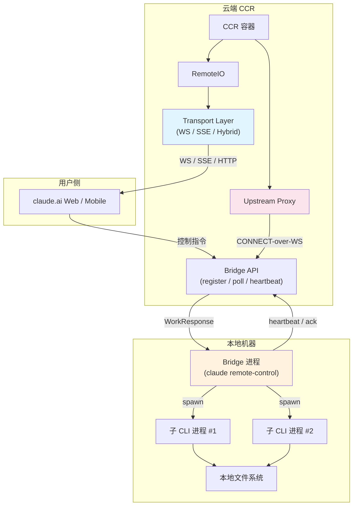
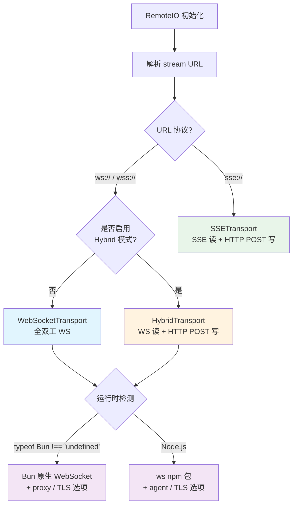

# 第十五章：远程与分布式执行

> **本章摘要**
>
> Claude Code 并不局限于开发者的本地终端。通过 Bridge 架构和 CCR（Claude Code Remote）容器系统，它实现了从本地 CLI 到远程云端的无缝扩展。本章深入剖析这套远程执行架构：Bridge 系统如何在本地轮询、派发和管理远程会话；三种 Transport 协议（WebSocket、SSE、Hybrid）如何在不同网络环境中提供可靠通信；指数退避与睡眠检测如何保障断线重连的鲁棒性；Upstream Proxy 如何在 CCR 容器内实现组织级代理转发；以及 Token 安全措施如何通过堆内存隔离和 fail-open 设计在安全性与可用性之间取得平衡。最后，我们分析 RemoteAgentTask 的会话追踪机制和 GrowthBook 驱动的轮询调优策略。

---

## 15.1 架构全景：从本地到云端

Claude Code 的远程执行架构采用经典的 **Bridge 模式**：本地 CLI 进程充当"桥"的角色，一侧连接 claude.ai 的 Web 界面或移动端，另一侧通过生成子进程管理远程会话。这种设计的核心优势在于，用户无需在 Web 端直接暴露任何本地文件系统或 Shell 访问权限 —— 所有操作都经由 Bridge 进程中转。

当系统运行在 CCR 模式（`CLAUDE_CODE_REMOTE=true`）时，整个 CLI 运行在云端容器内部，使用 `RemoteIO` 替代标准的 `StructuredIO`，并通过 Transport 层与外部客户端通信。



### 进入 Bridge 模式

Bridge 的入口在 `cli.tsx` 的快速路径分发表中，优先级为 7：

```typescript
if (feature('BRIDGE_MODE') && (args[0] === 'remote-control' || args[0] === 'rc')) {
  const { bridgeMain } = await import('../bridge/bridgeMain.js');
  await bridgeMain(args.slice(1));
  return;
}
```

`feature('BRIDGE_MODE')` 是 Bun 的编译期宏，当此特性未启用时，整个分支在构建产物中被完全消除（Dead Code Elimination），确保外部发行版不包含任何 Bridge 相关代码。

---

## 15.2 会话管理：创建、轮询、心跳、归档

Bridge 的核心是一个带有状态追踪的轮询循环。让我们拆解其生命周期。

### 15.2.1 Bridge 配置

```typescript
export type BridgeConfig = {
  dir: string;
  machineName: string;
  branch: string;
  gitRepoUrl: string | null;
  maxSessions: number;
  spawnMode: SpawnMode;         // 'single-session' | 'worktree' | 'same-dir'
  bridgeId: string;             // 客户端生成的 UUID
  workerType: string;           // 'claude_code' | 'claude_code_assistant'
  environmentId: string;
  reuseEnvironmentId?: string;  // 后端下发的 ID，用于重连
  apiBaseUrl: string;
  sessionIngressUrl: string;
  sessionTimeoutMs?: number;    // 默认 24 小时
};
```

`spawnMode` 决定了多会话并发的隔离策略：`single-session` 表示同一时间只运行一个会话；`worktree` 为每个会话创建独立的 Git worktree；`same-dir` 则在相同目录下并发执行。

### 15.2.2 主循环

```typescript
export async function runBridgeLoop(
  config: BridgeConfig,
  environmentId: string,
  environmentSecret: string,
  api: BridgeApiClient,
  spawner: SessionSpawner,
  // ...
): Promise<void> {
  const activeSessions = new Map<string, SessionHandle>();
  const completedWorkIds = new Set<string>();

  // 主轮询循环 + 指数退避
  while (!signal.aborted) {
    const work = await api.pollForWork(environmentId, secret, signal);
    if (work) {
      const session = spawner.spawn(opts, dir);
      activeSessions.set(session.sessionId, session);
      await api.acknowledgeWork(environmentId, work.id, token);
    }
    await sleep(getPollInterval());
  }
}
```

这里的简化伪代码展示了核心流程。实际实现中，循环还维护了以下状态映射：

| 状态映射 | 用途 |
|---------|------|
| `activeSessions` | sessionId -> SessionHandle |
| `sessionStartTimes` | sessionId -> 启动时间戳 |
| `sessionWorkIds` | sessionId -> workId |
| `sessionIngressTokens` | sessionId -> ingress token |
| `completedWorkIds` | 已完成的 workId 集合（防重复） |
| `timedOutSessions` | 已超时的 sessionId 集合 |

### 15.2.3 心跳与 Token 刷新

Bridge 通过两个并行机制维持会话活性：

**心跳**：定期调用 `api.heartbeatWork()` 延长工作租约。

```typescript
async function heartbeatActiveWorkItems() {
  for (const [sessionId] of activeSessions) {
    try {
      await api.heartbeatWork(environmentId, workId, ingressToken);
    } catch (err) {
      if (err.status === 401 || err.status === 403) {
        // JWT 过期 -> 触发服务端重新分发
        await api.reconnectSession(environmentId, sessionId);
      }
    }
  }
}
```

**Token 刷新**：在 JWT 过期前 5 分钟主动刷新。401 响应触发 OAuth 重试：

```typescript
async function withOAuthRetry<T>(
  fn: (accessToken: string) => Promise<{ status: number; data: T }>,
): Promise<{ status: number; data: T }> {
  const response = await fn(resolveAuth());
  if (response.status !== 401) return response;
  const refreshed = await deps.onAuth401(accessToken);
  if (refreshed) return fn(resolveAuth());
  return response;
}
```

### 15.2.4 会话派生与子进程管理

`SessionSpawner` 负责将 Bridge 接收到的 `WorkResponse` 转化为实际的 CLI 子进程：

```typescript
export function createSessionSpawner(deps): SessionSpawner {
  return {
    spawn(opts, dir): SessionHandle {
      // 生成命令: process.execPath [...scriptArgs] --sdk-url <url> --input-format stream-json
      // 监控 stdout 的 SDK 消息
      // 跟踪 activities: tool_start, text, result, error
    }
  };
}
```

每个 `WorkResponse` 包含一个 `secret` 字段（base64url 编码的 `WorkSecret` JSON），其中携带了 session ingress token、认证信息、Git 源码配置和 MCP 配置。子进程通过 `--sdk-url` 参数接收通信端点，通过环境变量接收认证凭据。

### 15.2.5 Bridge API 操作全集

| 操作 | 方法 | 用途 |
|------|------|------|
| `registerBridgeEnvironment` | POST | 注册桥接环境，获取 environment_id |
| `pollForWork` | GET | 轮询待处理工作 |
| `acknowledgeWork` | POST | 确认工作已接收 |
| `heartbeatWork` | POST | 心跳续约 |
| `stopWork` | POST | 停止工作（可选 force） |
| `reconnectSession` | POST | 重连已断开的会话 |
| `archiveSession` | POST | 归档已完成的会话 |
| `deregisterEnvironment` | DELETE | 注销桥接环境 |

所有 ID 字段都经过严格的路径安全校验：

```typescript
export function validateBridgeId(id: string, label: string): string {
  const SAFE_ID_PATTERN = /^[a-zA-Z0-9_-]+$/;
  if (!id || !SAFE_ID_PATTERN.test(id)) {
    throw new Error(`Invalid ${label}: contains unsafe characters`);
  }
  return id;
}
```

这一校验防止了路径遍历攻击 —— 当 `environmentId` 或 `sessionId` 被拼接进 URL 路径时，特殊字符（如 `../`）会被拒绝。

---

## 15.3 Transport 抽象：三种协议的统一接口

远程通信的核心抽象是 `Transport` 接口，所有传输协议都实现这一契约：

```typescript
interface Transport {
  connect(): Promise<void>;
  write(message: StdoutMessage): Promise<void>;
  close(): void;
  setOnData(callback: (data: string) => void): void;
  setOnClose(callback: (closeCode?: number) => void): void;
  setOnConnect(callback: () => void): void;
}
```

`RemoteIO`（CCR 模式的 I/O 层）根据 URL 协议自动选择 Transport：

- `ws://` / `wss://` -> `WebSocketTransport` 或 `HybridTransport`
- `sse://` 路径 -> `SSETransport`



### 15.3.1 WebSocket Transport

`WebSocketTransport` 是最直接的全双工方案。其内部维护一个完整的状态机：

```
idle -> connected -> reconnecting -> connected -> ... -> closing -> closed
```

关键配置常量：

| 常量 | 值 | 用途 |
|------|---|------|
| `DEFAULT_BASE_RECONNECT_DELAY` | 1,000ms | 初始重连延迟 |
| `DEFAULT_MAX_RECONNECT_DELAY` | 30,000ms | 最大重连延迟 |
| `DEFAULT_RECONNECT_GIVE_UP_MS` | 600,000ms | 重连放弃阈值（10 分钟） |
| `DEFAULT_PING_INTERVAL` | 10,000ms | Ping 保活间隔 |
| `DEFAULT_KEEPALIVE_INTERVAL` | 300,000ms | Keepalive 间隔（5 分钟） |
| `SLEEP_DETECTION_THRESHOLD_MS` | 60,000ms | 睡眠检测阈值 |

**运行时双轨**：WebSocket 实例的创建根据运行时环境自动适配。在 Bun 运行时下使用 `globalThis.WebSocket`（原生支持 `proxy` 和 `tls` 选项）；在 Node.js 环境下动态导入 `ws` 包，使用 `agent` 进行代理配置。这种双轨设计确保了 CCR 容器（Node.js）和开发者本地（Bun）都能获得最优的 WebSocket 支持。

**消息缓冲**：Transport 维护一个 `CircularBuffer<StdoutMessage>` 用于断线重连时的消息重放。重连时通过 `X-Last-Request-Id` 请求头告知服务端上次成功发送的消息 ID，实现服务端侧的消息重放。

**永久关闭码**：当收到以下 close code 时，不进行重试：

- `1002` - 协议错误
- `4001` - 认证失败
- `4003` - 会话已终止

### 15.3.2 SSE Transport

SSE Transport 用于 CCR v2，采用 **SSE 读 + HTTP POST 写** 的分离架构：

- **读路径**：通过 GET 请求建立 SSE 流，利用 `Last-Event-ID` 实现断线恢复
- **写路径**：通过 HTTP POST 发送消息，内置 10 次重试、500ms-8000ms 指数退避

```typescript
export class SSETransport implements Transport {
  private lastSequenceNum = 0;
  private seenSequenceNums = new Set<number>();

  // 退避配置
  private static RECONNECT_BASE_DELAY_MS = 1000;
  private static RECONNECT_MAX_DELAY_MS = 30_000;
  private static RECONNECT_GIVE_UP_MS = 600_000;
  private static LIVENESS_TIMEOUT_MS = 45_000;  // 服务端每 15s 发送 keepalive

  // POST 重试配置
  private static POST_MAX_RETRIES = 10;
  private static POST_BASE_DELAY_MS = 500;
  private static POST_MAX_DELAY_MS = 8000;
}
```

SSE 帧的解析通过 `parseSSEFrames()` 函数实现，使用 `\n\n` 作为帧分隔符。每个事件包含 `event_id`、`sequence_num`、`event_type`、`source` 和 `payload` 字段。`seenSequenceNums` 集合确保幂等处理 —— 即使相同事件因重连被重复投递，也只处理一次。

**活性超时**：如果 45 秒内未收到任何数据（包括 keepalive 注释），Transport 判定连接已断，自动触发重连。服务端每 15 秒发送一次 keepalive（以 `:` 开头的 SSE 注释），因此 45 秒的阈值提供了 3 倍的容错余量。

### 15.3.3 Hybrid Transport

Hybrid Transport 是一种混合方案：**WebSocket 用于读取**（低延迟推送），**HTTP POST 用于写入**（可靠投递）。它继承自 `WebSocketTransport`：

```typescript
export class HybridTransport extends WebSocketTransport {
  private uploader: SerialBatchEventUploader<StdoutMessage>;
  private streamEventBuffer: StdoutMessage[] = [];  // 100ms 批量窗口

  override async write(message: StdoutMessage): Promise<void> {
    if (message.type === 'stream_event') {
      this.streamEventBuffer.push(message);
      if (!this.streamEventTimer) {
        this.streamEventTimer = setTimeout(
          () => this.flushStreamEvents(), BATCH_FLUSH_INTERVAL_MS);
      }
      return;
    }
    await this.uploader.enqueue([...this.takeStreamEvents(), message]);
    return this.uploader.flush();
  }
}
```

**为什么要串行化写入？** Bridge 模式通过 `void transport.write()` 以 fire-and-forget 方式触发写入。如果没有串行化，并发的 POST 请求写入同一个 Firestore 文档会导致"碰撞风暴"（collision storms）。`SerialBatchEventUploader` 确保写入请求严格按序执行，同时通过 100ms 的批量窗口将高频 `stream_event` 消息合并，减少网络往返。

### 15.3.4 Transport 对比

| 特性 | WebSocket | SSE | Hybrid |
|------|-----------|-----|--------|
| **读延迟** | 低（推送） | 低（推送） | 低（WS 推送） |
| **写可靠性** | 一般 | 高（HTTP POST + 重试） | 高（HTTP POST + 重试） |
| **断线恢复** | 消息缓冲 + `X-Last-Request-Id` | `Last-Event-ID` | WS 重连 + HTTP 重试 |
| **防火墙穿透** | 需 WS 支持 | 仅需 HTTP | 需 WS（读）+ HTTP（写） |
| **写顺序保证** | 单连接天然有序 | POST 可能乱序 | `SerialBatchEventUploader` 串行 |
| **适用场景** | 稳定网络 | 受限网络 / CCR v2 | Bridge 模式（高频写入） |

---

## 15.4 重连策略：指数退避与睡眠检测

网络连接的不可靠性是分布式系统的基本事实。Claude Code 的 Transport 层实现了一套精细的重连策略。

### 15.4.1 指数退避

所有 Transport 共享相同的退避模式：

```
delay = min(base * 2^attempt, cap)
```

对于 WebSocket Transport：
- **base** = 1,000ms
- **cap** = 30,000ms
- **give-up** = 600,000ms（10 分钟）

这意味着重连延迟序列为：1s, 2s, 4s, 8s, 16s, 30s, 30s, 30s, ... 直到 10 分钟后彻底放弃。

Bridge 主循环使用独立的退避配置：

```typescript
export type BackoffConfig = {
  connInitialMs: number;     // 2,000ms -- 连接级退避起点
  connCapMs: number;         // 120,000ms (2 分钟) -- 连接级退避上限
  connGiveUpMs: number;      // 600,000ms (10 分钟) -- 连接级放弃
  generalInitialMs: number;  // 500ms -- 通用操作退避起点
  generalCapMs: number;      // 30,000ms -- 通用操作退避上限
  generalGiveUpMs: number;   // 600,000ms (10 分钟) -- 通用操作放弃
  shutdownGraceMs?: number;  // 30s (SIGTERM -> SIGKILL 宽限)
  stopWorkBaseDelayMs?: number;  // 1s (1s/2s/4s 退避)
};
```

注意连接级退避（`connInitialMs = 2000, connCapMs = 120_000`）比通用操作退避（`generalInitialMs = 500, generalCapMs = 30_000`）更保守。这是因为连接失败往往意味着更严重的基础设施问题，需要更长的等待时间让系统恢复。

### 15.4.2 睡眠检测

笔记本电脑合盖、系统休眠是远程会话面临的独特挑战。当用户打开笔记本恢复工作时，Transport 可能已经累积了大量的退避延迟。如果不加处理，用户需要等待接近 cap（30 秒）才能重连，体验极差。

WebSocket Transport 的解决方案是 **睡眠检测阈值**：

```typescript
private static SLEEP_DETECTION_THRESHOLD_MS = 60_000;
```

机制如下：如果两次重连尝试之间的时间间隔超过 60 秒（即 cap 值 30 秒的 2 倍），Transport 判定系统经历了睡眠。此时，重连预算（已用时间累计）被重置为零，退避延迟从 `base`（1 秒）重新开始。

这一设计的关键洞察是：**系统休眠期间流逝的时间不应计入重连预算**。如果用户的笔记本休眠了 8 小时，唤醒后应该立即以最小延迟尝试重连，而不是因为"已超过 10 分钟放弃阈值"而直接断开。

---

## 15.5 Upstream Proxy：CCR 容器内的 MITM 代理

### 15.5.1 设计目标

在企业部署场景中，组织可能要求所有出站 HTTP 流量经过指定代理（用于审计、DLP 或网络隔离）。CCR 容器内的 Upstream Proxy 正是为此设计：它在容器本地启动一个 CONNECT 代理，将流量通过 WebSocket 隧道转发到组织配置的上游代理。

### 15.5.2 初始化序列

```
1. 从 /run/ccr/session_token 读取会话令牌
2. 调用 prctl(PR_SET_DUMPABLE, 0) -- 阻止同 UID 进程通过 ptrace 读取堆内存
3. 下载 Upstream Proxy CA 证书，与系统 CA 包合并
4. 启动本地 CONNECT->WebSocket 中继 (relay.ts)
5. 删除令牌文件（令牌仅保留在堆内存中）
6. 暴露 HTTPS_PROXY / SSL_CERT_FILE 等环境变量给子进程
```

整个初始化序列发生在 `init.ts` 的 Phase 6（CCR Upstream Proxy），仅在 `CLAUDE_CODE_REMOTE=true` 时触发。

### 15.5.3 CONNECT-over-WebSocket 中继

传统的 HTTP CONNECT 隧道需要代理服务器支持原始 TCP 转发。但 CCR 的入口网关使用 GKE L7 负载均衡器配合路径前缀路由，不支持原始 CONNECT 请求。解决方案是将 CONNECT 隧道包装在 WebSocket 帧内：

```typescript
// message UpstreamProxyChunk { bytes data = 1; }
export function encodeChunk(data: Uint8Array): Uint8Array {
  // Wire 格式: tag=0x0a (field 1, wire type 2), varint length, data bytes
  const varint: number[] = [];
  let n = data.length;
  while (n > 0x7f) { varint.push((n & 0x7f) | 0x80); n >>>= 7; }
  varint.push(n);
  const out = new Uint8Array(1 + varint.length + data.length);
  out[0] = 0x0a;
  out.set(varint, 1);
  out.set(data, 1 + varint.length);
  return out;
}
```

字节流被封装为 `UpstreamProxyChunk` protobuf 消息 —— 手工编码而非使用 protobuf 库，以获得最佳性能（避免引入额外的序列化依赖和开销）。

**运行时适配**：中继服务器在 Bun 下使用 `Bun.listen`，在 Node.js（CCR 容器的实际运行时）下使用 `net.createServer`。

### 15.5.4 环境变量注入

当 Upstream Proxy 初始化成功后，所有子进程（通过 `registerUpstreamProxyEnvFn` 注册）自动继承以下环境变量：

```typescript
export function getUpstreamProxyEnv(): Record<string, string> {
  if (!state.enabled) return {};
  const proxyUrl = `http://127.0.0.1:${state.port}`;
  return {
    HTTPS_PROXY: proxyUrl,
    https_proxy: proxyUrl,          // 兼容大小写敏感的库
    NO_PROXY: NO_PROXY_LIST,
    no_proxy: NO_PROXY_LIST,
    SSL_CERT_FILE: state.caBundlePath,
    NODE_EXTRA_CA_CERTS: state.caBundlePath,
    REQUESTS_CA_BUNDLE: state.caBundlePath,  // Python requests
    CURL_CA_BUNDLE: state.caBundlePath,      // curl
  };
}
```

`NO_PROXY` 列表明确排除了不应经过代理的目标，包括 `localhost`、RFC 1918 私有地址段、`anthropic.com`（API 直连）、`github.com`、以及主流包管理器（npm、PyPI、crates.io、Go proxy）。

---

## 15.6 Token 安全：堆内存隔离与 Fail-Open 设计

CCR 容器中的 Token 安全是一个精心设计的多层防御体系。

### 15.6.1 四层安全措施

1. **`prctl(PR_SET_DUMPABLE, 0)`**：在 Linux 上禁止同 UID 的其他进程通过 `ptrace` 附加并读取当前进程的堆内存。这阻止了恶意工具调用（例如，用户提示模型执行的 shell 命令）通过 `/proc/[pid]/mem` 窃取 Token。

2. **Token 文件删除（unlinking）**：Token 最初从 `/run/ccr/session_token` 读取。Upstream Proxy 中继确认启动后，立即 `unlink` 该文件。此后，Token 仅存在于进程的堆内存中，文件系统上不再有任何副本。

3. **Auth Header 分离**：WebSocket 升级使用 Bearer JWT 认证；隧道内的 CONNECT 请求使用 Basic auth（session ID + token）。两种认证凭据在不同层级使用，互不混淆。

4. **Fail-Open 设计**：如果初始化过程中任何步骤失败（CA 证书下载失败、中继启动失败等），系统记录警告日志并继续运行 —— 不启用代理。这一选择优先保障了可用性：宁可在没有代理的情况下正常工作，也不因代理故障导致整个会话不可用。

### 15.6.2 Fail-Open 的权衡

Fail-Open 是一个有争议的设计决策。在安全敏感的企业环境中，可能更希望 fail-closed（代理失败则阻止所有出站流量）。Claude Code 选择 fail-open 的理由是：

- Upstream Proxy 的主要职责是 **转发流量到组织代理**，而非 **阻断流量**
- 代理失败时，流量回退到直连模式，仍受 API 层的认证和授权保护
- 在容器环境中，代理故障是暂时的（重启可恢复），而会话中断对用户的影响是即时且显著的

---

## 15.7 RemoteAgentTask：云端会话追踪

### 15.7.1 状态模型

`RemoteAgentTask` 是客户端（本地 CLI 或 Web 端）追踪远程会话的抽象：

```typescript
export type RemoteAgentTaskState = TaskStateBase & {
  type: 'remote_agent'
  remoteTaskType: RemoteTaskType  // 'remote-agent' | 'ultraplan' | 'ultrareview' | 'autofix-pr' | 'background-pr'
  sessionId: string
  command: string
  title: string
  todoList: TodoList
  log: SDKMessage[]
  isLongRunning?: boolean
  pollStartedAt: number
  reviewProgress?: {
    stage?: 'finding' | 'verifying' | 'synthesizing'
    bugsFound: number
    bugsVerified: number
    bugsRefuted: number
  }
  isUltraplan?: boolean
  ultraplanPhase?: Exclude<UltraplanPhase, 'running'>
};
```

`remoteTaskType` 的多态性值得注意：同一个 `RemoteAgentTask` 框架支撑了五种不同类型的远程任务。`ultraplan` 和 `ultrareview` 是重量级任务（可能运行数十分钟），`autofix-pr` 和 `background-pr` 是后台自动化任务，`remote-agent` 则是通用的远程 Agent 执行。

### 15.7.2 前置条件检查

在创建远程会话之前，`checkRemoteAgentEligibility()` 执行一系列严格的前置条件校验：

- 用户已登录
- 云环境可用
- 当前目录是 Git 仓库
- 存在 Git remote
- GitHub App 已安装
- 组织策略允许远程执行

任何条件不满足都会返回明确的错误消息，引导用户修复。

### 15.7.3 Completion Checkers

远程任务的完成判定通过可插拔的 Checker 机制实现：

```typescript
export function registerCompletionChecker(
  remoteTaskType: RemoteTaskType,
  checker: RemoteTaskCompletionChecker,
): void
```

每种 `remoteTaskType` 可以注册自己的完成检查器。在每次轮询时，Checker 会检查远程会话的最新状态（通过 WebSocket 或 SSE 接收的 `SDKMessage` 日志），判定任务是否完成、是否需要用户交互、是否出错。这种设计将完成判定逻辑与轮询机制解耦，使新的远程任务类型可以轻松接入。

### 15.7.4 元数据持久化

远程会话的元数据被持久化到 session sidecar 文件中，支持会话恢复：

```typescript
async function persistRemoteAgentMetadata(meta: RemoteAgentMetadata): Promise<void>
async function removeRemoteAgentMetadata(taskId: string): Promise<void>
```

当用户关闭并重新打开 CLI 时，可以从持久化的元数据中恢复对远程会话的追踪。

---

## 15.8 GrowthBook 驱动的轮询调优

Bridge 的轮询间隔不是硬编码的 —— 它由 GrowthBook Feature Flag 远程控制，运维团队可以在不发布新版本的情况下全局调整整个 Bridge 舰队的行为。

### 15.8.1 轮询配置架构

```typescript
export function getPollIntervalConfig(): PollIntervalConfig {
  const raw = getFeatureValue_CACHED_WITH_REFRESH<unknown>(
    'tengu_bridge_poll_interval_config',
    DEFAULT_POLL_CONFIG,
    5 * 60 * 1000,  // 5 分钟刷新缓存
  );
  const parsed = pollIntervalConfigSchema().safeParse(raw);
  return parsed.success ? parsed.data : DEFAULT_POLL_CONFIG;
}
```

配置从 GrowthBook 获取，本地缓存 5 分钟后刷新。解析失败时回退到默认配置 —— 又一个 fail-open 的实例。

### 15.8.2 多维度轮询策略

配置支持精细的多维度控制：

| 参数 | 默认值 | 含义 |
|------|--------|------|
| `poll_interval_ms_not_at_capacity` | 基础值 | 未满载时的轮询间隔 |
| `poll_interval_ms_at_capacity` | 较长值 | 满载时的轮询间隔（减少无效请求） |
| `multisession_poll_interval_ms_not_at_capacity` | 5,000ms | 多会话模式、未满载 |
| `multisession_poll_interval_ms_partial_capacity` | 2,000ms | 多会话模式、部分满载 |
| `multisession_poll_interval_ms_at_capacity` | 10,000ms | 多会话模式、满载 |
| `non_exclusive_heartbeat_interval_ms` | 0 | 非独占心跳间隔 |
| `session_keepalive_interval_v2_ms` | 120,000ms | v2 会话保活间隔 |
| `reclaim_older_than_ms` | 5,000ms | 回收超时阈值 |

### 15.8.3 安全约束

Schema 层面通过 Zod 强制执行安全约束：

- 所有间隔值的最小值为 100ms（防止误配置导致的 API 轰炸）
- `poll_interval_ms_at_capacity` 允许为 0（表示禁用，完全依赖心跳），但非零时必须 >= 100ms
- **至少一种活性机制**必须启用：`non_exclusive_heartbeat_interval_ms > 0` 或 `poll_interval_ms_at_capacity > 0`，防止 Bridge 进入既不轮询也不心跳的"静默死亡"状态

```typescript
.refine(cfg =>
  cfg.non_exclusive_heartbeat_interval_ms > 0 ||
  cfg.poll_interval_ms_at_capacity > 0
)
```

这一设计体现了生产级系统的防御性思维：即使运维人员意外地将某个间隔设为 0，系统也不会进入完全不可观测的状态。

---

## 15.9 本章小结

Claude Code 的远程执行架构展现了一系列生产级分布式系统的经典模式：

1. **Bridge 模式**将复杂的远程控制逻辑封装为本地轮询 + 子进程派发，避免了直接暴露本地系统的安全风险。

2. **Transport 抽象**通过统一接口支撑三种协议，在稳定性、延迟和防火墙穿透之间提供灵活的权衡选择。Hybrid Transport 的"WS 读 + HTTP 写"设计尤其巧妙 —— 既获得了 WebSocket 的低延迟推送，又利用了 HTTP POST 的可靠投递和串行化保证。

3. **重连策略**中的睡眠检测（2 倍 cap 阈值）是面向笔记本电脑使用场景的精准优化，将系统休眠的"假时间"排除在重连预算之外。

4. **Upstream Proxy**的 CONNECT-over-WebSocket 设计绕过了 L7 负载均衡器的限制，手工编码的 protobuf 追求了极致的序列化性能。

5. **Token 安全**通过 `prctl` + 文件删除 + Auth 分离的组合拳实现纵深防御，而 fail-open 设计则在安全性与可用性之间做出了务实的权衡。

6. **GrowthBook 驱动的轮询调优**将运维旋钮从代码中提取到远程配置，使舰队级的行为调整无需发版即可完成。

这些设计决策共同构建了一个既能在开发者笔记本上流畅运行、又能在企业云端容器中可靠执行的远程执行基础设施。
