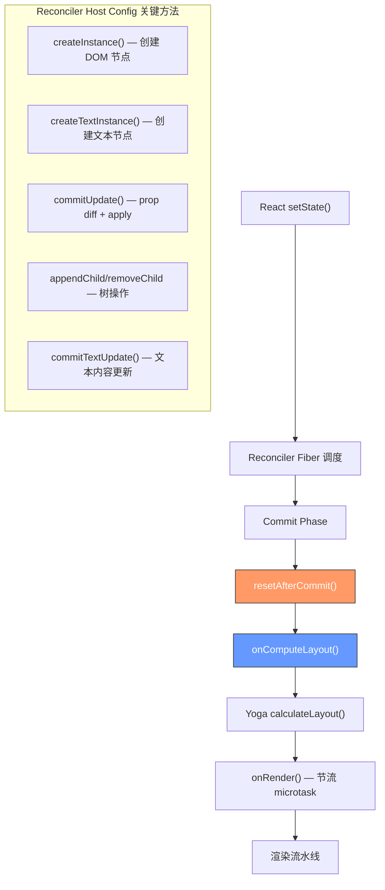
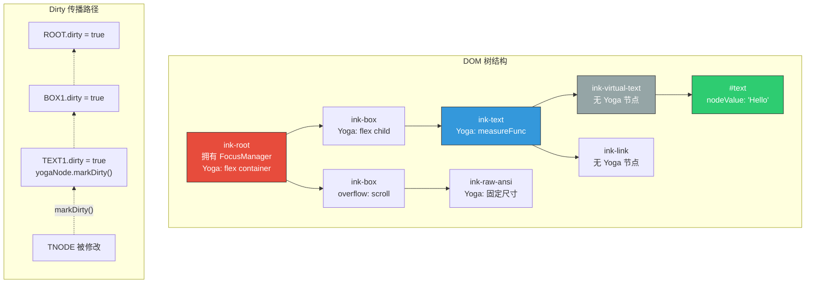

# 第16章：自定义终端渲染器

> *"任何足够复杂的 CLI 应用程序都包含一个临时的、不完整的、充满 bug 的、缓慢的终端 GUI 框架的半成品实现。"*
>
> Claude Code 团队选择了不同的路径：他们 fork 了 Ink，然后将其重建为一个真正的终端显示服务器。

---

## 16.1 为什么需要自定义 Ink？

Ink 是一个基于 React 的终端渲染库，允许开发者用 JSX 描述终端界面。对于简单的 CLI 工具来说，原版 Ink 完全够用。但 Claude Code 不是简单的 CLI 工具——它是一个全屏交互式应用程序，拥有滚动视图、文本选择、鼠标追踪、搜索高亮和硬件滚动能力。原版 Ink 的局限性在多个维度上浮现：

**逐行字符串渲染**。原版 Ink 的输出单元是字符串行——每帧重新生成完整的输出字符串，然后与上一帧逐行比较。这对于 200x120 的终端意味着每帧分配和比较 24,000+ 个字符串对象，GC 压力极大。

**无 cell 级别的 diff**。当一行中间的一个字符变化时，原版 Ink 必须重写整行。对于 Claude Code 的 streaming token 显示场景——每 50ms 有新字符追加——这意味着大量不必要的终端写入和可见闪烁。

**缺少双缓冲**。没有 front/back frame buffer 的概念，无法实现无闪烁更新。

**不支持替代屏幕模式下的高级功能**。硬件滚动（DECSTBM）、鼠标追踪、Kitty keyboard protocol、同步输出等现代终端功能完全缺失。

**无选择和搜索系统**。文本选择需要在 screen buffer 上做 hit testing 和 overlay 渲染——这要求框架了解每个 cell 的精确位置和样式。

Claude Code 团队的解决方案是将 Ink 重建为一个完整的终端显示引擎：packed array screen buffer 替代字符串、cell 级 diff 替代行级比较、双缓冲 frame 管理、DOM-like 事件系统和硬件滚动支持。核心代码量从原版 Ink 的约 2,000 行膨胀到超过 10,000 行，涵盖 25+ 个文件。

### Ink 引擎核心类

一切的中心是 `Ink` 类——每个 stdout 流只实例化一次。它拥有 reconciler container、DOM root、frame buffer、object pool 和完整的渲染流水线：

```typescript
export default class Ink {
  private readonly terminal: Terminal;
  private readonly container: FiberRoot;
  private rootNode: dom.DOMElement;
  private renderer: Renderer;
  private readonly stylePool: StylePool;
  private charPool: CharPool;
  private hyperlinkPool: HyperlinkPool;
  private frontFrame: Frame;
  private backFrame: Frame;
  private scheduleRender: (() => void) & { cancel?: () => void };
  private isUnmounted = false;
  private isPaused = false;
}
```

构造函数按严格顺序执行 14 个初始化步骤：

1. 拦截 `console.log/error`，重定向到 debug log（防止 alt screen 被污染）
2. 创建 `Terminal` 句柄，包装 stdout/stderr
3. 从 `stdout.columns/rows` 读取终端尺寸（fallback 80x24）
4. 实例化共享 pool：`StylePool`、`CharPool`、`HyperlinkPool`
5. 通过 `emptyFrame()` 分配 front 和 back frame buffer
6. 创建 `LogUpdate` diff 引擎
7. 构建节流渲染调度器（microtask + throttle，leading + trailing edge）
8. 注册 `signal-exit` handler，确保进程退出时清理终端状态
9. 在 TTY stdout 上监听 `resize` 和 `SIGCONT` 事件
10. 创建 root DOM 节点（`ink-root`），挂载 Yoga layout 节点
11. 创建 `FocusManager`
12. 通过 `createRenderer()` 创建渲染函数
13. 将 `onRender` 和 `onComputeLayout` 回调绑定到 root 节点
14. 以 `ConcurrentRoot` 模式创建 React reconciler container

这个初始化序列体现了一个核心设计原则：**渲染引擎对终端的完全控制**。从拦截 console 输出到注册进程退出回调，引擎确保在其生命周期内对终端状态拥有独占权。

---

## 16.2 React Reconciler Host Config 实现

Claude Code 的终端 UI 运行在一个自定义的 React reconciler 之上。这不是使用 `react-dom`——而是通过 `react-reconciler` 包提供的 host config 接口，将 React 的 fiber 树连接到自定义的终端 DOM。

### 类型参数

Reconciler 通过泛型参数定义了终端 DOM 的类型系统：

```typescript
const reconciler = createReconciler<
  ElementNames,    // 7 种元素类型
  Props,           // Record<string, unknown>
  DOMElement,      // Container 和 Instance 相同
  DOMElement,      // Instance
  TextNode,        // 文本节点
  DOMElement,      // SuspenseInstance
  unknown,         // HydratableInstance（不使用）
  unknown,         // PublicInstance
  DOMElement,      // HostContext
  HostContext,     // { isInsideText: boolean }
  null,            // UpdatePayload（React 19 不使用）
  NodeJS.Timeout,  // TimeoutHandle
  -1,              // NoTimeout
  null             // TransitionStatus
>({...})
```

### 关键方法

**createInstance** —— 创建 DOM 节点。这里有一个巧妙的设计：当 `ink-text` 嵌套在另一个 text context 内部时，自动降级为 `ink-virtual-text`：

```typescript
createInstance(originalType, newProps, _root, hostContext, internalHandle) {
  const type = originalType === 'ink-text' && hostContext.isInsideText
    ? 'ink-virtual-text' : originalType;
  const node = createNode(type);
  for (const [key, value] of Object.entries(newProps)) {
    applyProp(node, key, value);
  }
  return node;
}
```

**createTextInstance** —— 强制文本必须在 `<Text>` 内部：

```typescript
createTextInstance(text, _root, hostContext) {
  if (!hostContext.isInsideText) {
    throw new Error(`Text string "${text}" must be rendered inside <Text>`);
  }
  return createTextNode(text);
}
```

**commitUpdate** —— React 19 的 prop 更新方式，不使用 updatePayload：

```typescript
commitUpdate(node, _type, oldProps, newProps) {
  const props = diff(oldProps, newProps);
  const style = diff(oldProps.style, newProps.style);
  if (props) {
    for (const [key, value] of Object.entries(props)) {
      if (key === 'style') { setStyle(node, value); continue; }
      if (key === 'textStyles') { setTextStyles(node, value); continue; }
      if (EVENT_HANDLER_PROPS.has(key)) { setEventHandler(node, key, value); continue; }
      setAttribute(node, key, value);
    }
  }
  if (style && node.yogaNode) {
    applyStyles(node.yogaNode, style, newProps.style);
  }
}
```

**resetAfterCommit** —— 连接 React commit 和渲染流水线的关键枢纽：

```typescript
resetAfterCommit(rootNode) {
  // 1. 在 React commit 阶段计算 Yoga 布局
  if (typeof rootNode.onComputeLayout === 'function') {
    rootNode.onComputeLayout();
  }
  // 2. 调度节流渲染
  rootNode.onRender?.();
}
```

**事件优先级集成** —— Reconciler 通过 Dispatcher 获取更新优先级信息：

```typescript
getCurrentUpdatePriority: () => dispatcher.currentUpdatePriority,
setCurrentUpdatePriority(p) { dispatcher.currentUpdatePriority = p; },
resolveUpdatePriority(): number { return dispatcher.resolveEventPriority(); },
```

键盘和点击事件被标记为 `DiscreteEventPriority`（同步、立即处理），而 resize 和 scroll 事件使用 `ContinuousEventPriority`（批量处理）。



---

## 16.3 DOM 实现

### 节点类型

Claude Code 的终端 DOM 定义了 7 种元素类型和 1 种文本节点。每种类型在布局和渲染中扮演不同角色：

| 元素类型 | 用途 | 是否拥有 Yoga 节点 |
|---------|------|:--:|
| `ink-root` | 文档根节点，拥有 FocusManager | 是 |
| `ink-box` | Flex 容器，类似 `<div>` | 是 |
| `ink-text` | 文本容器，拥有 Yoga measure 函数 | 是 |
| `ink-virtual-text` | 嵌套文本，无独立布局 | 否 |
| `ink-link` | 超链接包装器 | 否 |
| `ink-progress` | 进度指示器 | 否 |
| `ink-raw-ansi` | 预渲染的 ANSI 内容 | 是 |

### DOMElement 结构

```typescript
export type DOMElement = {
  nodeName: ElementNames;
  attributes: Record<string, DOMNodeAttribute>;
  childNodes: DOMNode[];
  parentNode: DOMElement | undefined;
  yogaNode?: LayoutNode;
  style: Styles;
  dirty: boolean;
  // 滚动状态
  scrollTop?: number;
  pendingScrollDelta?: number;
  scrollHeight?: number;
  stickyScroll?: boolean;
  // 事件处理器
  _eventHandlers?: Record<string, unknown>;
  // 渲染回调
  onComputeLayout?: () => void;
  onRender?: () => void;
}
```

### 节点创建与 Yoga 节点选择性挂载

并非所有 DOM 节点都需要 Yoga layout 节点。`ink-virtual-text`、`ink-link` 和 `ink-progress` 共享父节点的布局——它们是纯逻辑容器：

```typescript
export const createNode = (nodeName: ElementNames): DOMElement => {
  const needsYogaNode =
    nodeName !== 'ink-virtual-text' &&
    nodeName !== 'ink-link' &&
    nodeName !== 'ink-progress';
  const node: DOMElement = {
    nodeName, style: {}, attributes: {}, childNodes: [],
    parentNode: undefined,
    yogaNode: needsYogaNode ? createLayoutNode() : undefined,
    dirty: false,
  };
  if (nodeName === 'ink-text') {
    node.yogaNode?.setMeasureFunc(measureTextNode.bind(null, node));
  }
  return node;
};
```

### Dirty 传播

当任何节点被修改时，dirty 标记从修改点向上冒泡到根节点。遇到第一个 `ink-text` 或 `ink-raw-ansi` 节点时，同时标记其 Yoga 节点为 dirty，触发重新测量：

```typescript
export const markDirty = (node?: DOMNode): void => {
  let current: DOMNode | undefined = node;
  let markedYoga = false;
  while (current) {
    if (current.nodeName !== '#text') {
      (current as DOMElement).dirty = true;
      if (!markedYoga && (current.nodeName === 'ink-text' ||
          current.nodeName === 'ink-raw-ansi') && current.yogaNode) {
        current.yogaNode.markDirty();
        markedYoga = true;
      }
    }
    current = current.parentNode;
  }
};
```

这里有一个性能关键的设计：**attribute setter 在值未变化时跳过 dirty 标记**。Event handler 的 identity 变化（React 每次 re-render 都会产生新函数引用）被存储在独立的 `_eventHandlers` 中，不会触发 dirty，从而不会破坏 blit 优化。



---

## 16.4 渲染流水线：从 React 树到终端像素

这是整个框架最核心的部分。一次完整的渲染经历 7 个阶段，将 React 组件树转化为终端上的可见像素。

### 阶段 1：React Commit

React 的 reconciler 完成 fiber diff 后，调用 host config 方法应用变更——`appendChild`、`removeChild`、`commitUpdate`、`commitTextUpdate`。每个变更操作通过 `markDirty()` 标记受影响的节点。

### 阶段 2：Yoga 布局计算

在 `resetAfterCommit` 中，立即执行 Yoga 布局：

```typescript
this.rootNode.onComputeLayout = () => {
  this.rootNode.yogaNode.setWidth(this.terminalColumns);
  this.rootNode.yogaNode.calculateLayout(this.terminalColumns);
};
```

Yoga（编译为 WASM）执行完整的 Flexbox 布局算法。`ink-text` 节点的 measure function 在此阶段被调用，计算文本的自然宽高。

### 阶段 3：DOM 树遍历与 Screen Buffer 生成

`renderNodeToOutput()` 深度遍历 DOM 树，将每个节点渲染到 `Output` 操作队列中。这里有一个关键的 **blit 优化**——如果节点未标记为 dirty 且位置未变化，直接从上一帧的 screen buffer 复制 cell 数据：

```typescript
if (!node.dirty && cached &&
    cached.x === x && cached.y === y &&
    cached.width === width && cached.height === height && prevScreen) {
  output.blit(prevScreen, fx, fy, fw, fh);
  return;  // 跳过整个子树
}
```

这是整个系统中最重要的单一优化。在稳态帧中（比如 spinner 转动、时钟更新），只有 dirty 节点的 cell 被重新渲染，其他所有节点通过 `TypedArray.set()` 批量复制。

### 阶段 4：Output 操作队列与 Screen Buffer

`renderNodeToOutput()` 不直接写入 screen buffer，而是将操作收集到一个 `Output` 队列中。这个队列支持 7 种操作类型：

```typescript
export type Operation =
  | WriteOperation    // 在 (x, y) 写入 ANSI 文本
  | ClipOperation     // 推入 clip 矩形
  | UnclipOperation   // 弹出 clip 矩形
  | BlitOperation     // 从另一个 screen 复制 cell
  | ClearOperation    // 清零矩形区域
  | NoSelectOperation // 标记 cell 为不可选择
  | ShiftOperation    // 移动行（用于硬件滚动）
```

`Output.get()` 方法通过两遍处理将操作队列转化为最终的 Screen：

- **Clear pass**：展开 damage 区域以覆盖 clear 操作；收集绝对定位元素的 clear
- **Main pass**：处理 write/blit/clip/shift 操作，支持嵌套 clip 矩形交集

**Clip 交集**防止嵌套的 `overflow: hidden` 容器写入到祖先 clip 区域之外：

```typescript
function intersectClip(parent: Clip | undefined, child: Clip): Clip {
  if (!parent) return child;
  return {
    x1: maxDefined(parent.x1, child.x1),
    x2: minDefined(parent.x2, child.x2),
    y1: maxDefined(parent.y1, child.y1),
    y2: minDefined(parent.y2, child.y2),
  };
}
```

操作队列最终 flush 到 packed `Int32Array` screen buffer：

```typescript
export type Screen = {
  cells: Int32Array;      // 每 cell 2 个 Int32: [charId, packed(styleId|hyperlinkId|width)]
  cells64: BigInt64Array; // 同一 buffer 的 64-bit 视图，用于批量填充
  charPool: CharPool;     // 字符串 interning
  damage: Rectangle;      // 写入区域的 bounding box
}
```

每个 cell 用 2 个 Int32 表示。Word 1 是 `charId`（通过 CharPool intern），word 2 的位布局：

```
Bits [31:17] = styleId   (15 bits, 最多 32767 种样式)
Bits [16:2]  = hyperlinkId (15 bits)
Bits [1:0]   = width     (2 bits: Narrow=0, Wide=1, SpacerTail=2, SpacerHead=3)
```

200x120 的终端有 24,000 个 cell。使用 `Int32Array` 而非对象数组消除了 24,000+ 个 JS 对象的 GC 开销。

### 阶段 5：Overlay 应用

Selection overlay 和 search highlight 在 diff 之前直接修改 screen buffer 中的 cell style：

```typescript
// 选择高亮：反转选中区域的背景色
applySelectionOverlay(screen, selection, stylePool);
// 搜索高亮：所有匹配项反色，当前匹配项黄色+粗体
applySearchHighlight(screen, matches, currentMatch, stylePool);
```

### 阶段 6：Diff 与 VirtualScreen 光标追踪

`LogUpdate.render()` 对比前后两帧，生成最小的 patch 列表。diff 引擎通过 `VirtualScreen` 类跟踪虚拟光标位置，计算最短的相对光标移动路径：

```typescript
class VirtualScreen {
  cursor: Point;
  diff: Diff = [];
  readonly viewportWidth: number;

  txn(fn: (prev: Point) => [patches: Diff, next: Delta]): void {
    const [patches, next] = fn(this.cursor);
    for (const patch of patches) this.diff.push(patch);
    this.cursor.x += next.dx;
    this.cursor.y += next.dy;
  }
}
```

cell 级 diff 的核心逻辑：

```typescript
diffEach(prev.screen, next.screen, (x, y, removed, added) => {
  moveCursorTo(screen, x, y);
  if (added) {
    const styleStr = stylePool.transition(currentStyleId, added.styleId);
    writeCellWithStyleStr(screen, added, styleStr);
  } else if (removed) {
    // 用空格清除
  }
});
```

`StylePool.transition()` 缓存任意两个 style ID 之间的 ANSI 转换序列，避免重复计算：

```typescript
transition(fromId: number, toId: number): string {
  if (fromId === toId) return '';
  const key = fromId * 0x100000 + toId;
  let str = this.transitionCache.get(key);
  if (str === undefined) {
    str = ansiCodesToString(diffAnsiCodes(this.get(fromId), this.get(toId)));
    this.transitionCache.set(key, str);
  }
  return str;
}
```

diff 引擎必须处理宽字符（emoji、CJK 字符）的特殊情况。终端的 wcwidth 实现可能与 Unicode 标准不一致，导致光标位置偏移。引擎通过宽度补偿解决这个问题：

```typescript
function writeCellWithStyleStr(screen, cell, styleStr): boolean {
  const needsCompensation = cellWidth === 2 && needsWidthCompensation(cell.char);
  if (needsCompensation && px + 1 < vw) {
    // 在 x+1 写入空格（覆盖旧终端上的间隙）
    diff.push({ type: 'cursorTo', col: px + 2 });
    diff.push({ type: 'stdout', content: ' ' });
    diff.push({ type: 'cursorTo', col: px + 1 });
  }
  diff.push({ type: 'stdout', content: cell.char });
  return true;
}
```

### 阶段 7：终端写入

优化器合并相邻的 stdout patch，减少系统调用次数。然后 `writeDiffToTerminal()` 将最终的 ANSI 序列写入 stdout。在 alt screen 模式下，使用绝对定位（`CSI H`）；在 main screen 模式下，使用相对光标移动——因为绝对定位无法到达 scrollback 中的行。

```mermaid
flowchart LR
    A["React 树<br/>Fiber Commit"] --> B["Yoga 布局<br/>calculateLayout()"]
    B --> C["DOM 遍历<br/>renderNodeToOutput()"]
    C --> D["Screen Buffer<br/>packed Int32Array"]
    D --> E["Overlay<br/>Selection + Search"]
    E --> F["Diff Engine<br/>cell 级比较"]
    F --> G["Terminal Write<br/>ANSI 序列"]

    style A fill:#e74c3c,stroke:#333,color:#fff
    style B fill:#e67e22,stroke:#333,color:#fff
    style C fill:#f1c40f,stroke:#333,color:#000
    style D fill:#2ecc71,stroke:#333,color:#fff
    style E fill:#3498db,stroke:#333,color:#fff
    style F fill:#9b59b6,stroke:#333,color:#fff
    style G fill:#1abc9c,stroke:#333,color:#fff
```



---

## 16.5 Frame 管理：双缓冲与无闪烁更新

### 双缓冲架构

引擎维护两个 Frame：

- **frontFrame**：当前终端上可见的内容
- **backFrame**：上一帧，被复用为下一次渲染的写入目标

```typescript
export default class Ink {
  private frontFrame: Frame;
  private backFrame: Frame;
  // ...
}
```

每个 Frame 包含：

```typescript
type Frame = {
  screen: Screen;              // cell buffer
  viewport: { width, height }; // 终端尺寸
  cursor: { x, y, visible };   // 逻辑光标位置
}
```

渲染完成后，帧交换：

```typescript
this.backFrame = this.frontFrame;
this.frontFrame = frame;
```

### onRender 的 15 个阶段

`onRender` 是主帧函数，协调从 screen buffer 生成到终端写入的所有工作。其内部按固定顺序执行 15 个阶段：

1. **Guard**：跳过 unmounted 或 paused 状态；取消 pending drain timer
2. **Flush interaction time**：将每次按键的时间更新合并为每帧一次
3. **Render**：调用 `this.renderer()`，执行 `renderNodeToOutput()` 生成 Frame
4. **Follow-scroll compensation**：在 sticky scroll 模式下，平移选择端点以跟踪内容
5. **Selection overlay**：对选中区域的 cell 应用反转样式
6. **Search highlight**：所有匹配项应用 inverse；当前匹配项应用黄色+粗体
7. **Full-damage backstop**：如果布局偏移、选择激活或 `prevFrameContaminated`，扩展 damage 到全屏
8. **Diff**：调用 `this.log.render(prevFrame, nextFrame)` 生成 `Diff[]` patch 列表
9. **Buffer swap**：交换 front/back frame
10. **Pool reset**：每 5 分钟替换 CharPool/HyperlinkPool
11. **Optimize**：合并相邻的 stdout patch
12. **Cursor positioning**：alt screen 发出 `CSI H`；main screen 计算相对移动
13. **Write**：调用 `writeDiffToTerminal()` flush patch 到 stdout
14. **Drain scheduling**：如果 `scrollDrainPending`，以四分之一间隔调度下一帧
15. **Telemetry**：触发 `onFrame` 回调，附带各阶段耗时

### 节流调度

渲染不是同步触发的，而是通过 microtask + throttle 调度：

```typescript
const deferredRender = (): void => queueMicrotask(this.onRender);
this.scheduleRender = throttle(deferredRender, FRAME_INTERVAL_MS, {
  leading: true, trailing: true
});
```

`leading: true` 确保第一个变更立即渲染（低延迟响应）；`trailing: true` 确保最后一个变更不会丢失。滚动 drain 帧使用 `FRAME_INTERVAL_MS >> 2`（四分之一间隔）以实现更流畅的滚动动画。

### 全屏 Damage 回退

在某些情况下，差分更新不安全，引擎会回退到全屏重绘：

- 终端尺寸变化
- 内容从超过 viewport 高度缩小到 viewport 内
- 选择状态活跃时的布局偏移
- scrollback 中不可达行的变更

```typescript
if (layoutShifted || selectionActive || this.prevFrameContaminated) {
  // 扩展 damage 到全屏
}
```

---

## 16.6 终端能力检测

Claude Code 运行在数十种终端模拟器上——从 macOS Terminal.app 到 VS Code 集成终端，从 iTerm2 到 Kitty，从 tmux 内到原生 SSH。每种终端支持不同的能力集。

### 检测机制

引擎通过多种信号探测终端能力：

**TERM_PROGRAM 环境变量**：直接标识终端：
- `vscode` → VS Code 集成终端（xterm.js）
- `iTerm.app` → iTerm2
- `WezTerm` → WezTerm
- `tmux` → tmux 内部

**CSI 查询序列**：发送 escape sequence 并解析终端响应：
- DA1/DA2（Device Attributes）：识别终端 VT 能力级别
- DECRPM（DEC Private Mode Report）：查询特定模式是否受支持
- XTVERSION：获取终端名称和版本

```typescript
export type TerminalResponse =
  | { type: 'decrpm'; mode: number; status: number }
  | { type: 'da1'; params: number[] }
  | { type: 'da2'; params: number[] }
  | { type: 'kittyKeyboard'; flags: number }
  | { type: 'xtversion'; name: string }
```

### Kitty Keyboard Protocol

传统终端键盘输入使用 VT100 序列，无法区分 `Ctrl+I` 和 `Tab`，也无法报告 key release 事件。Kitty keyboard protocol（CSI u 模式）解决了这些问题：

```
ESC [ codepoint ; modifier u
```

引擎在检测到支持后启用此协议，获得完整的修饰键信息和精确的按键标识。

### 超链接支持

OSC 8 超链接允许终端中的可点击链接。引擎通过 `HyperlinkPool` 管理链接 ID，在 diff 阶段生成正确的 OSC 8 转义序列。

### 键盘解析

键盘输入的解析是终端能力检测的下游消费者。引擎使用流式 tokenizer 处理 stdin 字节流，支持多种编码格式：

- **CSI 序列**：方向键、功能键、修饰键组合
- **CSI u（Kitty keyboard protocol）**：`ESC [ codepoint [; modifier] u`
- **modifyOtherKeys**：`ESC [ 27 ; modifier ; keycode ~`
- **SGR mouse events**：`ESC [ < button ; col ; row M/m`
- **终端响应**：DECRPM、DA1、DA2、XTVERSION、cursor position、OSC
- **Bracketed paste**：`ESC [200~` ... `ESC [201~`

解析结果的 `key` 属性遵循浏览器约定：单个可打印字符（`'a'`、`'3'`、`' '`）或多字符特殊键名（`'down'`、`'return'`）。判断可打印字符的惯用方式是 `e.key.length === 1`。

### 同步输出

Synchronized output（BSU/ESU）在一对标记之间批量发送所有更新，终端在收到 ESU 后一次性渲染——消除了部分更新导致的撕裂。这对于大面积更新尤为重要：没有 BSU/ESU 时，终端可能在收到一半的 ANSI 序列后就刷新显示，导致用户看到中间状态。

### Color Level 适配

```typescript
boostChalkLevelForXtermJs();  // VS Code: level 2 → 3（启用 truecolor）
clampChalkLevelForTmux();     // tmux: level 3 → 2（降级到 256 色）
```

---

## 16.7 终端模式

### Main Screen vs Alt Screen

引擎管理两种截然不同的显示模式：

**Main Screen**（默认模式）：内容自然滚动。光标跟踪内容底部。帧高度可以超过 viewport，将行推入 scrollback。diff 使用相对光标移动，因为绝对定位无法到达 scrollback 中的行。

**Alt Screen**（全屏模式）：通过 `<AlternateScreen>` 组件激活（DEC private mode 1049h）。内容锁定在 viewport 内。每帧从 `CSI H`（cursor home）开始，所有移动使用绝对定位。DECSTBM 硬件滚动可用。

```typescript
setAltScreenActive(active: boolean, mouseTracking = false): void {
  if (this.altScreenActive === active) return;
  this.altScreenActive = active;
  if (active) {
    this.resetFramesForAltScreen();
  } else {
    this.repaint();
  }
}
```

### 硬件滚动

在 alt screen 模式下，当检测到内容需要整体滚动时，引擎利用 DECSTBM（Set Top and Bottom Margins）让终端执行硬件滚动，而非逐 cell 重绘：

```typescript
if (altScreen && next.scrollHint && decstbmSafe) {
  const { top, bottom, delta } = next.scrollHint;
  shiftRows(prev.screen, top, bottom, delta);
  scrollPatch = [{
    type: 'stdout',
    content: setScrollRegion(top + 1, bottom + 1) +
      (delta > 0 ? csiScrollUp(delta) : csiScrollDown(-delta)) +
      RESET_SCROLL_REGION + CURSOR_HOME,
  }];
}
```

### Raw Mode 和鼠标追踪

进入 alt screen 时，终端被设为 raw mode：禁用行缓冲、回显和信号处理（Ctrl+C 不再直接杀进程）。鼠标追踪通过 SGR 模式启用，引擎解析 `ESC [ < button ; col ; row M/m` 序列以获取精确的鼠标位置。

### 挂起与恢复

当用户通过 `Ctrl+Z` 挂起进程后又恢复时（`SIGCONT`），引擎执行完整的状态恢复：

1. 如果之前在 alt screen 模式，重新进入 alt screen
2. 重新启用鼠标追踪
3. 重置 frame buffer 为空白（强制全屏重绘）
4. 触发完整 repaint

```typescript
// SIGCONT handler
stdout.on('resume', () => {
  if (this.altScreenActive) {
    this.resetFramesForAltScreen();
  }
  this.prevFrameContaminated = true;
  this.scheduleRender();
});
```

### Resize 处理

终端 resize 是同步处理的（不做 debounce），因为 resize 后的第一帧必须立即适应新尺寸：

1. 更新 `terminalColumns` / `terminalRows`
2. 重新启用鼠标追踪（某些终端在 resize 后丢失追踪状态）
3. 重置 frame buffer（`prevFrameContaminated = true`）
4. 延迟清屏到下一个原子 BSU/ESU 块
5. 重新渲染 React 树

---

## 16.8 性能优化总览

这套架构的性能设计贯穿每个层面：

| 优化技术 | 影响范围 | 机制 |
|---------|---------|------|
| Packed `Int32Array` Screen | 内存 + GC | 消除 24,000+ 个 cell 对象 |
| CharPool ASCII 快速路径 | CPU | `Int32Array[128]` 直接查表，O(1) |
| StylePool 转换缓存 | CPU | 任意两个 style 间的 ANSI diff 只计算一次 |
| Blit 优化 | CPU + 带宽 | 未修改节点直接从上一帧复制 |
| Damage tracking | CPU | Diff 只遍历被写入的 bounding box 内的 cell |
| DECSTBM 硬件滚动 | 带宽 | 终端执行行移动，引擎只更新变化的行 |
| 行级 charCache | CPU | 未变化的文本行跳过 tokenize 和 grapheme clustering |
| Pool 定期重置 | 内存 | 每 5 分钟替换 CharPool/HyperlinkPool，防止无限增长 |

**宽度计算**是一个容易被忽略但性能影响极大的热路径。终端中每个字符占据的列数不同——ASCII 字符占 1 列，CJK 字符和大多数 emoji 占 2 列，零宽连接符（ZWJ）和变体选择符占 0 列。引擎优先使用 Bun 的原生 `stringWidth`（单次 C++ 调用），回退到 JavaScript 实现：

```typescript
export const stringWidth = bunStringWidth
  ? str => bunStringWidth(str, { ambiguousIsNarrow: true })
  : stringWidthJavaScript;

function stringWidthJavaScript(str: string): number {
  // 快速路径 1：纯 ASCII（无 ANSI、无宽字符）
  // 快速路径 2：简单 Unicode（无 emoji/变体选择符）
  // 慢路径：grapheme segmentation + emoji 检测
}
```

**charCache（行级缓存）** 避免对未变化的文本行重复执行 tokenize 和 grapheme clustering：

```typescript
function writeLineToScreen(screen, line, x, y, screenWidth, stylePool, charCache) {
  let characters = charCache.get(line);
  if (!characters) {
    characters = reorderBidi(
      styledCharsWithGraphemeClustering(
        styledCharsFromTokens(tokenize(line)), stylePool));
    charCache.set(line, characters);
  }
  // 写入 cell 到 screen
}
```

缓存在帧之间持久化，当条目超过 16384 个时被清除。

这些优化的综合效果是：在典型的 streaming 显示场景中，每帧只有少量 cell 被重新渲染和 diff，终端写入量维持在最低水平。即使在 200 列 x 120 行的大终端上，每帧处理时间也保持在毫秒级别。

---

## 16.9 小结

Claude Code 的终端渲染器展示了一个精心设计的分层架构：React reconciler 管理组件生命周期和状态，自定义 DOM 提供布局和事件模型，Yoga WASM 执行 Flexbox 布局，packed array screen buffer 存储帧数据，cell 级 diff 引擎生成最小更新，终端能力检测确保跨平台兼容。

这不仅仅是一个 "更好的 Ink"。这是一个完整的终端显示服务器——没有 GPU，但有 double buffering；没有像素，但有 packed cell array；没有 compositor，但有 damage-tracking diff engine。它将 Unix 终端从一个字符流设备转化为一个可编程的显示表面，让 React 组件能够以接近原生终端应用的性能和视觉质量运行。
