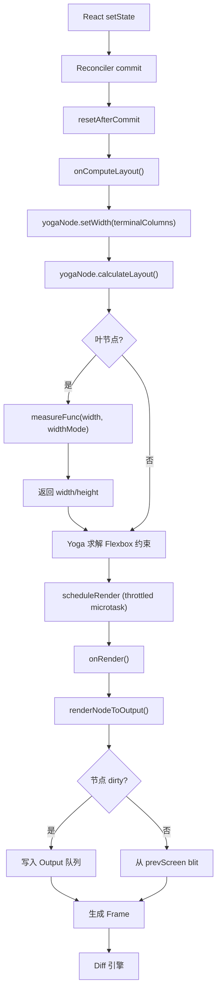
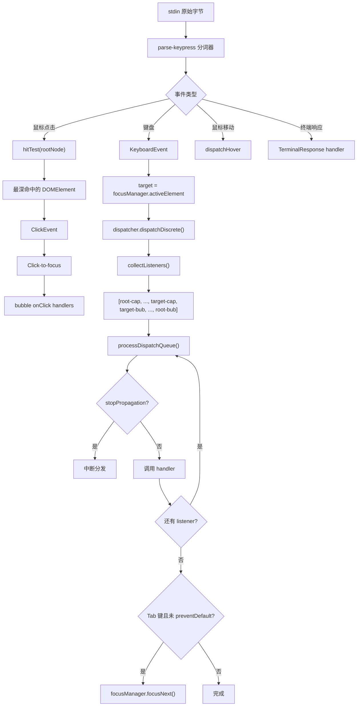
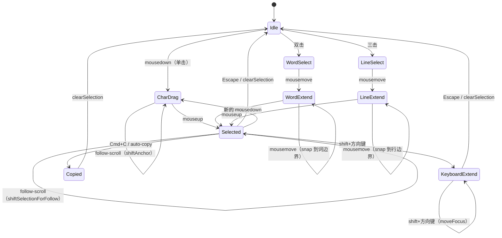

# 第十七章：布局引擎与事件系统

> 终端不是浏览器，但 Claude Code 把它当浏览器来用——Yoga 计算 Flexbox 布局，capture/bubble 分发事件，状态机管理文本选择。这套架构把一个朴素的 TTY 流变成了一个无 GPU 的显示服务器。

## 17.1 Yoga 布局引擎集成

### 从 CSS Flexbox 到终端网格

浏览器的布局引擎面对的是像素级渲染，而终端的最小寻址单元是字符单元格（cell）。Claude Code 选择 Facebook 的 Yoga 引擎——一个跨平台 Flexbox 实现——作为布局核心。Yoga 通过 WebAssembly 编译运行在 Node.js 中，为每个 DOM 节点提供精确到字符单元格的定位计算。

这个选择带来了显著的架构优势：React 组件可以直接使用 `flexDirection`、`alignItems`、`justifyContent` 等属性声明布局意图，Yoga 负责将这些约束求解为具体的 `(x, y, width, height)` 坐标。

### 53 方法的适配器接口

布局引擎通过 `LayoutNode` 接口与上层解耦。这个接口定义了 53 个方法，覆盖了树管理、布局计算、结果查询和样式设置四个维度：

```typescript
export type LayoutNode = {
  // 树管理
  insertChild(child: LayoutNode, index: number): void;
  removeChild(child: LayoutNode): void;
  getChildCount(): number;
  getParent(): LayoutNode | null;

  // 布局计算
  calculateLayout(width?: number, height?: number): void;
  setMeasureFunc(fn: LayoutMeasureFunc): void;
  markDirty(): void;

  // 布局结果查询
  getComputedLeft(): number;
  getComputedTop(): number;
  getComputedWidth(): number;
  getComputedHeight(): number;
  getComputedBorder(edge: LayoutEdge): number;
  getComputedPadding(edge: LayoutEdge): number;

  // 样式设置（50+ 方法）
  setWidth(value: number): void;
  setFlexDirection(dir: LayoutFlexDirection): void;
  setDisplay(display: LayoutDisplay): void;
  setOverflow(overflow: LayoutOverflow): void;
  setPositionPercent(edge: LayoutEdge, value: number): void;
  // ... 更多样式 setter
};
```

`createLayoutNode()` 工厂函数将调用委托给 `createYogaLayoutNode()`，后者创建 WASM 支持的 Yoga 节点实例。这层抽象的关键价值在于：如果将来需要替换布局引擎（比如换成 Taffy），只需提供新的 `LayoutNode` 实现，上层代码无需改动。

### 节点类型与 Yoga 节点分配

并非所有 DOM 节点都需要独立的 Yoga 节点。系统对七种节点类型做了精确区分：

```typescript
export const createNode = (nodeName: ElementNames): DOMElement => {
  const needsYogaNode =
    nodeName !== 'ink-virtual-text' &&
    nodeName !== 'ink-link' &&
    nodeName !== 'ink-progress';

  const node: DOMElement = {
    nodeName, style: {}, attributes: {}, childNodes: [],
    parentNode: undefined,
    yogaNode: needsYogaNode ? createLayoutNode() : undefined,
    dirty: false,
  };

  if (nodeName === 'ink-text') {
    node.yogaNode?.setMeasureFunc(measureTextNode.bind(null, node));
  } else if (nodeName === 'ink-raw-ansi') {
    node.yogaNode?.setMeasureFunc(measureRawAnsiNode.bind(null, node));
  }
  return node;
};
```

`ink-virtual-text`、`ink-link` 和 `ink-progress` 共享父节点的 Yoga 节点，不参与独立布局计算。`ink-text` 和 `ink-raw-ansi` 则注册 measure callback，让 Yoga 在布局时能够查询它们的自然尺寸。

## 17.2 布局计算与缓存

### Measure Callback 机制

Yoga 在 `calculateLayout()` 过程中遇到叶节点时，会调用该节点注册的 measure function 来获取其固有尺寸。对于文本节点，这个过程涉及文本测量和自动换行：

```typescript
const measureTextNode = function(node, width, widthMode) {
  const rawText = node.nodeName === '#text'
    ? node.nodeValue : squashTextNodes(node);
  const text = expandTabs(rawText);
  const dimensions = measureText(text, width);

  if (dimensions.width <= width) return dimensions;

  // 当 widthMode 为 Undefined 时，使用自然宽度
  if (text.includes('\n') && widthMode === LayoutMeasureMode.Undefined) {
    return measureText(text, Math.max(width, dimensions.width));
  }

  // 超宽文本需要换行后重新测量
  const textWrap = node.style?.textWrap ?? 'wrap';
  const wrappedText = wrapText(text, width, textWrap);
  return measureText(wrappedText, width);
};
```

Raw ANSI 节点的测量则极其简单——它们的尺寸是预知的：

```typescript
const measureRawAnsiNode = function(node) {
  return {
    width: node.attributes['rawWidth'] as number,
    height: node.attributes['rawHeight'] as number,
  };
};
```

### 脏标记传播与布局失效

当节点内容或样式变化时，系统需要通知 Yoga 重新计算。`markDirty()` 从变更节点向根节点回溯，沿途标记每个祖先为 dirty，并在遇到第一个文本或 raw-ansi 节点时调用其 Yoga 节点的 `markDirty()`：

```typescript
export const markDirty = (node?: DOMNode): void => {
  let current: DOMNode | undefined = node;
  let markedYoga = false;
  while (current) {
    if (current.nodeName !== '#text') {
      (current as DOMElement).dirty = true;
      if (!markedYoga && (current.nodeName === 'ink-text' ||
          current.nodeName === 'ink-raw-ansi') && current.yogaNode) {
        current.yogaNode.markDirty();
        markedYoga = true;
      }
    }
    current = current.parentNode;
  }
};
```

属性和样式的 setter 会做值比较来避免不必要的脏标记。事件处理器存储在独立的 `_eventHandlers` 字段中，handler identity 的变化（React 重渲染时常见）不会触发脏标记，从而保护 blit 优化不被破坏。

### 布局计算流水线



`onComputeLayout` 在 React commit 阶段执行（在 layout effects 之前），确保 Yoga 的布局结果在 React 生命周期回调运行时已经可用。`calculateLayout()` 是同步的，对于典型的终端 UI 树（几十到几百个节点），耗时通常在亚毫秒级别。

## 17.3 差分更新系统

### LogUpdate 逐行差分

终端不是帧缓冲设备——它是一个字符流。更新屏幕的唯一方式是写入 ANSI 转义序列来移动光标并覆盖字符。`LogUpdate.render()` 方法比较前后两帧，生成最小的补丁列表：

```typescript
render(prev: Frame, next: Frame, altScreen = false, decstbmSafe = true): Diff
```

差分引擎的核心是 `diffEach()`，它逐单元格比较两个 Screen buffer：

```typescript
diffEach(prev.screen, next.screen, (x, y, removed, added) => {
  // 跳过 spacer cell（宽字符的尾随占位符）
  // 跳过不覆盖已有内容的空单元格
  moveCursorTo(screen, x, y);
  if (added) {
    transitionHyperlink(screen.diff, currentHyperlink, added.hyperlink);
    const styleStr = stylePool.transition(currentStyleId, added.styleId);
    writeCellWithStyleStr(screen, added, styleStr);
  } else if (removed) {
    // 用空格清除
  }
});
```

### DECSTBM 硬件滚动优化

在 Alt Screen 模式下，当内容整体上移或下移时，差分引擎利用终端的硬件滚动能力（DECSTBM——DEC Set Top and Bottom Margins）来避免重绘整个屏幕：

```typescript
if (altScreen && next.scrollHint && decstbmSafe) {
  const { top, bottom, delta } = next.scrollHint;
  // 在内存中移动 prev.screen 的行以匹配终端的硬件滚动
  shiftRows(prev.screen, top, bottom, delta);
  scrollPatch = [{
    type: 'stdout',
    content: setScrollRegion(top + 1, bottom + 1) +
      (delta > 0 ? csiScrollUp(delta) : csiScrollDown(-delta)) +
      RESET_SCROLL_REGION + CURSOR_HOME,
  }];
}
```

硬件滚动只需要几个字节的控制序列就能移动整个区域的内容，终端模拟器在内部通过 GPU 纹理偏移或内存 memmove 来实现，远比逐单元格重绘高效。

### VirtualScreen 光标追踪

差分引擎维护一个虚拟光标来计算相对移动。这对 Main Screen 模式尤为关键——因为绝对定位无法到达已经滚入 scrollback 的行：

```typescript
class VirtualScreen {
  cursor: Point;
  diff: Diff = [];
  readonly viewportWidth: number;

  txn(fn: (prev: Point) => [patches: Diff, next: Delta]): void {
    const [patches, next] = fn(this.cursor);
    for (const patch of patches) this.diff.push(patch);
    this.cursor.x += next.dx;
    this.cursor.y += next.dy;
  }
}
```

### StylePool 过渡缓存

样式过渡（从一个 ANSI 样式切换到另一个）的计算结果被缓存，避免对相同的样式对重复计算 diff：

```typescript
transition(fromId: number, toId: number): string {
  if (fromId === toId) return '';
  const key = fromId * 0x100000 + toId;
  let str = this.transitionCache.get(key);
  if (str === undefined) {
    str = ansiCodesToString(diffAnsiCodes(this.get(fromId), this.get(toId)));
    this.transitionCache.set(key, str);
  }
  return str;
}
```

将两个 style ID 打包进一个 number 作为 Map key，比用字符串拼接 key 更高效——这是热路径上的关键优化。

## 17.4 事件系统：Capture/Bubble 阶段

### Dispatcher 引擎

事件系统的核心是 `Dispatcher` 类，它实现了与 DOM 标准一致的 capture/bubble 两阶段事件分发：

```typescript
export class Dispatcher {
  currentEvent: TerminalEvent | null = null;
  currentUpdatePriority: number = DefaultEventPriority;
  discreteUpdates: DiscreteUpdates | null = null;

  dispatch(target: EventTarget, event: TerminalEvent): boolean {
    const previousEvent = this.currentEvent;
    this.currentEvent = event;
    try {
      event._setTarget(target);
      const listeners = collectListeners(target, event);
      processDispatchQueue(listeners, event);
      return !event.defaultPrevented;
    } finally {
      this.currentEvent = previousEvent;
    }
  }

  dispatchDiscrete(target, event) {
    // 包装在 reconciler.discreteUpdates 中执行
  }
  dispatchContinuous(target, event) {
    // 设置 ContinuousEventPriority
  }
}
```

### Listener 收集算法

listener 的收集遵循 react-dom 的两阶段模式——从目标节点向根节点回溯，同时构建 capture（前插）和 bubble（后插）两个列表：

```typescript
function collectListeners(target, event): DispatchListener[] {
  const listeners: DispatchListener[] = [];
  let node = target;
  while (node) {
    const isTarget = node === target;
    const captureHandler = getHandler(node, event.type, true);
    const bubbleHandler = getHandler(node, event.type, false);

    if (captureHandler) {
      listeners.unshift({   // Capture: 前插（root 最先）
        node, handler: captureHandler,
        phase: isTarget ? 'at_target' : 'capturing',
      });
    }
    if (bubbleHandler && (event.bubbles || isTarget)) {
      listeners.push({      // Bubble: 后插（target 最先）
        node, handler: bubbleHandler,
        phase: isTarget ? 'at_target' : 'bubbling',
      });
    }
    node = node.parentNode;
  }
  return listeners;
}
```

最终列表的顺序：`[root-cap, ..., parent-cap, target-cap, target-bub, parent-bub, ..., root-bub]`。这与浏览器 DOM 事件流完全一致。

### 事件优先级映射

```typescript
function getEventPriority(eventType: string): number {
  switch (eventType) {
    case 'keydown': case 'keyup': case 'click':
    case 'focus': case 'blur': case 'paste':
      return DiscreteEventPriority;    // 同步，立即处理
    case 'resize': case 'scroll': case 'mousemove':
      return ContinuousEventPriority;  // 批量处理
    default:
      return DefaultEventPriority;
  }
}
```

优先级信息通过 `Dispatcher` 传递给 React reconciler，影响状态更新的调度策略。`DiscreteEventPriority` 对应用户的直接交互（按键、点击），需要同步刷新；`ContinuousEventPriority` 对应连续输入（滚动、鼠标移动），可以批量合并以减少渲染次数。

### 事件分发流程



## 17.5 键盘事件解析

### parse-keypress.ts 的复杂性

键盘解析器是整个 UI 框架中最复杂的单个模块（约 23K 行），因为它必须处理几十年终端仿真器积累下来的各种转义序列格式。解析器以流式分词器的形式实现，处理以下协议：

**CSI 序列**：传统的方向键、功能键和修饰符组合。例如 `ESC [ A` 表示上箭头，`ESC [ 1 ; 5 A` 表示 Ctrl+上箭头。

**Kitty 键盘协议（CSI u）**：现代终端的扩展协议，格式为 `ESC [ codepoint [; modifier] u`，能够区分按键按下和释放，支持完整的修饰键组合，解决了传统 CSI 序列无法表达的歧义（例如 Ctrl+i 与 Tab）。

**modifyOtherKeys**：格式 `ESC [ 27 ; modifier ; keycode ~`，xterm 扩展协议。

**SGR 鼠标事件**：`ESC [ < button ; col ; row M/m`，其中 `M` 表示按下，`m` 表示释放。

**Bracketed paste**：`ESC [200~` 开始，`ESC [201~` 结束，中间的内容作为粘贴文本而非按键序列。这对于防止粘贴内容中的控制字符被误解释至关重要。

**终端响应**：DECRPM、DA1、DA2、XTVERSION、光标位置报告、OSC 序列等。

解析器的输出是统一的 `ParsedKey` 结构：

```typescript
export type ParsedKey = {
  kind: 'key';
  name: string;           // 'a', 'return', 'escape', 'f1' 等
  fn: boolean;
  ctrl: boolean;
  meta: boolean;
  shift: boolean;
  option: boolean;
  super: boolean;
  sequence: string | undefined;
  raw: string | undefined;
  isPasted?: boolean;
}
```

`KeyboardEvent` 类将 `ParsedKey` 包装为标准事件对象，`key` 属性遵循浏览器约定：可打印字符为单字符（`'a'`、`'3'`），特殊键为多字符名称（`'down'`、`'return'`）。判断可打印字符的惯用方式是 `e.key.length === 1`。

## 17.6 鼠标事件与命中测试

### Hit Testing 算法

鼠标点击事件的处理需要将屏幕坐标映射到 DOM 节点。`hitTest()` 使用 `nodeCache`（由 `renderNodeToOutput` 填充的节点位置缓存）进行反向查找：

```typescript
export function hitTest(
  node: DOMElement, col: number, row: number
): DOMElement | null {
  const rect = nodeCache.get(node);
  if (!rect) return null;
  if (col < rect.x || col >= rect.x + rect.width ||
      row < rect.y || row >= rect.y + rect.height) return null;
  // 后绘制的兄弟节点覆盖先绘制的——反向遍历返回最上层命中
  for (let i = node.childNodes.length - 1; i >= 0; i--) {
    const child = node.childNodes[i]!;
    if (child.nodeName === '#text') continue;
    const hit = hitTest(child, col, row);
    if (hit) return hit;
  }
  return node;
}
```

反向遍历子节点是一个关键细节——它确保视觉上位于顶层的元素（后绘制的兄弟节点）优先被命中，与浏览器的 z-order 行为一致。

### ClickEvent 与坐标转换

```typescript
export class ClickEvent extends Event {
  readonly col: number;         // 屏幕列坐标
  readonly row: number;         // 屏幕行坐标
  localCol: number;             // 相对于处理器所在 Box 的列坐标
  localRow: number;             // 相对于处理器所在 Box 的行坐标
  readonly cellIsBlank: boolean; // 是否点击在空白区域
}
```

分发过程中，事件从命中节点向上冒泡。每经过一个注册了 `onClick` 的节点，系统根据该节点在 nodeCache 中的位置重新计算 `localCol` 和 `localRow`，为每个处理器提供正确的局部坐标。

### Hover 分发（mouseenter/mouseleave）

鼠标移动事件的处理采用了与浏览器 `mouseenter`/`mouseleave` 一致的非冒泡模型：

```typescript
export function dispatchHover(
  root, col, row, hovered: Set<DOMElement>
): void {
  const next = new Set<DOMElement>();
  let node = hitTest(root, col, row) ?? undefined;
  while (node) {
    if (node._eventHandlers?.onMouseEnter ||
        node._eventHandlers?.onMouseLeave)
      next.add(node);
    node = node.parentNode;
  }
  // 对离开的节点触发 leave，对进入的节点触发 enter
  for (const old of hovered) {
    if (!next.has(old)) {
      hovered.delete(old);
      old._eventHandlers?.onMouseLeave?.();
    }
  }
  for (const n of next) {
    if (!hovered.has(n)) {
      hovered.add(n);
      n._eventHandlers?.onMouseEnter?.();
    }
  }
}
```

通过维护一个 `hovered` 集合并做集合差运算，系统精确地只对真正发生进出变化的节点分发事件，避免了不必要的重复触发。

## 17.7 选择系统状态机

### 状态定义

文本选择系统是一个完整的状态机，支持字符级、单词级和行级三种选择模式：

```typescript
export type SelectionState = {
  anchor: Point | null;       // 拖拽起点
  focus: Point | null;        // 当前拖拽位置
  isDragging: boolean;        // mousedown 到 mouseup 之间
  anchorSpan: {               // 双击/三击的锚定范围
    lo: Point; hi: Point; kind: 'word' | 'line'
  } | null;
  scrolledOffAbove: string[]; // 滚出视口上方的文本
  scrolledOffBelow: string[]; // 滚出视口下方的文本
  scrolledOffAboveSW: boolean[]; // 上方行的 soft-wrap 标记
  scrolledOffBelowSW: boolean[]; // 下方行的 soft-wrap 标记
  virtualAnchorRow?: number;  // 用于 round-trip 的预 clamp 行号
  virtualFocusRow?: number;
  lastPressHadAlt: boolean;
};
```

### 状态机转换



### 单词级选择的字符分类

双击触发单词选择时，系统使用与 iTerm2 一致的字符分类规则来确定词边界：

```typescript
const WORD_CHAR = /[\p{L}\p{N}_/.\-+~\\]/u;
function charClass(c: string): 0 | 1 | 2 {
  if (c === ' ' || c === '') return 0;  // 空白
  if (WORD_CHAR.test(c)) return 1;      // 单词字符
  return 2;                              // 标点
}
```

从点击位置向左右扫描，遇到不同字符类别时停止，形成单词边界。扫描过程还需要处理宽字符（CJK 字符和 emoji）的 SpacerTail 占位单元格。

### 滚动补偿

选择系统最复杂的部分是滚动补偿。当内容因 follow-scroll（流式输出追加）而向上移动时，选择范围必须跟随内容移动：

```typescript
// ink.tsx onRender 中
if (follow && s.anchor) {
  if (s.isDragging) {
    captureScrolledRows(s, frontFrame.screen,
      viewportTop, viewportTop + delta - 1, 'above');
    shiftAnchor(s, -delta, viewportTop, viewportBottom);
  } else {
    captureScrolledRows(s, frontFrame.screen,
      viewportTop, viewportTop + delta - 1, 'above');
    shiftSelectionForFollow(s, -delta, viewportTop, viewportBottom);
  }
}
```

被滚出视口的行的文本内容会被保存到 `scrolledOffAbove`/`scrolledOffBelow` 数组中，确保 Cmd+C 复制时能获取完整的选择文本，即使部分内容已经不可见。

`shiftSelection` 处理键盘滚动（PgUp/PgDn）时维护虚拟行号来保证 round-trip 正确性——用户向下滚动再向上滚动回来时，选择范围应精确恢复到原始位置。

### 选择叠加层

选择高亮在渲染完成后、差分计算前应用到 Screen buffer：

```typescript
export function applySelectionOverlay(screen, selection, stylePool): void {
  // 将 anchor/focus 规范化为 start/end
  // 对选择范围内的每行每个单元格：
  //   跳过 noSelect 单元格
  //   setCellStyleId(screen, col, row,
  //     stylePool.withSelectionBg(cell.styleId))
}
```

### URL 检测

当鼠标追踪拦截了 Cmd+Click 时（此时终端自身无法处理 URL 点击），Ink 自行实现 URL 检测：

```typescript
export function findPlainTextUrlAt(screen, col, row): string | undefined {
  // 从点击位置向左右扩展到 ASCII URL 字符边界
  // 查找 https?:// 或 file:// 协议前缀
  // 去除尾随的句子标点（平衡括号）
  return url;
}
```

## 17.8 焦点管理

### FocusManager

`FocusManager` 提供类 DOM 的焦点管理，维护一个焦点历史栈：

```typescript
export class FocusManager {
  activeElement: DOMElement | null = null;
  private focusStack: DOMElement[] = [];  // 最大 32 条目

  focus(node): void {
    // 将当前焦点压入栈（去重），分发 blur/focus 事件
  }

  handleNodeRemoved(node, root): void {
    // 清理栈，分发 blur，从栈中恢复焦点
  }

  focusNext(root) / focusPrevious(root): void {
    // 收集可 tab 的节点（tabIndex >= 0），循环切换
  }
}
```

Tab 键循环是 Tab 按键的默认行为——只有在没有处理器调用 `preventDefault()` 的情况下才会执行，与浏览器行为一致。焦点栈的上限为 32 条目，足以覆盖 Claude Code 最深的对话框嵌套场景。

### Tab/Shift+Tab 导航

Tab 和 Shift+Tab 分别映射到 `focusNext()` 和 `focusPrevious()`。这两个方法通过深度优先遍历 DOM 树来收集所有 `tabIndex >= 0` 的节点，然后在这个有序列表中前进或后退。到达列表末尾时循环回到开头。

### 编程式焦点

组件可以通过 `autoFocus` 属性在挂载时自动获取焦点，也可以通过 `ref` 获取 DOM 节点引用后调用 `focusManager.focus(node)` 来编程式地设置焦点。当一个拥有焦点的节点被从树中移除时，`handleNodeRemoved` 自动从焦点栈中恢复上一个焦点目标，确保焦点不会丢失到空节点。

## 17.9 架构反思

Claude Code 的布局引擎和事件系统的设计有一个清晰的主题：在终端环境中忠实重建浏览器的核心抽象。Yoga 提供了 Flexbox 布局，capture/bubble 提供了 DOM 事件流，hit testing 提供了鼠标交互，FocusManager 提供了焦点管理——所有这些都在一个只有字符单元格和 ANSI 转义序列的环境中实现。

这不是对浏览器的拙劣模仿。恰恰相反，这种架构选择让团队能够利用 React 生态系统的全部能力——组件化、声明式 UI、hooks——来构建复杂的终端界面。差分更新系统（LogUpdate + DECSTBM + VirtualScreen）确保了这种抽象不会带来不可接受的性能开销：在稳态下，每帧只更新真正变化的单元格。

选择系统的状态机是另一个精心设计的例子。三种选择模式、滚动补偿、离屏文本保存——这些细节的正确处理让终端中的文本选择体验几乎与原生应用无异。这种"不惜复杂度也要做对"的态度贯穿了整个 UI 框架的设计。
