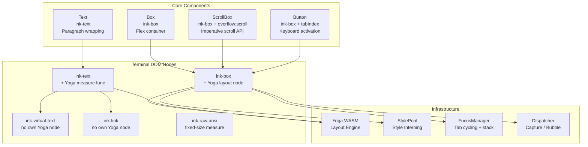
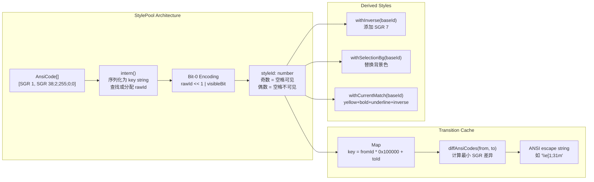

# 第十八章：组件架构与交互模式

> **本章摘要**
>
> Claude Code 的终端 UI 并非简单的字符输出 —— 它是一个构建在 React reconciler 之上的完整组件系统，拥有与浏览器 DOM 相媲美的布局引擎、样式系统和事件模型。本章深入剖析这套组件架构：Box、Text、ScrollBox、Button 四大核心组件如何映射到终端 DOM 节点并驱动 Yoga 布局；StylePool 如何通过 bit-0 编码和 transition cache 实现零开销的样式切换；权限对话框和消息渲染组件如何组合成完整的交互界面；design-system 如何定义统一的排版、间距和颜色 token；自定义 hooks 库如何封装输入、动画、选择和光标等终端特有的交互逻辑；以及 CharPool ASCII 快速路径、nodeCache blit 优化和 packed Int32Array 等性能技术如何让这一切在每一帧中流畅运行。

---

## 18.1 核心组件体系

Claude Code 的组件库建立在一个经过深度定制的 Ink 框架之上。与浏览器中 HTML 元素映射到渲染树节点类似，每个 React 组件最终映射为终端 DOM 中的特定节点类型：

```
ink-root          // 文档根节点，持有 FocusManager
  ink-box         // Flex 容器，类似 <div>
    ink-text      // 文本容器，注册 Yoga measure 函数
      ink-virtual-text  // 嵌套文本，共享父级 Yoga 节点
      ink-link          // 超链接包装器
      ink-progress      // 进度指示器
    ink-raw-ansi  // 预渲染的 ANSI 内容
```



### 18.1.1 Box：Flex 容器

`<Box>` 是最基本的布局原语，等价于浏览器中的 `<div style="display: flex">`。它映射到 `ink-box` 节点，拥有完整的 Styles API 和事件处理器接口：

```typescript
export type Props = Except<Styles, 'textWrap'> & {
  ref?: Ref<DOMElement>;
  tabIndex?: number;
  autoFocus?: boolean;
  // 鼠标事件
  onClick?: (event: ClickEvent) => void;
  onMouseEnter?: () => void;
  onMouseLeave?: () => void;
  // 焦点事件（捕获 + 冒泡）
  onFocus?: (event: FocusEvent) => void;
  onFocusCapture?: (event: FocusEvent) => void;
  onBlur?: (event: FocusEvent) => void;
  onBlurCapture?: (event: FocusEvent) => void;
  // 键盘事件（捕获 + 冒泡）
  onKeyDown?: (event: KeyboardEvent) => void;
  onKeyDownCapture?: (event: KeyboardEvent) => void;
};
```

默认值设定遵循 Flexbox 规范：`flexWrap: "nowrap"`, `flexDirection: "row"`, `flexGrow: 0`, `flexShrink: 1`。这意味着 Box 子元素默认水平排列且不换行，收缩时均匀缩小。

一个关键的工程决策是 Box 组件经过 React Compiler 编译（使用 `_c` memoization slots），将 props 解构与 JSX 渲染分离以最大化缓存命中率。在终端 UI 中，每一帧都有严格的时间预算，这种编译时优化至关重要。

**事件处理器的脏标记隔离**：Box 的事件处理器存储在 `_eventHandlers` 字典中，与 DOM attributes 分离。这是一个精妙的设计 —— React 重新渲染时 handler 的 identity 经常变化（因为闭包捕获了新的 state），但 handler identity 的变化不应导致节点标记为 dirty，否则 blit 优化会被击穿：

```typescript
// 事件处理器更新不触发 markDirty
if (EVENT_HANDLER_PROPS.has(key)) {
  setEventHandler(node, key, value);
  continue;  // 跳过 setAttribute -> markDirty 路径
}
```

### 18.1.2 Text：段落渲染

`<Text>` 是唯一允许包含字符串内容的组件。尝试在 `<Box>` 中直接放置文本会触发编译时错误 —— 这一约束由 reconciler 的 `createTextInstance` 强制执行：

```typescript
createTextInstance(text, _root, hostContext) {
  if (!hostContext.isInsideText) {
    throw new Error(`Text string "${text}" must be rendered inside <Text>`);
  }
  return createTextNode(text);
}
```

Text 组件的 Props 结合了文本样式与换行控制：

```typescript
export type Props = BaseProps & WeightProps;
// BaseProps: color, backgroundColor, italic, underline, strikethrough, inverse, wrap
// WeightProps: bold 和 dim 互斥（TypeScript 联合类型强制）
```

**换行模式的预缓存样式**是一个值得注意的优化。Text 为每种 `textWrap` 模式预先创建了 memoized 样式对象：

```typescript
const memoizedStylesForWrap: Record<NonNullable<Styles['textWrap']>, Styles> = {
  wrap:      { flexGrow: 0, flexShrink: 1, flexDirection: 'row', textWrap: 'wrap' },
  'wrap-trim': { ... },
  end:       { ... },
  middle:    { ... },
  'truncate-end': { ... },
  // ...
};
```

这避免了每次渲染时创建新的样式对象，减少了 GC 压力，并使 Yoga layout 的 `stylesEqual` 浅比较能够快速返回。

Text 节点在 Yoga 中注册了 measure 函数，该函数处理段落换行的核心逻辑：

```typescript
const measureTextNode = function(node, width, widthMode) {
  const rawText = squashTextNodes(node);  // 合并所有子文本节点
  const text = expandTabs(rawText);
  const dimensions = measureText(text, width);

  // 对于预换行内容（包含 \n），在 Undefined 模式下使用自然宽度
  if (text.includes('\n') && widthMode === LayoutMeasureMode.Undefined) {
    return measureText(text, Math.max(width, dimensions.width));
  }

  // 需要换行时，按 textWrap 策略处理
  const textWrap = node.style?.textWrap ?? 'wrap';
  const wrappedText = wrapText(text, width, textWrap);
  return measureText(wrappedText, width);
};
```

支持的换行模式包括：`wrap`（标准换行）、`wrap-trim`（换行并修剪尾部空格）、`end`/`truncate-end`（尾部截断加省略号）、`middle`/`truncate-middle`（中间截断）和 `truncate-start`（头部截断）。ANSI 转义序列在换行和截断过程中被保留 —— 这对于保持语法高亮至关重要。

### 18.1.3 ScrollBox：滚动容器

`<ScrollBox>` 包装了 `<Box overflow="scroll">`，通过 `useImperativeHandle` 暴露了一个完整的命令式滚动 API：

```typescript
export type ScrollBoxHandle = {
  scrollTo: (y: number) => void;
  scrollBy: (dy: number) => void;
  scrollToElement: (el: DOMElement, offset?: number) => void;
  scrollToBottom: () => void;
  getScrollTop: () => number;
  getScrollHeight: () => number;
  getViewportHeight: () => number;
  isSticky: () => boolean;
  subscribe: (listener: () => void) => () => void;
  setClampBounds: (min?: number, max?: number) => void;
};
```

**核心架构决策：绕过 React**。`scrollTo`/`scrollBy` 操作直接突变 DOM 节点上的 `scrollTop` 属性，调用 `markDirty()` 后通过 microtask 触发渲染，完全跳过 React reconciler：

```typescript
scrollBy(dy: number) {
  const el = domRef.current;
  el.stickyScroll = false;
  el.scrollAnchor = undefined;
  el.pendingScrollDelta = (el.pendingScrollDelta ?? 0) + Math.floor(dy);
  scrollMutated(el);  // markDirty -> microtask -> scheduleRenderFrom
}
```

这个决策的动机很明确：鼠标滚轮事件的频率可达每秒 120 次以上，如果每次滚轮事件都触发 React reconciler 的 setState -> diff -> commit 流程，帧率会显著下降。通过直接操作 DOM 节点，滚动操作的延迟从毫秒级降低到微秒级。

**智能滚动提示**：ScrollBox 在内容顶部和底部显示滚动提示（如 "N more lines above"），帮助用户理解当前滚动位置。当用户滚动到底部时，`stickyScroll` 标志会自动启用，使新内容追加时视口自动跟随 —— 这对于 LLM 流式输出至关重要。

**滚动动画的排水算法**：ScrollBox 不会一次性跳转到目标位置，而是使用自适应的排水（drain）算法平滑滚动。终端环境中有两种策略：

- **xterm.js 自适应排水**：小于 5 行的滚动立即完成（点击行为），6-11 行步进 2（追赶模式），12+ 行步进 3（快速滑动），30+ 行则直接跳转到动画窗口内。
- **原生终端比例排水**：步长为 `max(4, floor(abs * 3/4))`，对数收敛使大距离快速追赶而尾部减速。

### 18.1.4 Button：键盘交互

`<Button>` 提供了带焦点环的交互式按钮，支持 Tab 导航和 Enter/Space 激活。它本质上是一个带有 `tabIndex`、`autoFocus` 和 `onKeyDown` 处理器的 Box，通过 FocusManager 参与焦点循环。

Button 的 hover 状态通过 `onMouseEnter`/`onMouseLeave` 事件实现视觉反馈，active 状态在 `onKeyDown` 中检测 Enter 和 Space 键。焦点环的显示由 FocusManager 的 `activeElement` 状态驱动。

---

## 18.2 样式系统架构

### 18.2.1 样式类型体系

样式系统分为两个层次：**布局样式**（Styles）驱动 Yoga 引擎计算节点位置和尺寸，**文本样式**（TextStyles）控制字符的视觉呈现。

```typescript
// 文本样式：映射到 ANSI SGR 序列
export type TextStyles = {
  readonly color?: Color;           // 前景色
  readonly backgroundColor?: Color;  // 背景色
  readonly dim?: boolean;           // SGR 2
  readonly bold?: boolean;          // SGR 1
  readonly italic?: boolean;        // SGR 3
  readonly underline?: boolean;     // SGR 4
  readonly strikethrough?: boolean; // SGR 9
  readonly inverse?: boolean;       // SGR 7
};

// 颜色类型：四种表示方式
export type Color = RGBColor | HexColor | Ansi256Color | AnsiColor;
// RGBColor    = `rgb(${number},${number},${number})`
// HexColor    = `#${string}`
// Ansi256Color = `ansi256(${number})`
// AnsiColor   = 'ansi:black' | 'ansi:red' | ... | 'ansi:whiteBright'
```

布局样式涵盖了 CSS Flexbox 的完整子集：position、margin、padding、flex 属性、dimensions、border、overflow 和 gap。值得注意的是 `noSelect` 属性 —— 它标记单元格在文本选择时不可选中，`'from-left-edge'` 变体允许从左边缘开始排除，用于行号等装饰性内容。

### 18.2.2 Colorize 系统

颜色应用层需要处理一个现实世界的棘手问题：不同终端对颜色的支持差异巨大。Colorize 系统在模块加载时执行终端能力检测和修正：

```typescript
// 模块初始化时的终端适配
boostChalkLevelForXtermJs();  // VS Code 容器：level 2 -> 3（启用 truecolor）
clampChalkLevelForTmux();     // tmux：level 3 -> 2（除非设置了 CLAUDE_CODE_TMUX_TRUECOLOR）
```

这种设计的原因是：VS Code 内置终端声称只支持 256 色（chalk level 2），但实际上完全支持 24-bit truecolor；而 tmux 在默认配置下即使声称支持 truecolor，SGR 序列也可能被截断。通过环境检测修正 chalk level，UI 能在所有终端中获得最佳的视觉保真度。

文本样式的应用顺序也经过精心设计 —— 从内到外嵌套：

```
inverse -> strikethrough -> underline -> italic -> bold -> dim -> color -> backgroundColor
```

### 18.2.3 StylePool：样式内化与位编码

StylePool 是整个样式系统的性能核心。它将 ANSI 样式数组内化（intern）为整数 ID，使得样式比较从 O(n) 的数组比较降级为 O(1) 的整数比较：



**Bit-0 编码** 是一个特别精妙的优化。styleId 的最低位编码了 "该样式是否在空格字符上可见"（有背景色、inverse 或 underline 时为 1，否则为 0）。这使得渲染器在处理空格字符时，只需一个位掩码检查即可决定是否跳过该单元格：

```
if ((styleId & 1) === 0 && char === ' ') skip;  // 无可见效果的空格，跳过
```

在一个 200x50 的终端中，每帧有 10,000 个单元格需要处理。大量单元格是未着色的空格 —— bit-0 编码让渲染器在热循环中以最小成本跳过它们。

**Transition cache** 是另一个关键优化。当 diff 引擎需要从 style A 切换到 style B 时，它不是先 reset 再重新设置，而是计算两者之间的最小 SGR 差异：

```typescript
transition(fromId: number, toId: number): string {
  if (fromId === toId) return '';  // 最常见的情况：相同样式
  const key = fromId * 0x100000 + toId;
  let str = this.transitionCache.get(key);
  if (str === undefined) {
    str = ansiCodesToString(diffAnsiCodes(this.get(fromId), this.get(toId)));
    this.transitionCache.set(key, str);
  }
  return str;
}
```

transition cache 使用 `fromId * 0x100000 + toId` 作为 key，将两个 ID 打包为一个数字以避免字符串拼接。缓存永久有效 —— 因为 StylePool 中的 ID 到样式的映射是不可变的。

---

## 18.3 权限对话框组件

权限系统是 Claude Code 安全模型的核心交互界面。权限对话框由一组紧密协作的组件构成，负责在 AI agent 执行敏感操作前获取用户明确的授权。

对话框的典型结构包括：

- **标题区域**：显示请求的工具名称和操作描述
- **详情区域**：展示即将执行的命令、文件路径或 API 调用参数
- **按钮组**：提供 Allow（允许）、Deny（拒绝）、Always Allow（始终允许）等选项
- **键盘快捷键提示**：显示对应的快捷键（如 `y`/`n`/`a`）

这些对话框使用 Box 进行布局、Text 渲染说明文字、Button 提供交互按钮。焦点管理确保对话框弹出时立即获取焦点，键盘事件通过 capture/bubble 机制正确路由到按钮组件。

---

## 18.4 消息渲染组件

Claude Code 的对话界面由三类核心消息组件驱动：

**UserTextMessage**：渲染用户输入的文本。支持多行文本、代码块的语法高亮，以及 `@` 引用文件路径的特殊处理。

**AssistantMessage**：渲染 AI 助手的回复。这是最复杂的消息类型 —— 需要处理流式 Markdown 渲染、代码块的实时语法高亮、以及内联工具调用的展示。流式渲染的关键挑战在于 Markdown 解析器需要在不完整的输入上工作，且每个新 token 到达时不能重新渲染整个消息。

**Tool Result Messages**：渲染工具执行的结果。不同的工具有不同的结果展示方式 —— 文件读取显示带行号的代码块，搜索结果显示匹配列表，命令执行显示 stdout/stderr 输出。Tool result 组件使用 `ink-raw-ansi` 节点直接输出预格式化的 ANSI 内容，绕过文本测量以获得最佳性能。

---

## 18.5 Design System

Claude Code 内置了一个 design-system 目录，定义了统一的设计语言：

**排版系统**：定义了标题、正文、代码等不同层级的文本样式。每个层级指定字重（bold/dim）、颜色和间距。

**间距规范**：使用数字 token（0-4）表示不同的间距级别。终端环境中间距以字符为单位，水平间距用空格数，垂直间距用空行数。

**颜色 Token**：定义了语义化的颜色名称（如 `primary`、`success`、`error`、`warning`、`muted`），映射到具体的 ANSI 颜色值。这些 token 在不同的 chalk level 下会降级到最接近的可用颜色。

**表单组件**：基于核心组件构建的高层组件，包括 TextInput（文本输入框）、Select（选择器）、Confirm（确认对话框）等。这些组件封装了焦点管理、键盘导航和输入验证逻辑。

---

## 18.6 自定义 Hooks 库

Claude Code 的 hooks 库封装了终端环境特有的交互模式，使上层组件能以声明式方式使用命令式终端 API。

### use-input

核心输入处理 hook。它监听 stdin 的原始字节流，通过 parse-keypress 解析为结构化的 KeyboardEvent，然后通过 Dispatcher 分发到焦点元素：

```typescript
// 键盘事件的解析流程
Raw stdin bytes -> parse-keypress tokenizer -> ParsedKey -> KeyboardEvent
  -> focusManager.activeElement (或 rootNode)
  -> dispatcher.dispatchDiscrete
  -> collectListeners (capture + bubble)
  -> processDispatchQueue
```

parse-keypress 解析器处理多种终端协议：标准 CSI 序列（方向键、功能键）、Kitty 键盘协议（`ESC [ codepoint [; modifier] u`）、modifyOtherKeys、SGR 鼠标事件和 bracketed paste。

### use-animation-frame

为终端环境提供类似 `requestAnimationFrame` 的能力。由于终端没有浏览器的帧同步机制，这个 hook 使用 `FRAME_INTERVAL_MS` 间隔的 throttled microtask 来调度动画更新。它主要用于 spinner 动画和流式文本的平滑渲染。

### use-selection

封装文本选择的完整生命周期。管理三种选择模式的状态机：

- **字符模式**（单击拖拽）：anchor 固定在起始点，focus 跟随鼠标
- **单词模式**（双击）：使用字符分类匹配 iTerm2 默认行为，`/[\p{L}\p{N}_/.\-+~\\]/u` 作为 word 字符
- **行模式**（三击）：选中整行

选择状态在滚动时需要补偿 —— `shiftSelection` 跟踪虚拟行号以确保 round-trip 正确性。

### use-declared-cursor

管理光标的声明式定位。在终端 UI 中，光标位置需要在每帧结束时精确设置。这个 hook 允许组件声明"我需要光标在这里"，由框架在帧提交阶段统一处理冲突和优先级。

### use-terminal-viewport

提供终端视口尺寸的响应式状态。监听 TTY stdout 的 `resize` 事件，在终端窗口大小改变时触发组件重渲染。视口尺寸变化时，框架会重置帧缓冲区并设置 `prevFrameContaminated = true`，确保下一帧完整重绘。

---

## 18.7 性能优化技术

### 18.7.1 CharPool ASCII 快速路径

CharPool 是字符串 interning 池，将字符映射为整数 ID 以在 Int32Array 中高效存储。ASCII 字符（code < 128）使用直接数组查找而非 Map.get：

```typescript
export class CharPool {
  private strings: string[] = [' ', ''];  // Index 0 = 空格, 1 = 空字符串
  private ascii: Int32Array = new Int32Array(128).fill(-1);  // ASCII 快速路径

  intern(char: string): number {
    if (char.length === 1) {
      const code = char.charCodeAt(0);
      if (code < 128) {
        const cached = this.ascii[code]!;
        if (cached !== -1) return cached;
        // 首次遇到，分配 ID
        const id = this.strings.length;
        this.strings.push(char);
        this.ascii[code] = id;
        return id;
      }
    }
    // Unicode 字符走 Map 路径
    return this.stringMap.get(char) ?? this.allocate(char);
  }
}
```

在终端 UI 中，绝大多数单元格包含的是 ASCII 字符。`Int32Array` 的直接索引访问比 `Map.get` 的哈希查找快一个数量级，这在每帧处理数万个单元格的热循环中产生可观的累积收益。

### 18.7.2 nodeCache Blit 优化

这是渲染管线中最重要的单一优化。`nodeCache` 记录每个 DOM 节点上一帧的渲染矩形。当节点未标记为 dirty 且位置未变化时，其整个子树的渲染被跳过 —— 取而代之的是从上一帧的 screen buffer 中批量复制（blit）单元格：

```typescript
if (!node.dirty && cached &&
    cached.x === x && cached.y === y &&
    cached.width === width && cached.height === height && prevScreen) {
  output.blit(prevScreen, fx, fy, fw, fh);
  return;  // 跳过整个子树
}
```

blit 操作使用 `TypedArray.set()` 实现，这是 V8 引擎中高度优化的内存复制路径。在稳态帧中（如 spinner 转动或时钟更新），只有少数几个 dirty 节点需要重新渲染，其余 95%+ 的屏幕内容通过 blit 复制，使帧时间保持在亚毫秒级。

### 18.7.3 Packed Int32Array 单元格

传统方法是用 JavaScript 对象表示每个屏幕单元格。对于 200x120 的终端，这意味着 24,000 个对象 —— 对 GC 的压力不可忽视。Claude Code 使用紧凑的 `Int32Array` 存储：

```typescript
// 每个单元格占 2 个 Int32：[charId, packed]
// packed 的位布局：
// Bits [31:17] = styleId   (15 bits, 最多 32767 种样式)
// Bits [16:2]  = hyperlinkId (15 bits)
// Bits [1:0]   = width     (2 bits: Narrow=0, Wide=1, SpacerTail=2, SpacerHead=3)

cells: Int32Array;       // 连续内存布局
cells64: BigInt64Array;  // 同一 buffer 的 64-bit 视图

// 清屏：一次调用清零整个 buffer
resetScreen(screen): void {
  screen.cells64.fill(0n);  // BigInt64Array.fill 是单次 memset
}
```

`BigInt64Array` 视图的巧妙之处在于：清屏操作只需一次 `fill(0n)` 调用，而非遍历每个单元格。这将清屏时间从 O(n) 的循环降为近乎 O(1) 的 memset。

### 18.7.4 Damage Tracking

屏幕追踪一个 damage rectangle —— 仅记录实际写入（非 blit）的单元格的边界矩形。diff 引擎只迭代 damage 区域内的单元格：

```typescript
screen.damage = screen.damage ? unionRect(screen.damage, rect) : rect;
```

在典型场景中（如只有一个 spinner 在旋转），damage 区域可能只有几个字符宽。整个 diff 操作只需比较这几个单元格，而非扫描整个 10,000 单元格的屏幕。

### 18.7.5 帧调度与池重置

帧调度策略平衡了响应性和 CPU 使用率：

- **普通渲染**：以 `FRAME_INTERVAL_MS` 节流（leading + trailing edge），确保快速的首帧响应和最终的稳态帧
- **滚动排水帧**：以四分之一间隔运行（约 250fps 实际上限），提供平滑的滚动动画
- **microtask 封装**：使用 `queueMicrotask` 包装在 lodash throttle 内，确保 React layout effects 在渲染前完成提交

**池重置**解决长会话中内存增长问题。CharPool 和 HyperlinkPool 每 5 分钟替换为新实例，前帧的 screen 迁移到新池中：

```typescript
resetPools(): void {
  this.charPool = new CharPool();
  this.hyperlinkPool = new HyperlinkPool();
  migrateScreenPools(this.frontFrame.screen, this.charPool, this.hyperlinkPool);
  this.backFrame.screen.charPool = this.charPool;
  this.backFrame.screen.hyperlinkPool = this.hyperlinkPool;
}
```

### 18.7.6 Output charCache

Output 类的行级缓存避免了对未变化行的重复 tokenize 和 grapheme clustering：

```typescript
function writeLineToScreen(screen, line, x, y, screenWidth, stylePool, charCache) {
  let characters = charCache.get(line);
  if (!characters) {
    characters = reorderBidi(
      styledCharsWithGraphemeClustering(
        styledCharsFromTokens(tokenize(line)), stylePool));
    charCache.set(line, characters);
  }
}
```

缓存跨帧持久化，在超过 16384 条目时清除。这对于包含大量代码块的助手消息尤为有效 —— 代码行在多帧间保持不变，只需解析一次。

---

## 18.8 总结

Claude Code 的组件架构展示了一个核心理念：**终端可以像浏览器一样被系统化地编程**。通过 Box/Text/ScrollBox/Button 四大核心组件、两层样式系统（布局 + 视觉）、DOM-like 事件模型和系统化的性能优化，它将一个 Unix 终端转变为一个无 GPU 的显示服务器。

几个值得反复品味的架构决策：

1. **事件处理器与脏标记分离**：handler identity 变化不触发重渲染，保护 blit 优化的有效性
2. **ScrollBox 绕过 React**：高频滚动操作直接操作 DOM 节点，避免 reconciler 开销
3. **StylePool bit-0 编码**：一个位掩码检查决定是否跳过空格单元格，在热循环中节省数千次不必要的样式查找
4. **Packed Int32Array**：消除 24,000+ 个 GC-tracked 对象，使帧缓冲区分配和清除接近零成本
5. **Damage tracking**：将 diff 的扫描范围从全屏幕缩小到实际变化区域

这些技术的组合使得 Claude Code 能在每 16ms 的帧预算内完成从 React state 变更到终端像素更新的全部工作，为用户提供流畅的交互体验 —— 即使是在网络延迟和 LLM 流式输出的双重压力下。
