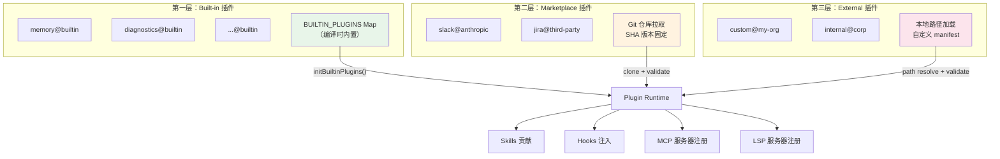
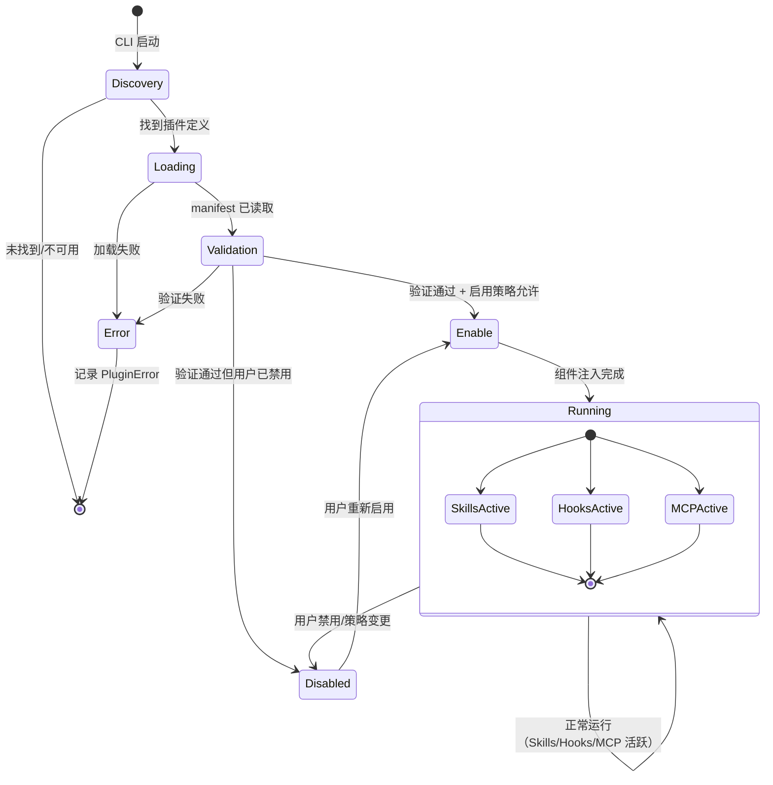
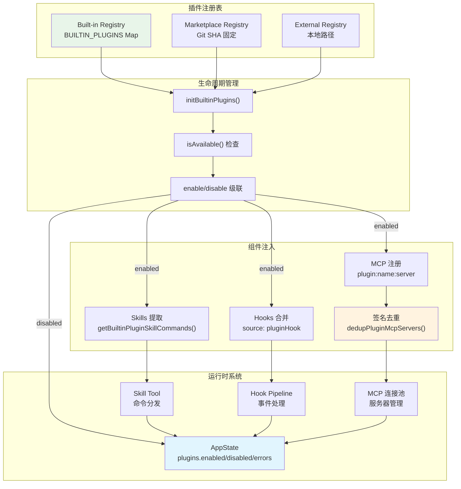

# 第十九章：插件系统

> **本章摘要**
>
> Claude Code 的可扩展性不仅体现在 Skills 和 Hooks 等用户态机制上，还体现在一套完整的插件（Plugin）架构中。插件是更高层次的封装单元 —— 一个插件可以同时贡献 Skills、Hooks、MCP 服务器、LSP 服务器甚至输出样式。本章深入剖析插件系统的核心设计：`LoadedPlugin` 和 `BuiltinPluginDefinition` 两大类型定义；`{name}@{marketplace}` 的 ID 命名规范；built-in、marketplace、external 三级插件体系；从发现到运行再到禁用的完整生命周期；插件与 AppState 的状态集成；Skills 提取、Hooks 注入、MCP 服务器注册的三大集成路径；基于签名的 MCP 去重机制；以及 plugin-only 策略执行与三级 enable/disable 级联逻辑。

---

## 19.1 插件定义格式

### 19.1.1 LoadedPlugin：运行时插件表示

在 Claude Code 内部，每个已加载的插件都以 `LoadedPlugin` 类型存在。这个类型定义在 `src/types/plugin.ts` 中，它是插件系统的核心数据结构：

```typescript
export type LoadedPlugin = {
  name: string
  manifest: PluginManifest
  path: string
  source: string               // e.g., "slack@anthropic"
  repository: string
  enabled?: boolean
  isBuiltin?: boolean
  sha?: string                 // Git commit SHA for version pinning
  commandsPath?: string
  commandsPaths?: string[]
  agentsPath?: string
  agentsPaths?: string[]
  skillsPath?: string
  skillsPaths?: string[]
  outputStylesPath?: string
  outputStylesPaths?: string[]
  hooksConfig?: HooksSettings
  mcpServers?: Record<string, McpServerConfig>
  lspServers?: Record<string, LspServerConfig>
  settings?: Record<string, unknown>
}
```

这个类型的设计体现了几个关键思想：

**多组件贡献**。一个插件不是单一功能的载体，而是一个"组件包"（component bundle）。`PluginComponent` 类型明确枚举了插件可以贡献的组件类型：

```typescript
export type PluginComponent =
  | 'commands' | 'agents' | 'skills' | 'hooks' | 'output-styles'
```

每种组件类型都有对应的 `Path`（单路径）和 `Paths`（多路径）字段，支持从插件的文件系统目录中加载相应资源。

**版本固定**。`sha` 字段存储 Git commit SHA，允许系统将插件锁定在特定版本。这对于 marketplace 插件尤为重要 —— 它既保证了可复现性，又提供了审计线索。

**来源追溯**。`source` 字段采用 `{name}@{marketplace}` 格式，精确标识插件的来源。这个字段在遥测（telemetry）、错误报告和策略执行中都发挥着关键作用。

### 19.1.2 BuiltinPluginDefinition：内置插件定义

内置插件（built-in plugins）与 CLI 二进制文件一同编译发行，使用专门的定义类型：

```typescript
export type BuiltinPluginDefinition = {
  name: string
  description: string
  version?: string
  skills?: BundledSkillDefinition[]
  hooks?: HooksSettings
  mcpServers?: Record<string, McpServerConfig>
  isAvailable?: () => boolean
  defaultEnabled?: boolean
}
```

与 `LoadedPlugin` 相比，`BuiltinPluginDefinition` 更加精简。它不需要 `path`、`repository` 等文件系统相关字段，因为内置插件的代码已经编译到 CLI 内部。它通过 `skills` 字段直接持有 `BundledSkillDefinition[]`，而非指向磁盘路径。

`isAvailable()` 回调是一个重要的门控机制。当此函数返回 `false` 时，插件对用户完全不可见 —— 不出现在列表中，不参与 Skills 收集，效果如同不存在。这允许根据 feature flag、运行环境或用户权限动态控制插件的可用性。

### 19.1.3 Plugin ID 命名规范

插件标识符遵循 `{name}@{marketplace}` 格式：

```typescript
export const BUILTIN_MARKETPLACE_NAME = 'builtin'

export function isBuiltinPluginId(pluginId: string): boolean {
  return pluginId.endsWith(`@${BUILTIN_MARKETPLACE_NAME}`)
}
```

三种典型的 ID 形式：

| 类型 | 示例 | 说明 |
|------|------|------|
| Built-in | `memory@builtin` | 随 CLI 发布的内置插件 |
| Marketplace | `slack@anthropic` | 通过官方或第三方 marketplace 安装 |
| External | `custom-tool@my-org` | 组织自建的外部插件 |

这种命名规范有两个实际用途：首先，`@` 后缀使系统能够快速判断插件类型，从而应用不同的安全策略和加载逻辑；其次，它天然支持多 marketplace 共存的生态格局。

---

## 19.2 三级插件体系

Claude Code 的插件生态分为三个层级，每个层级有不同的信任等级、加载机制和安全约束。



### 第一层：Built-in 插件

Built-in 插件的代码直接编译进 CLI 二进制文件。它们通过 `registerBuiltinPlugin()` 在启动时注册到全局的 `BUILTIN_PLUGINS` Map 中：

```typescript
const BUILTIN_PLUGINS: Map<string, BuiltinPluginDefinition> = new Map()

export function registerBuiltinPlugin(definition: BuiltinPluginDefinition): void {
  BUILTIN_PLUGINS.set(definition.name, definition)
}
```

Built-in 插件的特权：
- **零安装成本**：无需网络下载或文件系统操作
- **最高信任等级**：直接参与 CLI 核心流程
- **编译期保障**：类型安全由 TypeScript 编译器强制执行
- **默认启用**：除非用户显式禁用，否则 `defaultEnabled ?? true`

### 第二层：Marketplace 插件

Marketplace 插件通过 Git 仓库分发，使用 SHA 固定版本。它们的 `source` 字段为 `{name}@{marketplace_name}` 格式（非 `@builtin`）。加载时系统会：

1. 从仓库拉取指定 SHA 的代码
2. 验证 manifest 格式和完整性
3. 解析 `skillsPath`/`skillsPaths` 目录中的 SKILL.md 文件
4. 注册 `hooksConfig` 和 `mcpServers`

### 第三层：External 插件

External 插件从本地文件系统路径加载，适用于企业内部工具或开发中的实验性扩展。它们的信任等级最低，受到最严格的沙箱限制。

---

## 19.3 插件生命周期

插件的完整生命周期包含六个阶段。下面的状态图展示了从发现到禁用的完整流转：



### 阶段一：Discovery（发现）

对于 built-in 插件，发现阶段发生在 `initBuiltinPlugins()` 调用时。此函数在 CLI 启动的早期阶段执行，遍历 `src/plugins/bundled/` 下的注册模块：

```typescript
// src/plugins/bundled/index.ts
export function initBuiltinPlugins(): void {
  // 注册各内置插件定义
  registerBuiltinPlugin(memoryPlugin)
  registerBuiltinPlugin(diagnosticsPlugin)
  // ...
}
```

对于 marketplace 和 external 插件，发现阶段涉及扫描配置文件中声明的插件列表，解析 `source` 字段，确定仓库或路径信息。

### 阶段二：Loading（加载）

加载阶段的核心任务是读取插件的 manifest 和各组件路径。对于 built-in 插件，这是一个内存操作（已编译进二进制文件）。对于外部插件，系统需要：

1. 解析 `path` 指向的目录
2. 读取并解析 `PluginManifest`
3. 验证 `commandsPath`、`skillsPath`、`agentsPaths` 等路径的存在性
4. 加载 `hooksConfig`（如果存在）
5. 解析 `mcpServers` 和 `lspServers` 配置

### 阶段三：Validation（验证）

验证阶段确保插件定义的完整性和安全性。错误通过 `PluginError` 联合类型精确分类：

```typescript
export type PluginError =
  | { type: 'path-not-found'; source: string; plugin?: string; path: string }
  | { type: 'generic-error'; source: string; plugin?: string; message: string }
  | { type: 'plugin-not-found'; source: string; plugin?: string }
```

每种错误类型携带 `source` 字段用于追溯，`plugin` 字段可选标识具体插件名。这种判别联合（discriminated union）设计使得上游代码可以通过 `switch(error.type)` 精确处理每种故障场景。

### 阶段四：Enable（启用）

启用决策遵循三级级联逻辑（详见 19.8 节）。核心代码：

```typescript
const userSetting = settings?.enabledPlugins?.[pluginId]
const isEnabled =
  userSetting !== undefined
    ? userSetting === true                    // 1. 用户显式设置（最高优先级）
    : (definition.defaultEnabled ?? true)     // 2. 插件默认值，兜底为 true
```

### 阶段五：Running（运行）

一旦启用，插件的各组件被注入到对应的运行时系统中：
- Skills 通过 `getBuiltinPluginSkillCommands()` 提取并注入命令列表
- Hooks 通过 `hooksConfig` 合并到 hook 执行管线
- MCP 服务器通过命名空间化注册到连接池

### 阶段六：Disable（禁用）

禁用并非销毁。用户可以随时通过 `settings.enabledPlugins[pluginId] = false` 禁用插件。禁用后，插件的 Skills 不再出现在命令列表中，Hooks 不再被触发，MCP 服务器不再接受连接 —— 但插件定义本身保留在注册表中，可以随时重新启用。

---

## 19.4 插件与 AppState 的集成

Claude Code 通过 `AppState` 进行全局状态管理。插件状态集成在 `AppState` 的 `plugins` 命名空间下：

```typescript
// AppState 中的插件相关字段
{
  plugins: {
    enabled: LoadedPlugin[]      // 当前启用的插件列表
    disabled: LoadedPlugin[]     // 当前禁用的插件列表
    errors: PluginError[]        // 插件加载/验证错误
  }
}
```

这种分离设计的意义在于：

1. **UI 展示**：`enabled` 和 `disabled` 列表直接驱动插件管理界面的渲染
2. **错误聚合**：`errors` 数组收集所有生命周期中的错误，供用户排查
3. **响应式更新**：当插件状态变化时（启用/禁用/错误），AppState 的变更触发 UI 重渲染

`getBuiltinPlugins()` 函数是 AppState 插件数据的主要供应方：

```typescript
export function getBuiltinPlugins(): {
  enabled: BuiltinPluginInfo[]
  disabled: BuiltinPluginInfo[]
} {
  const enabled: BuiltinPluginInfo[] = []
  const disabled: BuiltinPluginInfo[] = []
  for (const [name, definition] of BUILTIN_PLUGINS) {
    if (!definition.isAvailable?.() && definition.isAvailable !== undefined) {
      continue  // 不可用的插件完全隐藏
    }
    const pluginId = `${name}@${BUILTIN_MARKETPLACE_NAME}`
    const info = { name, pluginId, description: definition.description }
    if (isPluginEnabled(pluginId, definition)) {
      enabled.push(info)
    } else {
      disabled.push(info)
    }
  }
  return { enabled, disabled }
}
```

注意 `isAvailable()` 检查：不可用的插件不进入 `disabled` 列表 —— 它们被彻底过滤掉，对用户完全透明。

---

## 19.5 Skills 提取：插件如何贡献技能

插件贡献 Skills 的机制因插件类型而异。

### Built-in 插件的 Skills 提取

Built-in 插件通过 `getBuiltinPluginSkillCommands()` 将 `BundledSkillDefinition[]` 转换为 `Command[]`：

```typescript
export function getBuiltinPluginSkillCommands(): Command[] {
  const { enabled } = getBuiltinPlugins()
  const commands: Command[] = []
  for (const plugin of enabled) {
    const definition = BUILTIN_PLUGINS.get(plugin.name)
    if (!definition?.skills) continue
    for (const skill of definition.skills) {
      commands.push(skillDefinitionToCommand(skill))
    }
  }
  return commands
}
```

转换过程中有一个微妙但重要的设计决策 —— `source` 字段使用 `'bundled'` 而非 `'builtin'`：

```typescript
function skillDefinitionToCommand(definition: BundledSkillDefinition): Command {
  return {
    // 'bundled' not 'builtin' -- 'builtin' in Command.source means hardcoded
    // slash commands (/help, /clear). Using 'bundled' keeps these skills in
    // the Skill tool's listing, analytics name logging, and prompt-truncation
    // exemption.
    source: 'bundled',
    loadedFrom: 'bundled',
    // ...
  }
}
```

为什么不用 `'builtin'`？因为在 `Command` 类型的语义中，`source: 'builtin'` 表示硬编码的斜杠命令（如 `/help`、`/clear`），这些命令不通过 Skill Tool 分发，不记录分析日志，也不参与 prompt 截断豁免。而插件贡献的 Skills 需要保留这些行为。

### External/Marketplace 插件的 Skills 提取

外部插件通过 `skillsPath` 和 `skillsPaths` 字段指向包含 SKILL.md 文件的目录。这些目录在加载阶段被扫描，其中的 SKILL.md 文件通过标准的 Skill 加载管线（`loadSkillsDir`）解析为 `Command` 对象，`loadedFrom` 设置为 `'plugin'`。

---

## 19.6 Hooks 注入：插件如何贡献钩子

插件通过 `LoadedPlugin.hooksConfig` 字段提供 Hooks 配置。这些 Hooks 被标记为 `source: 'pluginHook'`，与来自用户设置（`user`）、项目设置（`project`）和企业策略（`policySettings`）的 Hooks 一同合并到执行管线中。

```typescript
export type HookSource =
  | EditableSettingSource   // user, project, local settings
  | 'policySettings'       // 企业托管
  | 'pluginHook'           // 来自已安装的插件
  | 'sessionHook'          // 临时内存钩子
  | 'builtinHook'          // 内部内置钩子
```

合并发生在 `groupHooksByEventAndMatcher()` 中：

```typescript
const registeredHooks = getRegisteredHooks()
if (registeredHooks) {
  for (const [event, matchers] of Object.entries(registeredHooks)) {
    // 将插件钩子合并到分组结构中
  }
}
```

插件 Hooks 的执行遵循与用户定义 Hooks 相同的事件匹配和过滤规则。`pluginHook` 来源标记使系统能够在审计日志和错误报告中区分 Hook 的来源，同时允许策略层面对插件 Hooks 进行独立的准入控制。

对于异步 Hook，`PendingAsyncHook` 类型中也包含 `pluginId` 字段：

```typescript
export type PendingAsyncHook = {
  processId: string
  hookId: string
  hookEvent: HookEvent | 'StatusLine' | 'FileSuggestion'
  pluginId?: string    // 追踪来源插件
  // ...
}
```

---

## 19.7 MCP 服务器注册与签名去重

### 命名空间化注册

插件通过 `mcpServers` 字段声明 MCP 服务器。为避免与用户手动配置的服务器发生名称冲突，插件提供的服务器使用命名空间化的 key：

```
plugin:{pluginName}:{serverName}
```

例如，`slack` 插件提供的 `api` 服务器注册为 `plugin:slack:api`。这种前缀方案确保了全局唯一性。

### 基于签名的去重

当多个来源（用户手动配置、多个插件）声明了指向同一实际服务器的配置时，系统通过签名匹配进行去重：

```typescript
export function getMcpServerSignature(config: McpServerConfig): string | null {
  const cmd = getServerCommandArray(config)
  if (cmd) return `stdio:${jsonStringify(cmd)}`
  const url = getServerUrl(config)
  if (url) return `url:${unwrapCcrProxyUrl(url)}`
  return null
}
```

签名算法根据传输类型区分：
- **stdio 服务器**：签名为 `stdio:` + 命令数组的 JSON 序列化
- **URL 服务器**（SSE/HTTP/WS）：签名为 `url:` + 展开 CCR 代理后的 URL

`dedupPluginMcpServers()` 函数执行实际的去重逻辑：

1. 遍历所有插件声明的 MCP 服务器
2. 计算每个服务器的签名
3. 与手动配置的服务器签名比对 —— **手动配置优先**
4. 与已加载的其他插件服务器签名比对 —— **先加载者优先**
5. 签名冲突的插件服务器被丢弃

这种去重策略的设计意图是明确的：用户的显式配置永远优先于插件的隐式注入。当用户已经配置了一个 MCP 服务器，插件不应该静默地注册一个重复连接。

---

## 19.8 安全与沙箱

### Plugin-only 策略执行

企业环境可以通过策略启用 `isRestrictedToPluginOnly()` 模式。在此模式下：

```typescript
// 当 plugin-only 策略激活时
if (isRestrictedToPluginOnly('skills')) {
  // 用户自定义 Skills 被阻止
  // 项目级 Skills 被阻止
  // Legacy commands 被阻止
  // 仅允许：managed skills + plugin skills
}
```

这为企业提供了一种精确的控制手段：员工只能使用经过审批的插件所提供的功能，无法自行加载未经审查的 Skills。同样的限制也适用于 Hooks 和 MCP 服务器。

### 权限约束

不同层级的插件受到不同程度的权限约束：

| 能力 | Built-in | Marketplace | External |
|------|----------|-------------|----------|
| Shell 命令执行 | 受限（通过 allowedTools） | 受限 | 受限 |
| 文件系统访问 | 通过 Skill 定义的路径范围 | 通过 Skill 定义的路径范围 | 通过 Skill 定义的路径范围 |
| MCP 服务器注册 | 允许 | 允许（签名去重） | 允许（签名去重） |
| Hook 注入 | 允许 | 允许（source 标记） | 允许（source 标记） |
| 策略绕过 | 否 | 否 | 否 |

关键约束：来自 MCP 的 Skills 永远不能执行内联 Shell 命令。这在 `createSkillCommand` 的 `getPromptForCommand` 中被显式阻止：

```typescript
// Security: MCP skills never execute inline shell
if (loadedFrom !== 'mcp') {
  finalContent = await executeShellCommandsInPrompt(finalContent, ...)
}
```

### 错误隔离

插件错误不会导致 CLI 崩溃。`PluginError` 联合类型确保所有错误都被捕获和分类，错误被收集到 `AppState.plugins.errors` 中供用户查看，但不阻塞其他插件或核心功能的正常运行。

---

## 19.9 三级 Enable/Disable 级联

插件的启用/禁用决策不是简单的布尔开关，而是一个带有优先级的三级级联系统：

```typescript
const userSetting = settings?.enabledPlugins?.[pluginId]
const isEnabled =
  userSetting !== undefined
    ? userSetting === true                    // 层级 1：用户显式偏好
    : (definition.defaultEnabled ?? true)     // 层级 2：插件默认值 → 层级 3：兜底为 true
```

### 层级 1：用户显式设置（最高优先级）

用户通过 `settings.enabledPlugins` 显式设置某个插件的启用/禁用状态。这个设置存储在用户级别的配置文件中，不受项目设置影响。

当 `settings.enabledPlugins['memory@builtin']` 存在（无论是 `true` 还是 `false`）时，用户意图明确 —— 系统尊重用户的选择。

### 层级 2：插件默认值

如果用户未显式设置，系统回退到插件定义中的 `defaultEnabled` 字段。插件开发者可以选择其插件默认是否启用：

```typescript
registerBuiltinPlugin({
  name: 'experimental-feature',
  description: 'An experimental capability',
  defaultEnabled: false,  // 默认不启用，需用户主动开启
  // ...
})
```

### 层级 3：全局默认（兜底值）

如果 `defaultEnabled` 也未定义（`undefined`），系统采用 `true` 作为兜底值。这意味着大多数插件在注册后默认可用，降低了用户的配置负担。

### 来源追踪

系统在整个生命周期中追踪启用/禁用的决策来源。这在调试场景中尤为重要 —— 当用户问"为什么这个插件没有生效"时，系统可以明确告知：是用户自己禁用了它，还是插件定义中默认禁用，还是 `isAvailable()` 返回了 `false`。

`isAvailable()` 检查优先于 enable/disable 级联。一个不可用的插件甚至不会进入 `disabled` 列表 —— 它被完全从可见性中移除：

```typescript
if (!definition.isAvailable?.() && definition.isAvailable !== undefined) {
  continue  // 完全隐藏，不进入 enabled 或 disabled 列表
}
```

---

## 19.10 架构总览

下面的集成架构图展示了插件系统与 Claude Code 各子系统的交互关系：



---

## 19.11 设计复盘

Claude Code 的插件系统展示了几个值得注意的架构决策。

**组件包而非单一扩展点**。一个插件可以同时贡献 Skills、Hooks、MCP 服务器和 LSP 服务器。这种设计减少了配置碎片化 —— 用户安装一个"Slack 插件"就获得了完整的 Slack 集成，而不需要分别配置 Slack Skill、Slack Hook 和 Slack MCP 服务器。

**信任层级分离**。Built-in、Marketplace、External 三级体系为不同来源的代码提供了合适的信任等级。Built-in 插件享有最高信任，External 插件受到最严格的审查。这种分层与操作系统的权限环（Ring 0/1/2/3）有异曲同工之处。

**用户意图优先**。三级 enable/disable 级联确保用户的显式选择永远优先于系统默认值。这是一个"最少惊奇"原则的体现 —— 系统不会在用户明确说"不"之后自行启用某个功能。

**签名去重的实用主义**。MCP 服务器的去重不依赖名称匹配（名称可能被命名空间改写），而是基于实际的传输签名（命令行参数或 URL）。这种方法更加健壮 —— 它识别的是"这是否是同一个服务器"，而非"这是否是同一个名字"。

**错误容忍**。插件系统的核心设计原则之一是：一个插件的故障不应该拖垮整个系统。错误被收集而非抛出，失败的插件被跳过而非阻塞。这在一个包含多个第三方插件的生产环境中至关重要。

这些设计选择共同构建了一个既灵活又可控的扩展体系，为 Claude Code 的生态系统增长奠定了基础，同时为企业环境提供了必要的治理手段。
