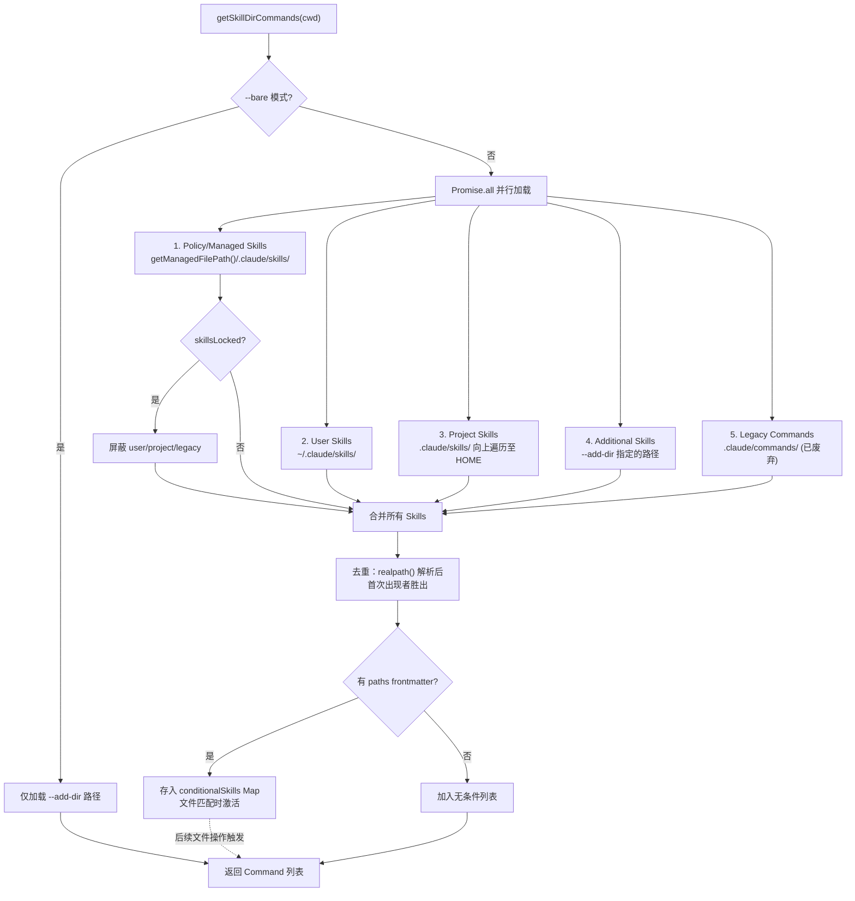
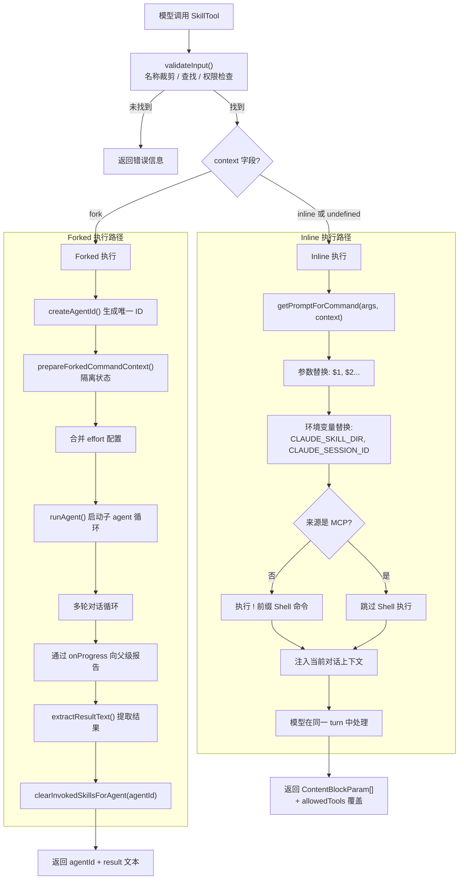

# 第二十章：Skills 框架

> **本章摘要**
>
> Claude Code 的 Skills 系统是其扩展能力的核心支柱。每个 Skill 本质上是一份 YAML frontmatter 加 Markdown prompt body 的文件，经过发现、解析、去重、Token 预算估算后，以统一的 `Command` 对象注册到系统中。本章从 Skill 文件格式的 18 个 frontmatter 字段开始，逐层剖析五大发现源（bundled、user、plugin、managed、MCP）的加载逻辑，深入分析条件 Skill 的 glob 匹配激活机制，比较 inline 与 forked 两种执行模型的架构差异，揭示 Token budgeting 的 frontmatter-only 估算策略，最后解析 bundled Skill 的安全提取机制和 Skill 到 slash command 的集成路径。

---

## 20.1 Skill 文件格式

### 目录结构

Skills 采用**目录为单元**的组织方式。每个 Skill 是一个独立目录，包含一个必需的入口文件和可选的辅助文件：

```
.claude/skills/
  my-skill/
    SKILL.md          # 必需的入口文件（大小写不敏感匹配 /^skill\.md$/i）
    helper-script.sh  # 可选的辅助脚本
    config.json       # 可选的配置文件
```

Skill 的名称取自其父目录名。例如，`my-skill/SKILL.md` 注册为 `/my-skill` 命令。嵌套目录通过 `:` 分隔符形成命名空间 -- `deploy/staging/SKILL.md` 对应 `deploy:staging`。

命名空间的构建逻辑很直接：

```typescript
function buildNamespace(targetDir: string, baseDir: string): string {
  const relativePath = targetDir.slice(normalizedBaseDir.length + 1)
  return relativePath ? relativePath.split(pathSep).join(':') : ''
}
```

系统同时兼容遗留格式：`.claude/commands/` 下的单个 `.md` 文件，文件名（去掉 `.md`）即为命令名。当同一目录下两种格式并存时，目录形式的 `SKILL.md` 优先级更高。

### Frontmatter Schema

每个 SKILL.md 文件以 YAML frontmatter 开头，由 `parseSkillFrontmatterFields()` 函数解析。完整的 18 字段 schema 如下：

| 字段 | 类型 | 默认值 | 说明 |
|------|------|--------|------|
| `name` | `string` | 目录名 | 显示名称覆盖 |
| `description` | `string` | 首段自动提取 | 人类可读描述 |
| `when_to_use` | `string` | undefined | 指导模型何时主动调用此 Skill |
| `allowed-tools` | `string\|string[]` | `[]` | 此 Skill 允许使用的工具列表 |
| `argument-hint` | `string` | undefined | 参数提示文本 |
| `arguments` | `string\|string[]` | `[]` | 命名参数占位符（`$1`, `$2` 等） |
| `model` | `string\|'inherit'` | undefined | 模型覆盖（如 `claude-sonnet-4-6`） |
| `user-invocable` | `boolean` | `true` | 用户是否可通过 `/` 前缀调用 |
| `disable-model-invocation` | `boolean` | `false` | 是否禁止模型主动调用 |
| `context` | `'fork'\|'inline'` | undefined | 执行模式 |
| `agent` | `string` | undefined | forked 执行时使用的 agent 类型 |
| `effort` | `EffortValue` | undefined | 努力级别（`EFFORT_LEVELS` 或整数） |
| `shell` | `FrontmatterShell` | undefined | `!` 命令使用的 Shell 解释器 |
| `hooks` | `HooksSettings` | undefined | Skill 作用域的 hooks（经 Zod 验证） |
| `paths` | `string\|string[]` | undefined | 条件激活的 glob 模式 |
| `version` | `string` | undefined | Skill 版本号 |

Frontmatter 由 `parseFrontmatter()` 进行 YAML 解析，然后逐字段校验。其中 `hooks` 字段通过 `HooksSchema().safeParse()` 进行严格的 Zod schema 验证，确保 hook 配置的类型安全。

### Prompt Body

YAML frontmatter 之后的 Markdown 内容构成 Skill 的 prompt body。这部分内容支持多种动态特性：

- **参数替换**：`$1`, `$2` 等占位符被用户传入的参数替换
- **环境变量**：`${CLAUDE_SKILL_DIR}` 替换为 Skill 的目录路径，`${CLAUDE_SESSION_ID}` 替换为当前会话 ID
- **内嵌 Shell 命令**：`!` 前缀的行会被执行并将输出替换回 prompt（MCP 来源的 Skill 出于安全考虑禁止此功能）

---

## 20.2 五大发现源

Skills 从五个独立来源并行加载，每个来源对应不同的使用场景和信任级别。



### 五个来源详解

**1. Managed Skills（企业策略级）**

来自 `getManagedFilePath()/.claude/skills/` 目录，由企业管理员部署。当 `isRestrictedToPluginOnly('skills')` 策略锁定时，user、project 和 legacy 三个来源被完全屏蔽，只有 managed 和 plugin 来源的 Skills 可以加载。

**2. User Skills（用户级）**

位于 `~/.claude/skills/` 目录。这是用户个人的全局 Skill 库，跨项目共享。适合存放通用的工作流程，如代码审查模板、commit 规范等。

**3. Project Skills（项目级）**

从当前工作目录的 `.claude/skills/` 开始，向上遍历目录树直到用户 HOME 目录。这种"向上行走"的设计允许 monorepo 场景下子项目继承父级 Skills。

**4. Additional Skills（附加路径）**

通过 `--add-dir` 命令行参数指定的额外目录。适用于临时引入外部 Skill 集合的场景，例如共享的团队 Skill 仓库。

**5. Legacy Commands（遗留兼容）**

`.claude/commands/` 目录下的 `.md` 文件。这是早期 Claude Code 的命令格式，现已废弃，但仍保留向后兼容支持。

### 加载优先级

五个来源按枚举顺序确定优先级：Managed > User > Project > Additional > Legacy。当多个来源产生同名 Skill 时，先加载者胜出。这由 `LoadedFrom` 判别类型追踪：

```typescript
export type LoadedFrom =
  | 'commands_DEPRECATED'  // 遗留 .claude/commands/
  | 'skills'               // .claude/skills/
  | 'plugin'               // 外部插件
  | 'managed'              // 企业管理路径
  | 'bundled'              // 编译进 CLI 二进制
  | 'mcp'                  // MCP server 的 prompts
```

`LoadedFrom` 不仅用于去重，还控制安全行为（MCP Skills 不能执行 Shell 命令）和遥测分析（`skill_loaded_from` 字段）。

### 去重机制

所有来源加载完成后，合并的 Skill 集合经过 symlink 感知的去重处理。每个 Skill 的文件路径通过 `realpath()` 解析为规范路径：

```typescript
async function getFileIdentity(filePath: string): Promise<string | null> {
  try {
    return await realpath(filePath)
  } catch {
    return null
  }
}
```

首次出现的 identity 胜出。这防止同一 Skill 文件通过不同的 symlink 路径或重叠的父目录被加载两次。考虑一个场景：`~/.claude/skills/lint` 是指向 `/shared/team-skills/lint` 的符号链接，而 `/shared/team-skills/` 同时通过 `--add-dir` 指定。没有 `realpath()` 去重，lint Skill 会出现两次。Identity 解析将两个引用折叠为单一的规范路径。

### --bare 模式例外

当 Claude Code 以 `--bare` 模式启动时，所有自动发现被跳过。仅加载 `--add-dir` 路径和 bundled Skills。此模式为嵌入场景而设计 -- 宿主应用控制可用 Skills 的精确集合，避免文件系统的环境发现引入不可预期的副作用。

---

## 20.3 发现管线详解

### 目录扫描与 gitignore 过滤

每个来源目录的扫描由 `loadSkillsDir()` 执行。它递归遍历目录结构，寻找 `SKILL.md` 文件（大小写不敏感）或遗留的 `.md` 文件。扫描过程中尊重 `.gitignore` 规则 -- 被忽略的目录不会被加载。

### Frontmatter 解析

找到入口文件后，系统读取文件内容并分离 YAML frontmatter 和 Markdown body。`parseFrontmatter()` 解析 YAML 部分，`parseSkillFrontmatterFields()` 逐字段提取并验证类型。如果没有显式 `description` 字段，系统从 Markdown body 的第一段自动提取描述文本。

### Shell 插值

Prompt body 中的 `!` 前缀行会在加载时执行。例如：

```markdown
当前 Git 分支信息：
! git branch --show-current
```

Shell 命令的输出替换回原始位置，成为最终 prompt 的一部分。这使得 Skills 可以根据项目当前状态动态调整行为。MCP 来源的 Skills 跳过此步骤，防止远程 MCP server 在本地执行任意命令。

### Token 计数与缓存

整个发现管线的结果以 `cwd` 为 key 进行 memoization。除非工作目录变更，后续调用直接返回缓存结果。条件 Skill 一旦被激活，即使清除缓存也保持激活状态。

---

## 20.4 条件 Skills

条件 Skills 是一种延迟激活机制：Skill 定义了 `paths` 字段的 glob 模式，只有当模型操作匹配这些模式的文件时才被激活。

```yaml
---
name: docker-helper
paths:
  - "**/Dockerfile"
  - "**/docker-compose*.yml"
---
```

### 激活流程

1. 发现管线解析到 `paths` 字段后，Skill 被存入独立的 `conditionalSkills` Map 而非活跃列表
2. 模型读写文件时，系统使用 `ignore` 库评估文件路径是否匹配任何条件 Skill 的 glob 模式
3. 匹配成功的 Skill 从 `conditionalSkills` 转移到 `activatedConditionalSkillNames` Set
4. 一旦激活，该 Skill 在整个会话期间保持活跃

特殊规则：`**` 模式（匹配一切）被视为"无过滤"，等效于无条件 Skill。

### 动态发现

`discoverSkillDirsForPaths()` 实现了更深层的动态性。当模型访问子目录中的文件时，系统从该文件路径向上遍历至 `cwd`，检查每一层是否存在 `.claude/skills/` 目录。新发现且未被 gitignore 排除的目录会被加载并合并到活跃 Skill 集合中。

```typescript
export async function discoverSkillDirsForPaths(
  filePaths: string[],
  cwd: string,
): Promise<string[]>
```

这种设计在大型 monorepo 中尤为重要 -- 子项目可以定义自己的 Skills，只在模型实际接触该子项目代码时才加载。

### 条件 Skills 与动态发现的区别

这两种机制互补但截然不同。条件 Skills 在**启动时已注册**，但被**文件模式门控** -- Skill 定义已解析并等待在 `conditionalSkills` Map 中。动态发现则找到**启动时完全未知的 Skill 目录**。条件 Skill 回答"这个已知 Skill 是否应该激活？"；动态发现回答"代码库的这个区域是否存在未知 Skills？"

实践中，项目可能对上下文敏感的辅助工具使用条件 Skills（Docker Skill 只在 Dockerfile 被操作时激活），同时依赖动态发现来加载深藏在目录树中的子项目专属 Skills -- 这些 Skills 不会在初始的父目录遍历中被找到。

---

## 20.5 SkillTool 执行模型

`SkillTool` 是面向模型的工具接口，注册名称为 `Skill`。它接受两个参数：

```typescript
export const inputSchema = z.object({
  skill: z.string().describe('The skill name'),
  args: z.string().optional().describe('Optional arguments'),
})
```

### 验证流程

模型调用 Skill 前，`validateInput()` 执行以下检查：

1. 裁剪 Skill 名称，移除可能的 `/` 前缀
2. 实验性远程 Skill 检查 `_canonical_<slug>` 是否在当前会话中已被发现
3. 在 `getAllCommands()` 中查找命令（合并本地和 MCP Skills）
4. 未找到的 Skill 返回适当错误信息
5. 检查 `isEnabled()` feature flag 门控

### Inline 与 Forked 执行

Skill 的执行分为两种模式，由 frontmatter 的 `context` 字段决定：



#### Inline 执行（默认模式）

Inline 是默认执行模式。Skill 的 prompt 被直接注入当前对话上下文：

1. `getPromptForCommand()` 生成 prompt 内容，执行参数替换和 Shell 命令
2. 内容以 `ContentBlockParam[]` 形式返回到当前 tool result
3. 模型在同一个 agent turn 中处理展开的 prompt
4. Skill 的 `allowedTools` 覆盖当前会话的工具权限

这种模式的优势在于零开销 -- Skill 的执行完全融入主对话流，不需要额外的 agent 上下文。

#### Forked 执行

当 `context: 'fork'` 时，Skill 在隔离的子 agent 中执行：

```typescript
async function executeForkedSkill(
  command: Command & { type: 'prompt' },
  commandName: string,
  args: string | undefined,
  context: ToolUseContext,
  canUseTool: CanUseToolFn,
  parentMessage: AssistantMessage,
  onProgress?: ToolCallProgress<Progress>,
): Promise<ToolResult<Output>>
```

执行步骤：

1. `createAgentId()` 生成唯一标识符
2. `prepareForkedCommandContext()` 建立隔离的执行状态
3. Skill 的 `effort` 配置合并到 agent 定义中
4. `runAgent()` 创建完整的多轮查询循环，子 agent 拥有独立的对话历史
5. 子 agent 的 tool 调用通过 `onProgress` 回调向父级报告进度
6. 完成后 `extractResultText()` 从 agent 消息中提取结果文本
7. `finally` 块中 `clearInvokedSkillsForAgent(agentId)` 执行资源清理

#### 输出类型

两种模式返回不同的输出 schema：

```typescript
// Inline 输出
const inlineOutputSchema = z.object({
  success: z.boolean(),
  commandName: z.string(),
  allowedTools: z.array(z.string()).optional(),
  model: z.string().optional(),
  status: z.literal('inline').optional(),
})

// Forked 输出
const forkedOutputSchema = z.object({
  success: z.boolean(),
  commandName: z.string(),
  status: z.literal('forked'),
  agentId: z.string(),
  result: z.string(),
})
```

Inline 模式返回可选的 `allowedTools` 和 `model` 覆盖，因为这些需要影响后续主对话的行为。Forked 模式返回 `agentId` 和 `result` 文本，因为子 agent 已完成执行，结果是自包含的。

#### 模式选择策略

Inline 与 forked 执行之间存在根本性的权衡。Inline 执行轻量无开销 -- 不创建 agent，不维护独立的对话历史，不需要清理。但它会用 Skill 展开的 prompt 和中间 tool 调用"污染"主对话上下文。对于短小精悍的 Skills（如 commit message 生成器），inline 是理想选择。

Forked 执行以开销换取隔离。子 agent 维护独立的对话历史，因此冗长的多步骤工作流（如读取大量文件的全面代码审查）不会膨胀父级上下文。父级只看到最终结果文本。然而 forked 执行付出了 agent 创建、多轮循环搭建和结果提取的代价。它也无法直接修改父级的工具权限或模型选择 -- 这些是 inline 返回路径的专属属性。

#### 分析与遥测

两种执行路径都发出遥测数据。Forked 执行额外追踪以下字段：

- `command_name`：第三方 Skills 的名称被脱敏以保护知识产权
- `_PROTO_skill_name`：未脱敏版本，存储在 PII 标记列中
- `execution_context`：forked 为 `'fork'`，inline 时缺省
- `invocation_trigger`：`'nested-skill'` 表示被另一 Skill 调用，`'claude-proactive'` 表示模型自主决策
- `query_depth`：嵌套层级，用于检测过深的 Skill 调用链

---

## 20.6 Token 预算管理

大规模项目可能注册数十甚至上百个 Skills。将所有 Skill 的完整内容加入 system prompt 会迅速耗尽 context window。Claude Code 通过 **frontmatter-only 估算** 策略解决这一问题。

### 估算函数

```typescript
export function estimateSkillFrontmatterTokens(skill: Command): number {
  const frontmatterText = [skill.name, skill.description, skill.whenToUse]
    .filter(Boolean)
    .join(' ')
  return roughTokenCountEstimation(frontmatterText)
}
```

只有 `name`、`description` 和 `whenToUse` 三个字段参与 Token 估算。这些字段在 system prompt 中呈现为 Skill 列表，供模型决定何时调用。

### 延迟加载

Skill 的完整 Markdown body **不在发现阶段加载**。只有当 Skill 被实际调用时（通过 `getPromptForCommand()`），才读取并展开完整内容。这种惰性策略确保注册 100 个 Skills 的 Token 开销与仅呈现 100 条摘要相当，而非 100 份完整 prompt。

### 截断策略

当 Skill 的完整内容超过剩余 Token 预算时，系统应用截断策略。Bundled Skills 享有截断豁免 -- 它们的 `source: 'bundled'` 标识使其绕过 prompt 截断逻辑，保证核心功能的完整性。

---

## 20.7 Bundled Skill 提取安全

Bundled Skills 是编译进 CLI 二进制的内置 Skill，通过 `registerBundledSkill()` 在启动时注册。

### BundledSkillDefinition

```typescript
export type BundledSkillDefinition = {
  name: string
  description: string
  aliases?: string[]
  whenToUse?: string
  argumentHint?: string
  allowedTools?: string[]
  model?: string
  disableModelInvocation?: boolean
  userInvocable?: boolean
  isEnabled?: () => boolean
  hooks?: HooksSettings
  context?: 'inline' | 'fork'
  agent?: string
  files?: Record<string, string>
  getPromptForCommand: (args: string, context: ToolUseContext) => Promise<ContentBlockParam[]>
}
```

### 引用文件提取

拥有 `files` 字段的 Bundled Skills 需要将引用文件提取到磁盘。这个过程面临一个安全威胁：如果攻击者在目标路径预先放置 symlink，提取操作可能被重定向到任意文件位置。Claude Code 通过三层防御应对：

**1. Per-Process Nonce 目录**

每个 CLI 进程使用 `getBundledSkillsRoot()` 下的唯一 nonce 目录，确保不同进程间的提取路径不可预测：

```
/tmp/claude-skills/<nonce>/
  skill-name/
    reference-file.json
```

**2. O_NOFOLLOW | O_EXCL 写入标志**

文件写入使用 `SAFE_WRITE_FLAGS`，包含 `O_NOFOLLOW`（拒绝跟随符号链接）和 `O_EXCL`（目标文件必须不存在）：

```typescript
async function safeWriteFile(p: string, content: string): Promise<void> {
  const fh = await open(p, SAFE_WRITE_FLAGS, 0o600)
  try {
    await fh.writeFile(content, 'utf8')
  } finally {
    await fh.close()
  }
}
```

**3. 严格权限设置**

目录权限设为 `0o700`（仅所有者可访问），文件权限设为 `0o600`（仅所有者可读写）。

### Memoized 提取

提取 Promise 按进程级别 memoize。多个并发调用者等待同一个提取 Promise，而非各自竞争写入。这既避免了竞态条件，又确保了只执行一次磁盘 I/O。

---

## 20.8 集成路径：从 Skill 到 Slash Command

### Command 统一模型

所有 Skill -- 无论来自文件系统、Plugin、MCP 还是 bundled -- 最终都被转换为统一的 `Command` 对象。这是 Skills 系统与命令系统的集成点。

```typescript
export function createSkillCommand({
  skillName, displayName, description,
  markdownContent, allowedTools, argumentHint,
  whenToUse, model, source, baseDir, loadedFrom,
  hooks, executionContext, agent, paths, effort, shell,
}): Command {
  return {
    type: 'prompt',
    name: skillName,
    description,
    allowedTools,
    source,
    loadedFrom,
    async getPromptForCommand(args, toolUseContext) {
      // 参数替换、环境变量替换、Shell 执行
    },
  }
}
```

### 用户调用路径

当 `user-invocable: true`（默认）时，Skill 作为 slash command 暴露给用户。用户在 CLI 中输入 `/skill-name args` 触发调用。系统将输入路由到对应 Command 的 `getPromptForCommand()`，生成的 prompt 注入对话流。

### 模型调用路径

当 `disable-model-invocation: false`（默认）时，模型可以通过 `SkillTool` 主动调用 Skill。模型在 system prompt 中看到所有可用 Skills 的 `name`、`description` 和 `when_to_use` 信息，据此决定何时发起调用。

### MCP Skill 桥接

MCP server 提供的 Skills 通过 `mcpSkillBuilders.ts` 桥接到本地 Skill 系统。这个模块解决了 MCP 客户端和 Skill 加载系统之间的循环依赖：

```typescript
export type MCPSkillBuilders = {
  createSkillCommand: typeof createSkillCommand
  parseSkillFrontmatterFields: typeof parseSkillFrontmatterFields
}

let builders: MCPSkillBuilders | null = null

export function registerMCPSkillBuilders(b: MCPSkillBuilders): void {
  builders = b
}
```

注册发生在 `loadSkillsDir.ts` 模块初始化时（通过 `commands.ts` 的静态 import 链在启动时执行），确保在 MCP server 连接建立前桥接已就绪。

### Plugin Skill 转换

Plugin 中定义的 `BundledSkillDefinition[]` 通过 `getBuiltinPluginSkillCommands()` 转换为标准 `Command[]`。转换时刻意使用 `source: 'bundled'` 而非 `source: 'builtin'` -- 后者保留给内置 slash commands（如 `/help`、`/clear`）。使用 `'bundled'` 确保 Plugin Skills 出现在 SkillTool 的列表中，被正确记入 analytics，并享受 prompt 截断豁免。

---

## 20.9 设计总结

Skills 框架的设计体现了几个核心工程原则：

**延迟加载，按需激活**。从 Token 预算的 frontmatter-only 估算，到条件 Skills 的 glob 匹配激活，再到完整 prompt 的调用时加载 -- 系统在每个层面都推迟开销，直到真正需要时才付出代价。

**安全分层，纵深防御**。MCP Skills 禁止 Shell 执行、bundled Skill 提取使用 `O_NOFOLLOW | O_EXCL` 和 per-process nonce、`LoadedFrom` 判别类型驱动差异化安全策略 -- 多层防线确保即使某一层被突破，整体安全性仍然得到保障。

**统一抽象，多态执行**。无论来源如何，所有 Skill 都收敛为 `Command` 对象。但执行时又分化为 inline 和 forked 两条路径，各自优化不同场景。这种"统一接口、差异实现"的模式是整个 Claude Code 架构的缩影。

**渐进发现，层级覆盖**。五大发现源形成从企业策略到项目本地的层级结构，策略锁定可以屏蔽低优先级来源。目录向上遍历和文件触发的动态发现进一步扩展了这种渐进式的能力扩展模型。

这些原则共同创造了一个兼具力量与安全的系统。开发者可以在几分钟内编写一个 Skill -- 写一份带 frontmatter 的 SKILL.md，放入 `.claude/skills/`，即可立即调用。企业可以将 Skill 加载锁定到 managed 路径，确保合规性。而模型本身可以基于 `when_to_use` 指导主动发现并调用 Skills，将被动工具转变为主动能力层。从这个意义上说，Skills 框架是将 Claude Code 从反应式助手转变为可组合 agent 平台的支点。
