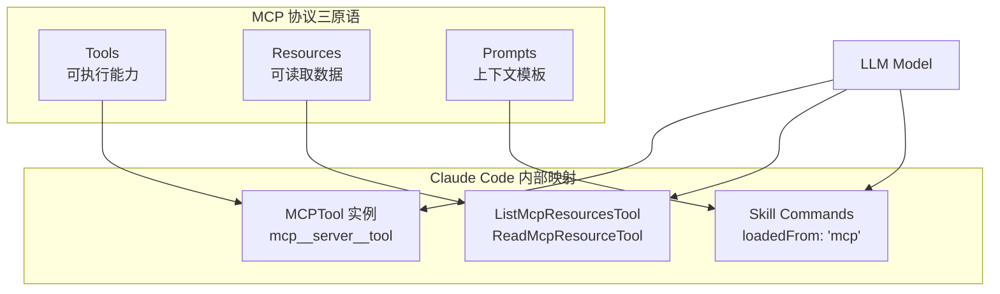
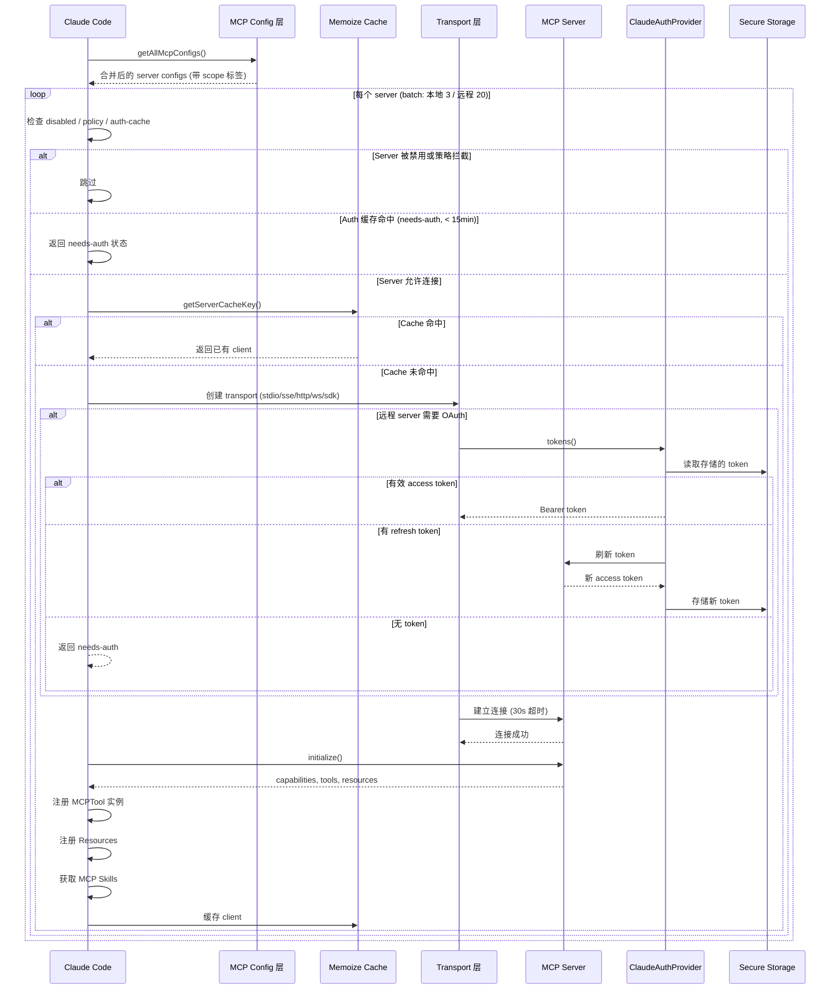
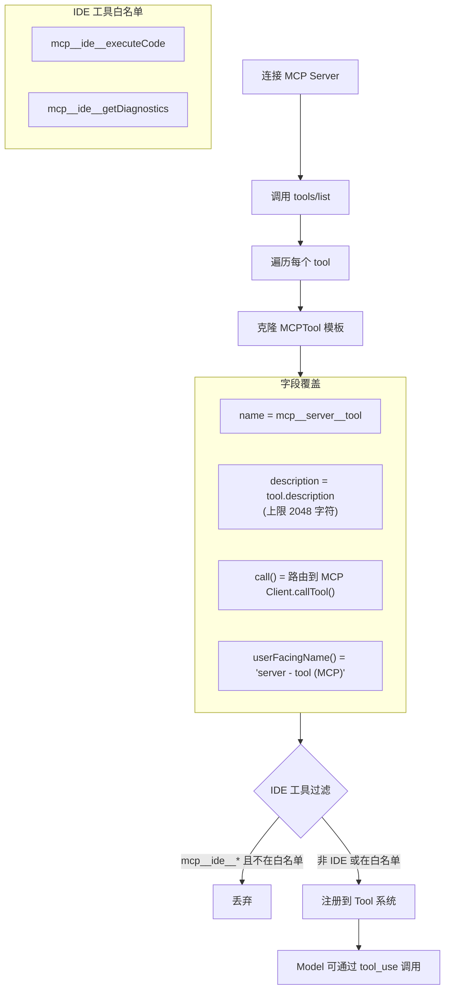
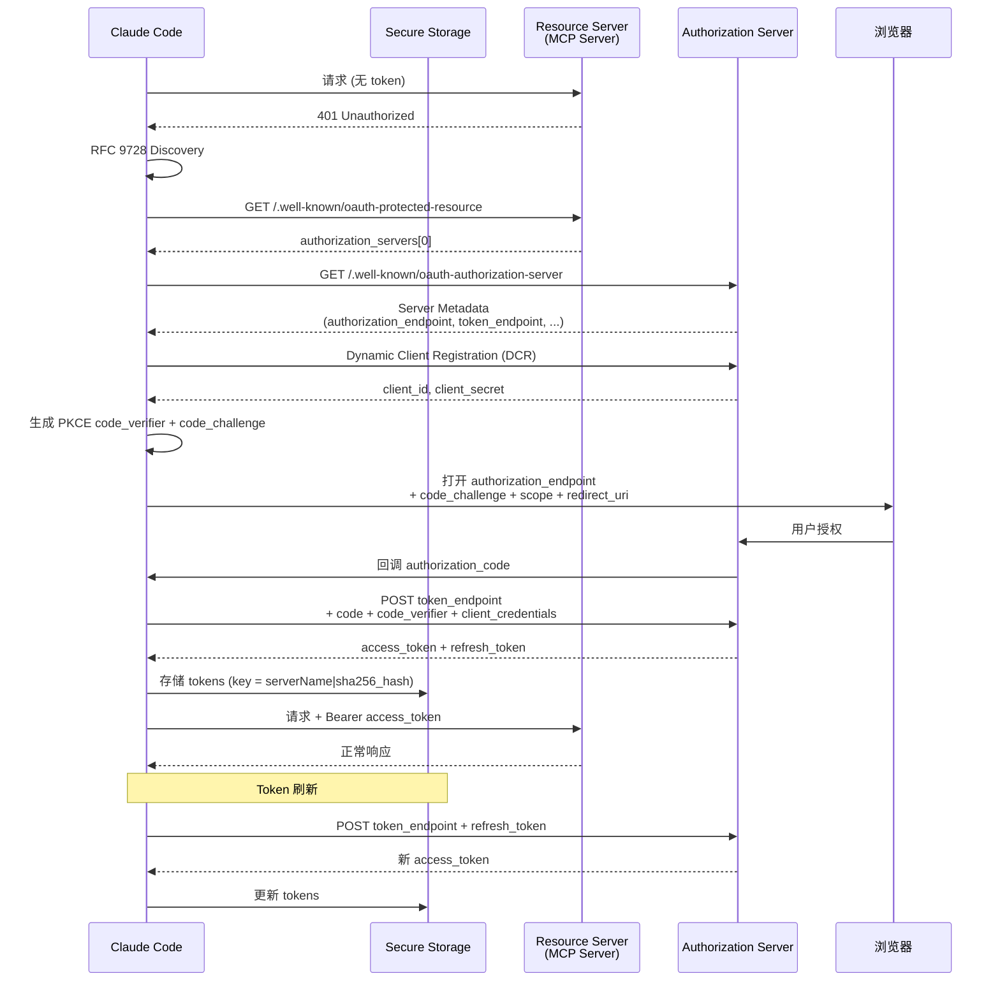

# 第二十一章：MCP Protocol Integration -- 连接一切的协议层

> MCP (Model Context Protocol) 是 Claude Code 扩展能力的核心通道。它不是一个简单的 RPC 框架 -- 它定义了 Tools、Resources、Prompts 三种原语，支持七种 transport 层，实现了完整的 OAuth 认证栈，并通过 memoized 连接管理和 deferred loading 机制在性能与功能之间取得了精巧的平衡。本章将从协议原语出发，逐层深入 transport 选择、连接生命周期、动态工具注册、认证流程、资源浏览、策略执行与延迟加载的完整架构。

---

## 21.1 MCP 协议概述：三种原语

MCP 协议定义了三种核心原语 (primitives)，每一种对应 Claude Code 与外部 server 交互的一种方式：

**Tools** -- 可执行的能力。MCP server 通过 `tools/list` 暴露它支持的工具集，每个工具有名称、描述和 JSON Schema 定义的输入参数。Claude Code 将这些工具注册为本地 `MCPTool` 实例，model 可以像调用内置工具一样调用它们。

**Resources** -- 可读取的数据。类似于 REST API 中的 GET 端点，每个 resource 有一个 URI 标识符。Claude Code 通过 `ListMcpResourcesTool` 浏览可用资源列表，通过 `ReadMcpResourceTool` 按 URI 读取具体内容。

**Prompts** -- 可注入的上下文模板。MCP server 可以提供预定义的 prompt 模板，Claude Code 将这些模板转化为 Skill Commands，model 可以通过 Skill Tool 调用它们。

三种原语覆盖了从"做什么"(Tools) 到"读什么"(Resources) 到"如何做"(Prompts) 的完整交互面。



---

## 21.2 七种 Transport 层

MCP 不绑定于单一传输协议。Claude Code 的 client 支持七种 transport type，定义在 `types.ts` 中：

```typescript
export type Transport = 'stdio' | 'sse' | 'sse-ide' | 'http' | 'ws' | 'sdk'
// 加上内部类型: 'ws-ide', 'claudeai-proxy'
```

### Transport 对比表

| Transport | 类型 | Config 类型 | 关键字段 | 典型场景 |
|-----------|------|------------|---------|---------|
| `stdio` | 本地进程 | `McpStdioServerConfig` | `command`, `args[]`, `env?` | 本地工具链，如 linter、formatter |
| `sse` | 远程长连接 | `McpSSEServerConfig` | `url`, `headers?`, `oauth?` | 传统 SSE 协议的远程 server |
| `sse-ide` | IDE 桥接 | `McpSSEIDEServerConfig` | `url`, `ideName` | VS Code 等 IDE 内嵌 server |
| `http` | 远程请求/响应 | `McpHTTPServerConfig` | `url`, `headers?`, `oauth?` | Streamable HTTP，现代远程 server |
| `ws` | WebSocket | `McpWebSocketServerConfig` | `url`, `headers?` | 需要双向实时通信的 server |
| `ws-ide` | IDE WebSocket | `McpWebSocketIDEServerConfig` | `url`, `ideName`, `authToken?` | IDE 通过 WebSocket 桥接 |
| `sdk` | 进程内 | `McpSdkServerConfig` | `name` | 内嵌 server (如 Chrome MCP) |
| `claudeai-proxy` | 代理 | `McpClaudeAIProxyServerConfig` | `url`, `id` | 通过 Anthropic 代理路由 |

每种 transport 的连接方式有本质差异：

- **stdio**：通过 `StdioClientTransport` spawn 子进程，stderr 独立管道收集日志。环境变量通过 `subprocessEnv()` 合并。
- **SSE / HTTP**：创建 `ClaudeAuthProvider` 作为 OAuth 提供者，用 timeout-aware 的 fetch wrapper 初始化。SSE 的 EventSource 连接没有超时限制 (长生命周期流)，而 HTTP 的每次请求有 60s 超时。
- **WebSocket**：使用 `ws.WebSocket` (Node) 或 Bun 原生 WebSocket，包装为 `WebSocketTransport`。
- **进程内 (sdk)**：通过 `createLinkedTransportPair()` 创建双向 transport 对，server 和 client 运行在同一进程中。
- **claudeai-proxy**：携带 OAuth bearer token 通过 Anthropic 的 MCP 代理路由。

---

## 21.3 Client 架构：连接生命周期

### 21.3.1 核心 Client

MCP client 实现位于 `services/mcp/client.ts` (约 3300 行)，基于官方 `@modelcontextprotocol/sdk` 库构建：

```typescript
const client = new Client(
  {
    name: 'claude-code',
    title: 'Claude Code',
    version: MACRO.VERSION ?? 'unknown',
    description: "Anthropic's agentic coding tool",
    websiteUrl: PRODUCT_URL,
  },
  {
    capabilities: {
      roots: {},
      elicitation: {},
    },
  },
)
```

Client 声明了两项 capability：`roots` (允许 server 查询工作目录) 和 `elicitation` (允许 server 向用户发起交互式询问)。

### 21.3.2 Memoized 连接

`connectToServer()` 通过 lodash `memoize` 实现连接复用。cache key 由 server 名称和序列化后的 config 组成：

```typescript
export function getServerCacheKey(
  name: string,
  serverRef: ScopedMcpServerConfig,
): string {
  return `${name}-${jsonStringify(serverRef)}`
}
```

同一 server config 的重复连接请求会命中 cache，直接返回已建立的 client。这避免了在 tool discovery、权限检查等场景中重复建立连接的开销。

### 21.3.3 Batched 连接

连接建立是分批进行的，而不是全部并行：

- **本地 server (stdio/sdk)**：每批 3 个 (`getMcpServerConnectionBatchSize()`)
- **远程 server (sse/http/ws)**：每批 20 个 (`getRemoteMcpServerConnectionBatchSize()`)

本地 server 的 batch size 更小，因为每个 stdio 连接会 spawn 子进程，过多并发 spawn 可能耗尽系统资源。远程 server 主要受网络延迟约束，更大的 batch size 能有效利用 I/O 并行。

### 21.3.4 连接生命周期图



### 21.3.5 超时设定

系统定义了分层的超时策略：

| 超时类型 | 默认值 | 环境变量覆盖 |
|---------|-------|------------|
| 连接超时 | 30s | `MCP_TIMEOUT` |
| 请求超时 | 60s | `MCP_REQUEST_TIMEOUT_MS` |
| 工具调用超时 | ~27.8 小时 | `MCP_TOOL_TIMEOUT` |
| 认证请求超时 | 30s | `AUTH_REQUEST_TIMEOUT_MS` |

工具调用超时 (`DEFAULT_MCP_TOOL_TIMEOUT_MS = 100_000_000`) 设置得极长，因为某些 MCP 工具可能触发长时间运行的操作 (如部署、大规模数据处理)。

### 21.3.6 Session Expired 检测

当 MCP session 过期时，server 返回 HTTP 404 加 JSON-RPC error code `-32001`：

```typescript
export function isMcpSessionExpiredError(error: Error): boolean {
  const httpStatus = 'code' in error
    ? (error as Error & { code?: number }).code
    : undefined
  if (httpStatus !== 404) return false
  return (
    error.message.includes('"code":-32001') ||
    error.message.includes('"code": -32001')
  )
}
```

双重检查 (HTTP 404 + JSON-RPC -32001) 避免了把普通 web server 的 404 误判为 session expired。检测到此错误后，client 会清除 memoized 连接并重新建立新的 session。

---

## 21.4 Tool Discovery 与动态注册

### 21.4.1 命名规范

MCP 工具遵循严格的双下划线命名规范：

```
mcp__<normalized_server_name>__<normalized_tool_name>
```

例如，名为 `github` 的 server 暴露的 `create_issue` 工具会注册为 `mcp__github__create_issue`。

```typescript
export function buildMcpToolName(serverName: string, toolName: string): string {
  return `${getMcpPrefix(serverName)}${normalizeNameForMCP(toolName)}`
}

// Normalization: 将无效字符替换为下划线
export function normalizeNameForMCP(name: string): string {
  let normalized = name.replace(/[^a-zA-Z0-9_-]/g, '_')
  // claudeai server 前缀额外清理连续下划线
  if (name.startsWith(CLAUDEAI_SERVER_PREFIX)) {
    normalized = normalized.replace(/_+/g, '_').replace(/^_|_$/g, '')
  }
  return normalized
}
```

反向解析同样基于 `__` 分隔符：

```typescript
export function mcpInfoFromString(toolString: string): {
  serverName: string
  toolName: string | undefined
} | null {
  const parts = toolString.split('__')
  const [mcpPart, serverName, ...toolNameParts] = parts
  if (mcpPart !== 'mcp' || !serverName) return null
  const toolName = toolNameParts.length > 0
    ? toolNameParts.join('__')
    : undefined
  return { serverName, toolName }
}
```

**已知限制**：server 名称中包含 `__` 会导致解析错误 -- 无法区分 server 名中的 `__` 和分隔符。

### 21.4.2 MCPTool 模板

`MCPTool.ts` 定义了一个模板工具，所有 MCP 工具都是它的克隆和定制版本：

```typescript
export const MCPTool = buildTool({
  isMcp: true,
  isOpenWorld() { return false },
  name: 'mcp',                     // 注册时被覆盖
  maxResultSizeChars: 100_000,
  async description() { return DESCRIPTION },   // 注册时被覆盖
  async prompt() { return PROMPT },             // 注册时被覆盖
  get inputSchema() { return inputSchema() },   // z.object({}).passthrough()
  get outputSchema() { return outputSchema() }, // z.string()
  async call() { return { data: '' } },         // 注册时被覆盖
  async checkPermissions() {
    return { behavior: 'passthrough', message: 'MCPTool requires permission.' }
  },
})
```

`inputSchema` 使用 `z.object({}).passthrough()` -- 它接受任何 JSON 对象，因为具体的 schema 由 MCP server 在协议层面定义和校验。

### 21.4.3 动态注册流程



当 MCP server 通过 `tools/list` 响应时，client 为每个工具执行以下操作：

1. **克隆** MCPTool 模板
2. **设置 name** 为 `mcp__<server>__<tool>` 格式
3. **设置 description**，上限 `MAX_MCP_DESCRIPTION_LENGTH = 2048` 字符
4. **覆盖 call()** 方法，使其路由到具体的 MCP Client `callTool()` 调用
5. **设置 userFacingName()** 为人类可读的 `<server> - <tool> (MCP)` 格式
6. **过滤 IDE 工具**：只有白名单中的 IDE 工具 (`mcp__ide__executeCode`, `mcp__ide__getDiagnostics`) 才会被保留

### 21.4.4 Tool Call 流程

1. Model 输出 `tool_use` block，指定 MCP 工具名和参数
2. 工具的 `call()` 方法调用 MCP Client 的 `callTool()`
3. 超时由 `getMcpToolTimeoutMs()` 控制 (默认约 27.8 小时)
4. 响应处理：
   - **Text content**：直接返回字符串
   - **Image content**：通过 `maybeResizeAndDownsampleImageBuffer()` 压缩
   - **Binary blob**：持久化到磁盘，返回引用路径
   - **超大结果**：通过 `truncateMcpContentIfNeeded()` 截断
5. 错误处理：`isError: true` 抛出 `McpToolCallError`；401 抛出 `McpAuthError`，更新 client 状态为 `needs-auth`

---

## 21.5 OAuth 认证流程

### 21.5.1 架构概述

MCP 的 OAuth 实现是一个完整的企业级认证栈，由 `auth.ts` (约 1800 行) 实现。核心是 `ClaudeAuthProvider`，它实现了 SDK 的 `OAuthClientProvider` 接口：

- **PKCE** (Proof Key for Code Exchange) 防止授权码拦截
- **DCR** (Dynamic Client Registration) 自动注册客户端
- **RFC 9728 / RFC 8414** 双重 discovery 机制
- **XAA** (Cross-App Access) 跨应用 token 交换
- **Step-up scope** 处理 403 时的权限提升

### 21.5.2 OAuth Discovery

Discovery 遵循标准化的探测链：

```
1. 如果配置了 metadataUrl → 直接获取 (必须 HTTPS)
2. RFC 9728: 探测 /.well-known/oauth-protected-resource
   → 读取 authorization_servers[0]
   → 按 RFC 8414 获取 server metadata
3. Fallback: 直接按 RFC 8414 对 MCP server URL 进行 path-aware discovery
```

这个三级探测链确保了对各种 OAuth 部署模式的兼容 -- 从完全标准的 protected resource discovery，到只有基本 authorization server metadata 的遗留部署。

### 21.5.3 Token 存储

Token 按 server 隔离存储在操作系统安全存储中 (macOS Keychain 等)。存储 key 使用 SHA-256 hash 确保不同配置的同名 server 不会互相干扰：

```typescript
export function getServerKey(
  serverName: string,
  serverConfig: McpSSEServerConfig | McpHTTPServerConfig,
): string {
  const configJson = jsonStringify({
    type: serverConfig.type,
    url: serverConfig.url,
    headers: serverConfig.headers || {},
  })
  const hash = createHash('sha256')
    .update(configJson)
    .digest('hex')
    .substring(0, 16)
  return `${serverName}|${hash}`
}
```

将 `type`, `url`, `headers` 三个字段序列化后取 SHA-256 的前 16 位十六进制字符作为后缀。即使两个 server 同名（例如不同项目中都叫 `api`），只要 URL 或 headers 不同，存储的 credential 就完全隔离。

### 21.5.4 完整 OAuth 流程



### 21.5.5 Token 刷新的容错处理

Token 刷新需要处理多种边界情况：

- **Transient errors (500, 503, 429)**：指数退避重试
- **Invalid grant**：清除所有 credential，标记 server 为 `needs-auth`
- **非标准错误码**：Slack 返回 `invalid_refresh_token` / `expired_refresh_token` 而不是 RFC 6749 标准的 `invalid_grant`。这些被规范化处理：

```typescript
const NONSTANDARD_INVALID_GRANT_ALIASES = new Set([
  'invalid_refresh_token',
  'expired_refresh_token',
  'token_expired',
])
```

- **200 状态码中的 OAuth 错误**：某些 server (如 Slack) 在 HTTP 200 响应中返回 error body。`normalizeOAuthErrorBody()` 检测此情况并将状态码重写为 400。

### 21.5.6 Step-Up Authentication

当 MCP server 返回 403 (Forbidden) 时，触发 step-up 检测：

1. 从 error response 中解析 `scope`
2. 在 token storage 中保存新的 `stepUpScope`
3. 标记 server 为 `needs-auth`，携带扩展后的 scope
4. 重新认证时使用缓存的 scope，而非重新探测

这允许 server 渐进式地请求更多权限 -- 例如初始连接只需要 `read` scope，当 model 尝试写操作时 server 返回 403 要求 `write` scope。

---

## 21.6 Cross-App Access (XAA)

XAA 解决了一个实际问题：当多个 MCP server 都需要认证时，用户不应该为每个 server 分别走一遍完整的 OAuth 流程。

### 21.6.1 工作机制

- 每个 server 可以在 `.mcp.json` 中配置 `oauth.xaa: true` 启用 XAA
- 全局 IdP (Identity Provider) 配置存储在 `settings.xaaIdp` 中，包含 `issuer`, `clientId`, `callbackPort`
- 通过 OIDC discovery 找到 IdP 的 authorization endpoint
- 用户在 IdP 完成一次认证后获取 `id_token`
- 该 `id_token` 被交换为目标 MCP server 的 access token

### 21.6.2 认证缓存

15 分钟的 TTL 缓存防止重复认证探测：

```typescript
const MCP_AUTH_CACHE_TTL_MS = 15 * 60 * 1000

async function isMcpAuthCached(serverId: string): Promise<boolean> {
  const cache = await getMcpAuthCache()
  const entry = cache[serverId]
  if (!entry) return false
  return Date.now() - entry.timestamp < MCP_AUTH_CACHE_TTL_MS
}
```

缓存写入通过 promise chain 序列化，防止多个 server 同时返回 401 时的并发读写竞争。

---

## 21.7 Resource 浏览

MCP 的 Resource 原语通过两个专用工具暴露给 model：

**ListMcpResourcesTool** -- 列出指定 server 的可用资源。返回资源名称、URI 和描述的列表，让 model 了解可以读取哪些数据。

**ReadMcpResourceTool** -- 按 URI 读取指定资源。返回资源内容，可以是文本、JSON 或二进制数据。

这两个工具在每个成功连接的 MCP server 上自动创建，不需要额外配置。model 可以先 list 再 read 的方式探索 server 提供的数据。

---

## 21.8 策略执行 (Policy Enforcement)

### 21.8.1 Allowlist 与 Denylist

两种策略机制控制 MCP server 的访问权限：

**Allowlist** (`allowedMcpServers`)：
- 支持三种匹配模式：name-based、command-based、URL-based
- 当 `allowManagedMcpServersOnly` 设置时，只有 managed settings 控制 allowlist
- 空数组 `[]` 阻止所有 server；`undefined` 表示无限制

**Denylist** (`deniedMcpServers`)：
- 总是从所有 source 合并 (用户可以为自己添加 deny)
- **绝对优先于 allowlist** -- denylist 中的 server 即使在 allowlist 中也会被拦截
- 支持相同的三种匹配模式

```typescript
function isMcpServerAllowedByPolicy(
  serverName: string,
  config?: McpServerConfig,
): boolean {
  if (isMcpServerDenied(serverName, config)) return false
  // ... allowlist logic
}
```

**SDK-type server 豁免**：`sdk` 类型的 server 不受策略过滤，因为它们是 SDK 内部管理的 transport 占位符。

### 21.8.2 Config Scope 层级

MCP server 配置来自多个 source，每个都带有 `ConfigScope` 标签：

```typescript
export type ConfigScope =
  | 'local'       // 项目中的 .mcp.json
  | 'user'        // 用户级 settings
  | 'project'     // 项目级 settings
  | 'dynamic'     // 编程方式 (SDK)
  | 'enterprise'  // 企业管理配置
  | 'claudeai'    // Claude.ai connectors
  | 'managed'     // Managed MCP 文件
```

配置合并流程 (`getAllMcpConfigs()`) 按以下顺序执行：

1. 加载 managed/enterprise 配置
2. 加载 user/project/local 配置
3. 加载 claude.ai connectors
4. 加载 plugin MCP servers
5. 执行环境变量展开 (`expandEnvVars()`)
6. 应用 allowlist/denylist 策略过滤
7. 去重 (plugin 和 claude.ai server 对手动配置去重)

去重基于 signature 匹配：

```typescript
export function getMcpServerSignature(config: McpServerConfig): string | null {
  const cmd = getServerCommandArray(config)
  if (cmd) return `stdio:${jsonStringify(cmd)}`
  const url = getServerUrl(config)
  if (url) return `url:${unwrapCcrProxyUrl(url)}`
  return null
}
```

手动配置的 server 优先于 plugin 提供的同 signature server。

---

## 21.9 Deferred Loading：延迟加载与 ToolSearch

### 21.9.1 为什么需要 Deferred Loading

一个项目可能连接十几个 MCP server，每个 server 可能暴露数十个工具。如果将所有工具的完整 schema 都放入 system prompt，会造成巨大的 token 开销。Deferred loading 解决了这个问题。

### 21.9.2 工作机制

1. MCP 工具初始只出现在 system prompt 的一个名称列表中 (`<system-reminder>` 中的 deferred tools 列表)
2. Model 只看到工具名称，没有参数 schema，因此无法直接调用
3. 当 model 判断某个工具可能有用时，调用 `ToolSearch` 工具
4. `ToolSearch` 接受查询字符串，返回匹配工具的完整 JSON Schema 定义
5. 返回的 schema 出现在 `<functions>` block 中，使该工具变为可调用状态

```
Model 视角:

[初始状态]
<system-reminder>
The following deferred tools are now available via ToolSearch:
mcp__github__create_issue
mcp__github__list_repos
mcp__slack__send_message
</system-reminder>

[调用 ToolSearch]
ToolSearch({ query: "github issue" })

[获得 schema 后]
<functions>
<function>{"name": "mcp__github__create_issue", "parameters": {...}}</function>
</functions>

[现在可以调用]
mcp__github__create_issue({ title: "Bug report", body: "..." })
```

这种设计在保持完整工具可发现性的同时，将 system prompt 的 token 消耗降到最低。只有 model 实际需要的工具才会加载完整 schema。

### 21.9.3 搜索匹配

`ToolSearch` 支持多种查询形式：

- **精确选择**：`select:Read,Edit,Grep` -- 按名称精确获取
- **关键词搜索**：`notebook jupyter` -- 模糊匹配，返回最多 `max_results` 个结果
- **名称约束搜索**：`+slack send` -- 要求名称包含 "slack"，按其余关键词排序

MCP 工具通过 `searchHint` 字段提供额外的搜索关键词 (3-10 词短语)，提高被发现的概率。

---

## 21.10 MCP Skills Bridge

MCP server 提供的 Prompts 不仅仅是文本模板 -- 它们被桥接为 Claude Code 的 Skill 系统。

`mcpSkillBuilders.ts` 解决了 MCP client 与 skill loading 系统之间的循环依赖：

```typescript
export type MCPSkillBuilders = {
  createSkillCommand: typeof createSkillCommand
  parseSkillFrontmatterFields: typeof parseSkillFrontmatterFields
}
```

MCP 来源的 skill 有一个关键安全限制：`loadedFrom: 'mcp'` 的 skill 不会执行 Markdown 中嵌入的 `!` 前缀 shell 命令。这防止恶意 MCP server 通过 prompt injection 在用户机器上执行任意代码。

---

## 21.11 Error 层级与容错

MCP 定义了分层的错误类型：

```typescript
class McpAuthError extends Error {
  serverName: string    // 触发认证错误的 server
}

class McpSessionExpiredError extends Error {}  // Session 过期，重试

class McpToolCallError extends TelemetrySafeError {
  readonly mcpMeta?: { _meta?: Record<string, unknown> }
}
```

**McpAuthError** -- 认证失败，需要用户重新授权。触发 client 状态切换到 `needs-auth`。

**McpSessionExpiredError** -- Server 端 session 已过期 (HTTP 404 + JSON-RPC -32001)。Client 清除 memoized 连接，用新 client 重试。

**McpToolCallError** -- 工具调用失败，但错误信息经过 telemetry 安全处理 (不包含用户代码或文件路径)。

这种分层设计确保不同类型的错误得到适当处理：认证错误引导用户重新授权，session 过期自动重连，工具调用错误安全上报。

---

## 21.12 小结

MCP integration 是 Claude Code 扩展性的基石。通过本章的分析，可以清晰地看到几个关键的设计决策：

**协议层面**：三种原语 (Tools, Resources, Prompts) 的划分覆盖了完整的交互面，避免了用单一 RPC 机制硬编码所有需求。

**传输层面**：七种 transport 的支持不是过度工程，而是对真实部署场景的务实回应 -- 从本地 CLI 工具 (stdio) 到企业 SSO 保护的远程服务 (http + OAuth) 到 IDE 集成 (sse-ide/ws-ide)。

**连接管理**：memoized 连接 + batched 初始化 + 15 分钟 auth cache 形成了三层缓存体系，在首次连接开销与运行时效率之间取得平衡。

**安全层面**：SHA-256 隔离的 token 存储、PKCE 认证流程、allowlist/denylist 双重策略、MCP skill 的 shell 命令禁止 -- 每一层都有明确的威胁模型。

**性能层面**：deferred loading 将 N 个 MCP 工具的 system prompt 开销从 O(N * schema_size) 降到 O(N * name_length)，只在实际使用时按需加载。

这些决策共同构建了一个既开放 (支持任意 MCP server 接入) 又安全 (多层策略与隔离) 且高效 (懒加载与连接复用) 的协议集成层。
