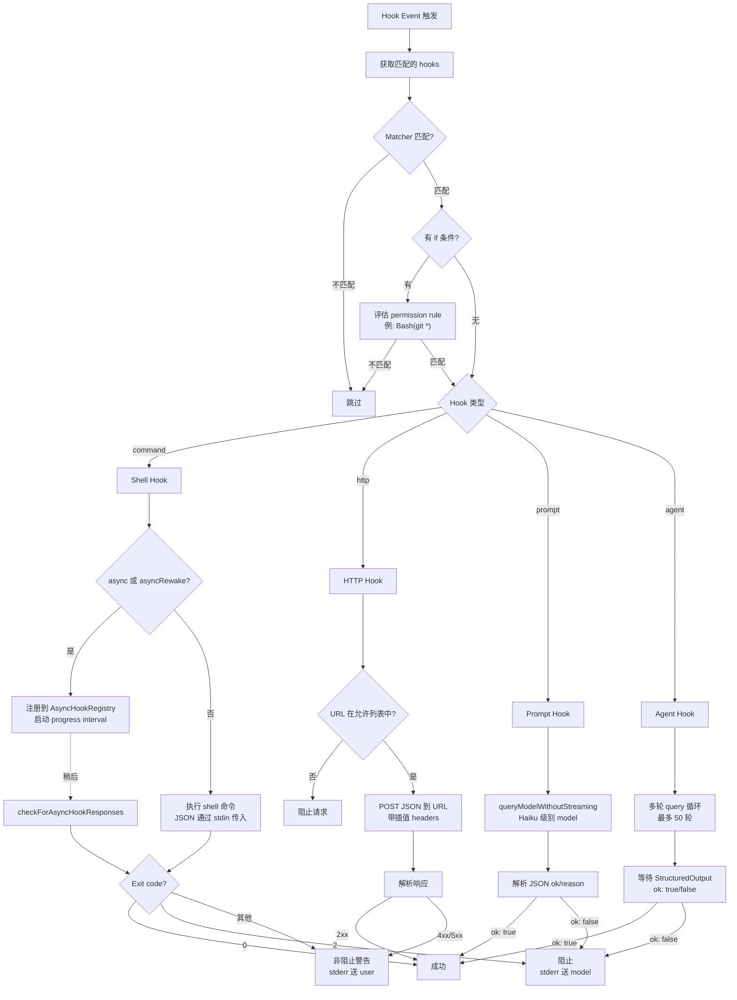
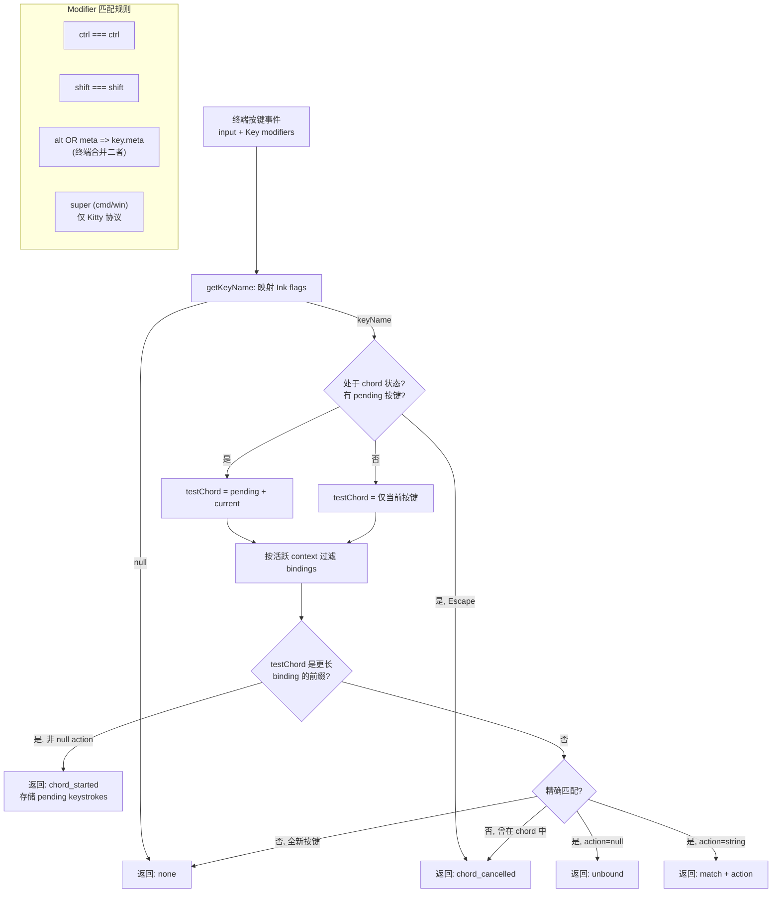

# 第二十二章：Hook System — 事件驱动的行为拦截与扩展

> Claude Code 的 Hook System 是一个完整的事件驱动拦截框架：27 种 event type 覆盖了从 tool 调用到 session 生命周期的每一个关键节点，4 种 execution type（command、HTTP、prompt、agent）提供了从 shell 脚本到多轮 LLM 推理的全谱系执行能力，exit code protocol 将 hook 的输出精确映射为 allow/block/warn 三种语义。本章将逐层拆解这套系统的事件模型、执行引擎、配置机制和异步协调策略，并附带 Keybinding System 的完整分析。

---

## 22.1 Hook 事件模型：27 种 Event Type

Hook System 的核心是事件模型。系统在 `hookEvents.ts` 中定义了 27 种事件类型，每种事件都有明确的触发时机、matcher 字段和 exit code 语义。这些事件分为五个逻辑类别。

### 22.1.1 完整 Event Type 表

| Event | 触发时机 | Matcher 字段 | Exit Code 语义 |
|-------|---------|-------------|---------------|
| **Tool 生命周期** | | | |
| `PreToolUse` | Tool 执行前 | `tool_name` | 0=静默放行, 2=阻止+stderr 送 model, 其他=stderr 送 user |
| `PostToolUse` | Tool 执行后 | `tool_name` | 0=写入 transcript, 2=stderr 送 model, 其他=stderr 送 user |
| `PostToolUseFailure` | Tool 执行失败后 | `tool_name` | 0=写入 transcript, 2=stderr 送 model |
| **Permission 事件** | | | |
| `PermissionDenied` | Auto mode classifier 拒绝 | `tool_name` | 0=写入 transcript, 可重试 |
| `PermissionRequest` | 显示权限对话框 | `tool_name` | 0=使用 hook 决定 |
| **Session 生命周期** | | | |
| `SessionStart` | 新 session 启动 | `source` | 0=stdout 送 Claude |
| `SessionEnd` | Session 结束 | `reason` | 0=成功 |
| `Stop` | Claude 即将结束回复 | (无) | 0=静默, 2=stderr 送 model+继续 |
| `StopFailure` | API 错误终止 turn | `error` | Fire-and-forget |
| **Subagent 事件** | | | |
| `SubagentStart` | Subagent 启动 | `agent_type` | 0=stdout 送 subagent |
| `SubagentStop` | Subagent 即将结束 | `agent_type` | 0=静默, 2=继续 |
| **Compaction 事件** | | | |
| `PreCompact` | Compaction 前 | `trigger` | 0=自定义指令, 2=阻止 |
| `PostCompact` | Compaction 后 | `trigger` | 0=stdout 送 user |
| **User 交互** | | | |
| `UserPromptSubmit` | 用户提交 prompt | (无) | 0=stdout 送 Claude, 2=阻止+擦除 |
| `Notification` | 发送通知 | `notification_type` | 0=静默 |
| **Task 管理** | | | |
| `TaskCreated` | Task 正在创建 | (无) | 2=阻止创建 |
| `TaskCompleted` | Task 完成 | (无) | 2=阻止完成 |
| `TeammateIdle` | Teammate 即将空闲 | (无) | 2=阻止空闲 |
| **MCP Elicitation** | | | |
| `Elicitation` | MCP elicitation 请求 | `mcp_server_name` | 0=使用响应, 2=拒绝 |
| `ElicitationResult` | 用户响应 elicitation | `mcp_server_name` | 0=使用响应, 2=阻止 |
| **配置与环境** | | | |
| `ConfigChange` | 配置文件变更 | `source` | 2=阻止变更 |
| `InstructionsLoaded` | CLAUDE.md/规则加载 | `load_reason` | 仅可观测性 |
| `Setup` | 仓库 setup hooks | `trigger` | 0=stdout 送 Claude |
| `CwdChanged` | 工作目录变更 | (无) | `CLAUDE_ENV_FILE` 可用 |
| `FileChanged` | 监控文件变更 | filename pattern | `CLAUDE_ENV_FILE` 可用 |
| **Worktree 操作** | | | |
| `WorktreeCreate` | 创建 worktree | (无) | stdout=path |
| `WorktreeRemove` | 删除 worktree | (无) | 0=成功 |

理解这张表的关键在于：**每种事件的 exit code 语义不是统一的**。同样是 exit code 2，在 `PreToolUse` 中意味着阻止 tool 执行，在 `Stop` 中意味着让 Claude 继续输出，在 `ConfigChange` 中意味着阻止配置变更。exit code 是一种 protocol，而非简单的"成功/失败"二值。

### 22.1.2 Matcher 字段的差异化语义

Matcher 字段在不同事件中匹配不同的元数据：

- **Tool 事件**（`PreToolUse`, `PostToolUse`, `PostToolUseFailure`, `PermissionDenied`, `PermissionRequest`）：匹配 `tool_name`
- **Session 事件**（`SessionStart`）：匹配 `source`，值为 `startup`、`resume`、`clear`、`compact` 之一
- **Notification 事件**：匹配 `notification_type`
- **Config 事件**：匹配 `source`，如 `user_settings`、`project_settings`
- **无 matcher 事件**（`UserPromptSubmit`, `Stop`, `TeammateIdle` 等）：所有该类型的 hook 都会触发

空 matcher 或未设置 matcher 的 hook 会匹配该事件类型下的**所有**触发。

---

## 22.2 核心 Hook Event 深度分析

### 22.2.1 PreToolUse — Tool 调用的守门人

`PreToolUse` 是最常用的 hook event。它在每次 tool 调用执行前触发，是实现自定义安全策略的首选入口。

**典型场景**：
- 阻止对特定目录的写入
- 在执行 shell 命令前进行安全审查
- 记录所有 tool 调用的审计日志

**Exit code 语义**：
- `0`：静默允许。如果 stdout 非空，内容写入 transcript
- `2`：阻止执行。stderr 作为阻止原因发送给 model
- 其他：非阻止性警告。stderr 显示给 user，tool 继续执行

### 22.2.2 PostToolUse — 执行后拦截

`PostToolUse` 在 tool 成功执行后触发。它可以对执行结果进行审查、记录或追加处理。

**关键区别**：`PostToolUse` 的 exit code 2 不会"撤销"已执行的操作（例如已写入的文件），但可以将错误信息发送给 model，影响后续决策。

### 22.2.3 Stop — 控制 Claude 的终止行为

`Stop` event 在 Claude 即将结束当前回复时触发。这是一个强大的控制点：

- Exit code `0`：允许 Claude 正常停止
- Exit code `2`：将 stderr 内容注入 model 上下文，**强制 Claude 继续输出**

这使得 hook 可以实现"不满意就继续"的模式——例如检查 Claude 的输出是否包含必需的代码审查检查项，如果缺失，则注入提示让 Claude 补充。

### 22.2.4 SessionStart 和 Setup

`SessionStart` 在 session 初始化时触发，其 stdout 会被注入到 Claude 的初始上下文中。这是注入 session 级配置、环境信息、项目特定指令的理想位置。

`Setup` 事件用于仓库级初始化，通常在首次打开项目时触发。

**重要实现细节**：`SessionStart` 和 `Setup` 是仅有的两个始终发射 `HookExecutionEvent` 的事件。其他事件需要通过 `setAllHookEventsEnabled(true)` 显式启用。

### 22.2.5 UserPromptSubmit — 输入拦截

`UserPromptSubmit` 在用户提交 prompt 后、发送给 Claude 前触发。Exit code 2 不仅阻止发送，还**擦除**用户输入。这可以用于实现输入过滤、敏感信息检测等。

---

## 22.3 Exit Code Protocol

Exit code 是 hook 与 Claude Code 之间的通信协议。三个值对应三种语义：

```
Exit 0 (成功)     -> 允许操作继续
                      stdout 的处理方式取决于具体事件

Exit 2 (阻止)     -> 阻止/拦截当前操作
                      stderr 发送给 model 作为阻止原因

其他 (警告)       -> 非阻止性警告
                      stderr 显示给 user
                      操作继续执行
```

为什么选择 exit code 2 而不是 1？这是一个刻意的设计决策。Exit code 1 在 Unix 系统中太过常见——命令失败、参数错误、网络超时都会产生 exit code 1。将其定义为"阻止"语义会导致大量误阻止。Exit code 2 在 Unix 惯例中表示"误用"（misuse），足够罕见，可以作为显式的阻止信号。



---

## 22.4 四种 Hook Execution Type

### 22.4.1 Command Hook（Shell 执行）

Command hook 是最基础、最常用的类型。它将一个 shell 命令作为子进程执行。

**Schema 定义**：

```typescript
const BashCommandHookSchema = z.object({
  type: z.literal('command'),
  command: z.string(),
  if: IfConditionSchema().optional(),
  shell: z.enum(['bash', 'powershell']).optional(),
  timeout: z.number().positive().optional(),
  statusMessage: z.string().optional(),
  once: z.boolean().optional(),
  async: z.boolean().optional(),
  asyncRewake: z.boolean().optional(),
})
```

**执行机制**：

1. Hook 的 JSON 输入通过 **stdin** 管道传递给 command
2. Shell 解释器默认使用 `$SHELL`（bash），也可以指定 `powershell`
3. `once` 标志使 hook 在首次执行后自动移除
4. `async` 标志使 hook 在后台非阻塞执行
5. `asyncRewake` 在后台执行完毕且 exit code 为 2 时唤醒 model

**环境变量**：
- `CLAUDE_ENV_FILE`：指向一个可写文件路径（用于 `CwdChanged`/`FileChanged` 事件），hook 可以写入 bash export 语句来设置环境变量

**配置示例**：

```json
{
  "hooks": {
    "PreToolUse": [
      {
        "matcher": "Bash",
        "hooks": [
          {
            "type": "command",
            "command": "python3 ~/.claude/security-check.py",
            "if": "Bash(rm *)",
            "timeout": 5000,
            "statusMessage": "Running security check..."
          }
        ]
      }
    ]
  }
}
```

### 22.4.2 HTTP Hook

HTTP hook 将 JSON 输入 POST 到指定 URL，适合与外部服务集成。

```typescript
const HttpHookSchema = z.object({
  type: z.literal('http'),
  url: z.string().url(),
  if: IfConditionSchema().optional(),
  timeout: z.number().positive().optional(),
  headers: z.record(z.string(), z.string()).optional(),
  allowedEnvVars: z.array(z.string()).optional(),
  statusMessage: z.string().optional(),
})
```

**安全特性**（`execHttpHook.ts`）：

1. **URL 白名单**：`allowedHttpHookUrls` 设置限制可访问的 URL
2. **环境变量插值**：Header 值支持 `$VAR_NAME` / `${VAR_NAME}` 语法，但仅限于 `allowedEnvVars` 列表中的变量
3. **Header 注入防护**：`sanitizeHeaderValue()` 剥离 CR/LF/NUL 字节
4. **SSRF 防护**：验证解析后的 IP 地址，阻止私有/链路本地地址范围（允许 loopback）
5. **Sandbox 代理**：sandbox 启用时通过 sandbox 网络代理路由

默认超时：10 分钟。

### 22.4.3 Prompt Hook（单轮 LLM）

Prompt hook 使用一次 LLM 调用来评估条件。这是让 AI 参与 hook 决策的轻量方式。

```typescript
const PromptHookSchema = z.object({
  type: z.literal('prompt'),
  prompt: z.string(),
  if: IfConditionSchema().optional(),
  timeout: z.number().positive().optional(),
  model: z.string().optional(),
  statusMessage: z.string().optional(),
  once: z.boolean().optional(),
})
```

**执行流程**（`execPromptHook.ts`）：

1. 将 `$ARGUMENTS` 占位符替换为 JSON 输入
2. 调用 `queryModelWithoutStreaming()`，使用 JSON schema 约束输出格式
3. System prompt 指示 model 返回 `{ok: true}` 或 `{ok: false, reason: "..."}`
4. 默认使用 Haiku 级别的小型快速 model
5. 默认超时 30 秒

**适用场景**：需要语义理解的策略判断，例如"这段代码修改是否涉及安全敏感的 API 调用"。

### 22.4.4 Agent Hook（多轮 LLM）

Agent hook 是最强大的类型——它启动一个完整的多轮 LLM query 循环，hook 本身可以使用 tool。

```typescript
const AgentHookSchema = z.object({
  type: z.literal('agent'),
  prompt: z.string(),
  if: IfConditionSchema().optional(),
  timeout: z.number().positive().optional(),
  model: z.string().optional(),
  statusMessage: z.string().optional(),
})
```

**执行机制**（`execAgentHook.ts`）：

1. 创建唯一的 `hookAgentId`
2. 配置隔离的 `ToolUseContext`：
   - 可使用所有 tool，但排除 `ALL_AGENT_DISALLOWED_TOOLS`（防止 hook agent 生成子 agent）
   - 添加 `StructuredOutputTool` 用于报告结果
   - 设置 `dontAsk` mode（无交互式权限弹窗）
3. 注册 `registerStructuredOutputEnforcement()` 作为 session 级 Stop hook
4. 执行最多 `MAX_AGENT_TURNS = 50` 轮 query
5. 等待 `{ ok: boolean, reason?: string }` 通过 StructuredOutput 返回
6. 默认超时 60 秒

---

## 22.5 Hook 配置机制

### 22.5.1 Settings 级定义

Hook 在 `settings.json` 的 `hooks` key 下配置：

```json
{
  "hooks": {
    "PreToolUse": [
      {
        "matcher": "Write",
        "hooks": [
          {
            "type": "command",
            "command": "echo 'About to write a file'"
          }
        ]
      }
    ]
  }
}
```

Schema 验证使用 Zod：

```typescript
export const HooksSchema = lazySchema(() =>
  z.record(z.enum(HOOK_EVENTS), z.array(HookMatcherSchema()))
)
```

一个 `HookMatcher` 将 matcher pattern 与一个或多个 hook command 关联：

```typescript
export type HookMatcher = {
  matcher?: string
  hooks: HookCommand[]
}
```

### 22.5.2 Matcher 规则

Matcher 字段基于事件的 `matcherMetadata.fieldToMatch` 进行匹配：

- `PreToolUse`/`PostToolUse`：匹配 tool 名称（如 `Write`、`Bash`、`Read`）
- `SessionStart`：匹配 source（`startup`、`resume`、`clear`、`compact`）
- `Notification`：匹配 notification type
- `ConfigChange`：匹配 source（`user_settings`、`project_settings` 等）

**空 matcher 匹配所有事件**。这是一个重要的默认行为——如果你想拦截所有 `PreToolUse` 事件而不区分 tool 类型，省略 matcher 即可。

### 22.5.3 `if` 条件过滤

Hook command 可以附加 `if` 字段，使用 permission rule 语法进行更精细的过滤：

```json
{
  "type": "command",
  "command": "run-lint.sh",
  "if": "Bash(git *)"
}
```

`if` 条件在 **hook 进程启动前** 评估。这避免了为不匹配的命令启动进程的开销。

关键语义：**`if` 条件是 hook identity 的一部分**。相同 command 加不同 `if` 条件被视为不同的 hook：

```typescript
const sameIf = (x: { if?: string }, y: { if?: string }) =>
  (x.if ?? '') === (y.if ?? '')
```

### 22.5.4 Hook 来源

Hook 来自多个来源，通过 `HookSource` 类型追踪：

```typescript
export type HookSource =
  | EditableSettingSource   // user, project, local settings
  | 'policySettings'       // Enterprise 策略管理
  | 'pluginHook'           // 已安装的 plugin
  | 'sessionHook'          // 临时内存 hook
  | 'builtinHook'          // 内部内置 hook
```

`getAllHooks()` 函数合并来自所有 settings 文件的 hook。当 `allowManagedHooksOnly` 启用时，user/project/local 级别的 hook 被屏蔽，仅保留 enterprise 策略 hook。

---

## 22.6 异步 Hook 协调

### 22.6.1 AsyncHookRegistry

异步 hook 通过 `AsyncHookRegistry.ts` 管理，在后台运行并稍后报告结果：

```typescript
export type PendingAsyncHook = {
  processId: string
  hookId: string
  hookName: string
  hookEvent: HookEvent | 'StatusLine' | 'FileSuggestion'
  toolName?: string
  startTime: number
  timeout: number
  command: string
  responseAttachmentSent: boolean
  shellCommand?: ShellCommand
  stopProgressInterval: () => void
}
```

**生命周期**：

1. **注册**：`registerPendingAsyncHook()` 存储 hook 及其 `ShellCommand` 引用，启动一个定期发射 `HookProgressEvent` 的 progress interval
2. **轮询**：`checkForAsyncHookResponses()` 遍历所有 pending hook，检查 shell command 是否完成，读取 stdout 中的 JSON 响应行
3. **清理**：`finalizePendingAsyncHooks()` 在 session 结束时杀死仍在运行的 hook 并终结已完成的 hook

**SessionStart hook 的特殊处理**：当一个 `SessionStart` 类型的异步 hook 完成时，系统会使 session 环境缓存失效，触发环境变量重新加载。

### 22.6.2 Post-Sampling Hooks

Post-sampling hook 是一种仅供内部使用的 hook 类型，不暴露在 settings 中：

```typescript
export type PostSamplingHook = (context: REPLHookContext) => Promise<void> | void

export type REPLHookContext = {
  messages: Message[]
  systemPrompt: SystemPrompt
  userContext: { [k: string]: string }
  systemContext: { [k: string]: string }
  toolUseContext: ToolUseContext
  querySource?: QuerySource
}
```

通过 `registerPostSamplingHook()` 注册，`executePostSamplingHooks()` 执行。错误会被记录日志但不会导致主流程失败。

### 22.6.3 Session Hooks

Session hook 是临时的、内存驻留的 hook，scope 到特定 session 或 agent：

```typescript
export type SessionHooksState = Map<string, SessionStore>
```

两个子类型：

1. **Command/Prompt hooks**：通过 `addSessionHook()` 添加，持久化为 `HookCommand` 对象
2. **Function hooks**：通过 `addFunctionHook()` 添加，在内存中执行 TypeScript callback

```typescript
export type FunctionHook = {
  type: 'function'
  id?: string
  timeout?: number
  callback: FunctionHookCallback
  errorMessage: string
  statusMessage?: string
}
```

**性能优化**：`SessionHooksState` 使用 `Map`（而非 `Record`），因此 mutation 是 O(1) 的，不会触发 store listener 通知。这在高并发工作流中至关重要——当并行 agent 在同一 tick 内触发 N 次 `addFunctionHook` 时，Map 的性能优势尤为明显。

---

## 22.7 Hook 与 Permission 系统的集成

Hook System 与 Permission System 的交互是 Claude Code 安全架构中最精巧的部分之一。

### 22.7.1 PreToolUse hook 作为权限守卫

`PreToolUse` hook 的 exit code 2 可以阻止 tool 执行，这实质上是一种**编程式权限决策**。与 Permission System 的 rule-based 决策不同，hook 可以执行任意逻辑——调用外部 API、检查文件内容、执行安全扫描。

### 22.7.2 PermissionRequest 事件

`PermissionRequest` 在权限对话框显示时触发。Hook 返回 exit code 0 时可以**替代用户做出权限决策**。这使得完全自动化的权限管理成为可能。

### 22.7.3 PermissionDenied 事件

当 auto mode classifier 拒绝一个 tool 调用时触发 `PermissionDenied`。Hook 可以记录这些拒绝事件用于审计，或者在 exit code 0 时允许 retry。

---

## 22.8 Keybinding System

Keybinding System 是 Claude Code 的另一个扩展面，提供了可定制的键盘快捷键体系。

### 22.8.1 架构概览

系统由 18 个 context 和约 80 个 action 组成。每个 context 代表 UI 的一个状态或区域：

```typescript
const KEYBINDING_CONTEXTS = [
  'Global', 'Chat', 'Autocomplete', 'Confirmation', 'Help',
  'Transcript', 'HistorySearch', 'Task', 'ThemePicker',
  'Settings', 'Tabs', 'Attachments', 'Footer', 'MessageSelector',
  'DiffDialog', 'ModelPicker', 'Select', 'Plugin',
]
```

Action 标识符遵循 `category:action` 模式：

```typescript
// 部分示例
'app:interrupt', 'app:exit', 'app:toggleTodos', 'app:toggleTranscript',
'chat:cancel', 'chat:cycleMode', 'chat:submit', 'chat:undo',
'autocomplete:accept', 'autocomplete:dismiss',
'confirm:yes', 'confirm:no',
```

另外支持 `command:*` 模式用于绑定 slash command（如 `command:help`）。

将 action 设置为 `null` 表示**解绑**。

### 22.8.2 Keystroke 解析

`parseKeystroke()` 将字符串格式的按键描述解析为结构化对象：

**Modifier 别名**：

| 配置语法 | 内部 modifier |
|---------|-------------|
| `ctrl`, `control` | `ctrl` |
| `alt`, `opt`, `option` | `alt` |
| `shift` | `shift` |
| `meta` | `meta` |
| `cmd`, `command`, `super`, `win` | `super` |

**Key 别名**：`esc` -> `escape`, `return` -> `enter`, `space` -> `' '`, 箭头符号（`\u2191\u2193\u2190\u2192`）映射到名称。

### 22.8.3 Chord 支持

多按键 chord 使用空格分隔的 keystroke 字符串表示：

```typescript
export function parseChord(input: string): Chord {
  if (input === ' ') return [parseKeystroke('space')]
  return input.trim().split(/\s+/).map(parseKeystroke)
}
```

示例：`"ctrl+x ctrl+k"` 是一个包含两个按键的 chord。

**Chord 解析流程**（`resolveKeyWithChordState()`）：

1. 如果当前处于 chord 状态（有 `pending` 按键）：
   - Escape 取消 chord
   - 构建 test chord = `[...pending, currentKeystroke]`
2. 检查 test chord 是否是某个更长 binding 的**前缀**
   - 如果是（且该 binding 未被 null 解绑）：进入 `chord_started` 状态
3. 检查**精确匹配**
   - 如果找到：返回 action（或 `unbound`）
4. 无匹配：取消 chord 或返回 `none`



### 22.8.4 Hot Reload

`loadUserBindings.ts` 通过 chokidar 实现文件监控和热重载：

```typescript
watcher = chokidar.watch(userPath, {
  persistent: true,
  ignoreInitial: true,
  awaitWriteFinish: {
    stabilityThreshold: 500,  // ms
    pollInterval: 200,         // ms
  },
  ignorePermissionErrors: true,
  usePolling: false,
  atomic: true,
})
```

**配置文件路径**：`~/.claude/keybindings.json`

**文件格式**：

```json
{
  "$schema": "...",
  "bindings": [
    { "context": "Chat", "bindings": { "ctrl+s": "chat:stash" } }
  ]
}
```

**合并策略**：用户 binding 追加到默认 binding 之后，后定义者胜出：

```typescript
const mergedBindings = [...defaultBindings, ...userParsed]
```

### 22.8.5 验证体系

五种验证类型确保配置正确性：

```typescript
export type KeybindingWarningType =
  | 'parse_error'      // 按键模式语法错误
  | 'duplicate'        // 同一 context 中重复绑定
  | 'reserved'         // 保留快捷键 (ctrl+c, ctrl+d)
  | 'invalid_context'  // 未知 context 名称
  | 'invalid_action'   // 未知 action 标识符
```

**JSON 重复键检测**：由于 `JSON.parse` 会静默使用最后一个值处理重复键，`checkDuplicateKeysInJson()` 直接扫描原始 JSON 字符串来发现重复。

---

## 22.9 实践示例

### 22.9.1 构建自定义安全 Hook

场景：阻止 Claude 删除 `src/` 目录下的任何文件。

```json
{
  "hooks": {
    "PreToolUse": [
      {
        "matcher": "Bash",
        "hooks": [
          {
            "type": "command",
            "command": "bash -c 'input=$(cat); cmd=$(echo \"$input\" | jq -r .command); if echo \"$cmd\" | grep -qE \"rm\\s+.*src/\"; then echo \"Blocked: cannot delete files in src/\" >&2; exit 2; fi; exit 0'",
            "if": "Bash(rm *)",
            "statusMessage": "Checking for protected file deletion..."
          }
        ]
      }
    ]
  }
}
```

工作原理：
1. `matcher: "Bash"` 限定只有 Bash tool 调用才触发
2. `if: "Bash(rm *)"` 进一步过滤，只有包含 `rm` 的命令才执行 hook
3. Hook 读取 stdin 的 JSON 输入，提取 command 字段
4. 检查是否匹配 `rm ... src/` 模式
5. 匹配时输出 stderr 并 exit 2 阻止执行

### 22.9.2 构建通知 Hook

场景：在 Claude 完成任务时通过 HTTP webhook 发送通知。

```json
{
  "hooks": {
    "Stop": [
      {
        "hooks": [
          {
            "type": "http",
            "url": "https://hooks.slack.com/services/T.../B.../xxx",
            "headers": {
              "Content-Type": "application/json",
              "Authorization": "Bearer $SLACK_TOKEN"
            },
            "allowedEnvVars": ["SLACK_TOKEN"],
            "timeout": 5000,
            "statusMessage": "Sending completion notification..."
          }
        ]
      }
    ]
  }
}
```

注意：
- HTTP hook 的 `allowedEnvVars` 字段确保只有明确声明的环境变量才会被插值，防止意外泄露
- 需要在 `allowedHttpHookUrls` settings 中注册 Slack webhook URL
- 无 matcher 意味着每次 Claude 停止时都触发

### 22.9.3 使用 Prompt Hook 进行语义审查

场景：让 LLM 判断即将执行的 shell 命令是否存在安全风险。

```json
{
  "hooks": {
    "PreToolUse": [
      {
        "matcher": "Bash",
        "hooks": [
          {
            "type": "prompt",
            "prompt": "Evaluate whether this shell command is safe to execute in a development environment. The command details are: $ARGUMENTS. Consider: does it modify system files? Does it access network resources unexpectedly? Does it delete data without backup?",
            "model": "claude-haiku-4-5-20250501",
            "timeout": 15000,
            "statusMessage": "AI security review..."
          }
        ]
      }
    ]
  }
}
```

Prompt hook 返回 `{ok: false, reason: "..."}` 时自动阻止，无需编写任何脚本。

---

## 22.10 架构总结

Hook System 的设计体现了几个核心原则：

**事件驱动，非侵入式**。27 种事件覆盖了 Claude Code 的完整生命周期，但 hook 本身不修改核心流程——它们通过 exit code protocol 表达意图，由框架决定如何响应。

**渐进式复杂度**。从简单的 shell command 到多轮 LLM agent，四种 execution type 覆盖了从脚本化到智能化的全谱系，开发者可以根据需求选择适当的复杂度。

**安全优先**。HTTP hook 的 URL 白名单、SSRF 防护、环境变量隔离，以及 agent hook 的 tool 限制和 `dontAsk` mode，都体现了"默认安全"的设计理念。

**异步友好**。`AsyncHookRegistry` 和 `asyncRewake` 机制使得耗时操作不会阻塞主流程，同时保留了在完成时影响后续决策的能力。

这套系统与 Permission System、Tool System 的深度集成，使 Claude Code 成为一个真正可定制、可审计、可扩展的 AI Agent 平台。
