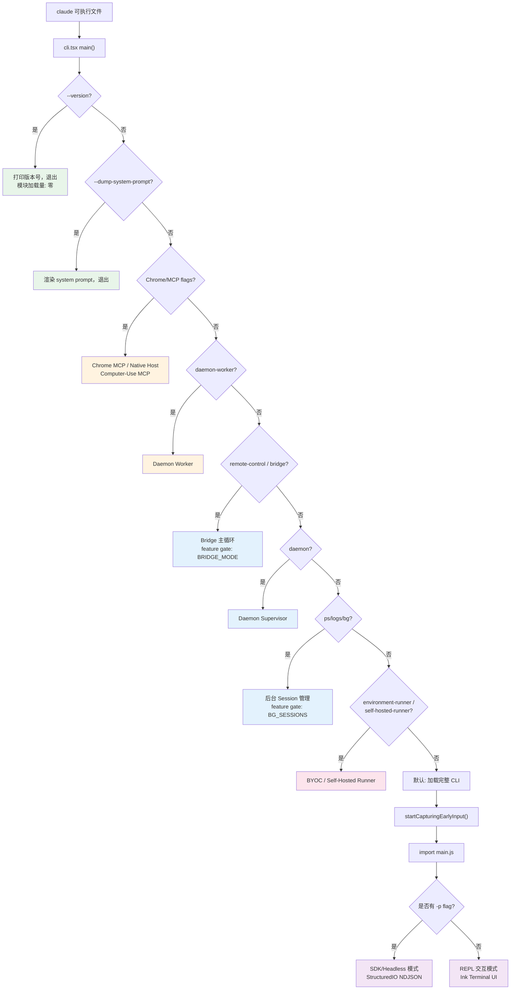
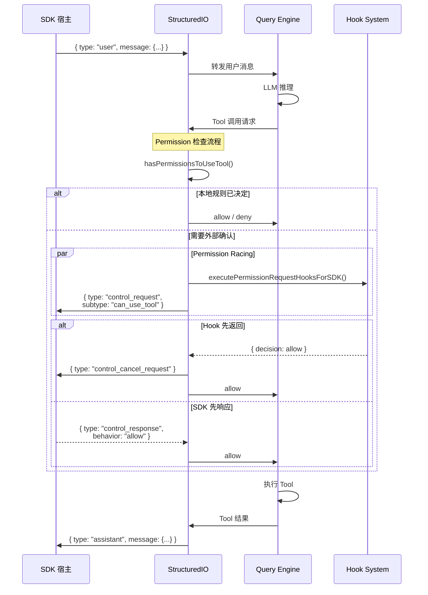

# 第二十三章：CLI 架构与多模式入口

> 一个 302 行的入口文件如何将 513K 行的 TypeScript 代码库分解为 10 种独立的运行模式？Claude Code 的 `cli.tsx` 实现了一套优先级驱动的 fast-path dispatch 机制：在加载任何核心模块之前，通过逐级检查 CLI flag 和环境变量，将请求路由到从零开销的 `--version` 到完整 REPL 的不同执行路径。配合 Bun bundler 的 `feature()` 编译期宏实现 30+ 个 feature gate 的死代码消除，以及 5,594 行的 `print.ts` 编排层管理消息队列与 NDJSON 结构化 I/O 协议，整套架构在极低的冷启动开销下支撑了从开发者工作站到云端容器的全场景部署。

---

## 23.1 入口分发：10 种运行模式

Claude Code 并非一个单一的交互式终端工具。它是一个多态二进制文件，同一个 `claude` 可执行文件根据 CLI 参数和环境变量的组合进入完全不同的运行模式。这种设计的核心约束是：**每种模式只应加载自己需要的模块**。

### 23.1.1 模式总览

| 模式 | 入口方式 | I/O 机制 | 使用场景 |
|------|---------|---------|---------|
| **REPL**（交互式） | `claude`（无特殊 flag） | Terminal Ink UI | 开发者工作站 |
| **SDK / Headless** | `claude -p "prompt"` | stdin/stdout NDJSON | Agent SDK、CI/CD |
| **Server** | `claude --direct-connect-server-url` | WebSocket | Direct-connect 服务器 |
| **Remote / CCR** | `CLAUDE_CODE_REMOTE=true` | WebSocket/SSE transport | 云端托管 session |
| **Bridge** | `claude remote-control` | Polling + 子进程 | Remote Control 宿主 |
| **Daemon** | `claude daemon` | IPC + worker 进程 | 长运行 supervisor |
| **Background** | `claude --bg` / `claude ps` | Detached session 注册 | 非阻塞任务 |
| **Chrome MCP** | `--claude-in-chrome-mcp` | stdio MCP 协议 | 浏览器集成 |
| **BYOC Runner** | `claude environment-runner` | REST API polling | Bring-your-own-compute |
| **Self-Hosted Runner** | `claude self-hosted-runner` | REST API polling | 自托管基础设施 |

这 10 种模式的分发逻辑全部集中在 `src/entrypoints/cli.tsx`，一个仅 302 行的文件。

### 23.1.2 Fast-Path Dispatch 表

`main()` 函数实现了一张优先级有序的分发表。排在前面的路径加载更少的模块，执行更快：

| 优先级 | 条件 | 动作 | 加载模块量 |
|--------|------|------|-----------|
| 1 | `--version` / `-v` | 打印 `MACRO.VERSION`，退出 | 零 |
| 2 | `--dump-system-prompt` | 渲染 system prompt，退出 | config, model, prompts |
| 3 | `--claude-in-chrome-mcp` | 运行 Chrome MCP server | claudeInChrome/mcpServer |
| 4 | `--chrome-native-host` | 运行 Chrome native host | claudeInChrome/chromeNativeHost |
| 5 | `--computer-use-mcp` | 运行 computer-use MCP server | computerUse/mcpServer |
| 6 | `--daemon-worker` | 运行 daemon worker | daemon/workerRegistry |
| 7 | `remote-control` / `rc` / `bridge` | Bridge 主循环 | bridge/bridgeMain |
| 8 | `daemon` | Daemon supervisor | daemon/main |
| 9 | `ps` / `logs` / `attach` / `kill` / `--bg` | 后台 session 管理 | cli/bg |
| 10 | `new` / `list` / `reply` | Template job | cli/handlers/templateJobs |
| 11 | `environment-runner` | BYOC runner | environment-runner/main |
| 12 | `self-hosted-runner` | 自托管 runner | self-hosted-runner/main |
| 13 | `--tmux` + `--worktree` | Tmux worktree 执行 | utils/worktree |
| 14 | `--update` / `--upgrade` | 重写 argv 到 `update` | (argv 重写) |
| 15 | `--bare` | 设置 SIMPLE env 变量 | (环境变量) |
| DEFAULT | 以上均不匹配 | 加载完整 CLI | 所有模块 |

这张表的关键设计决策：**所有 import 都是动态的**。没有任何顶层 `import` 语句会在分发之前触发模块求值：

```typescript
// 优先级 7：Bridge 模式 — 仅在匹配时加载 bridgeMain
if (feature('BRIDGE_MODE') && (args[0] === 'remote-control' || args[0] === 'rc')) {
  const { bridgeMain } = await import('../bridge/bridgeMain.js');
  await bridgeMain(args.slice(1));
  return;
}
```

当没有任何 fast-path 匹配时，进入默认路径：

```typescript
const { startCapturingEarlyInput } = await import('../utils/earlyInput.js');
startCapturingEarlyInput();  // 开始缓冲 stdin 按键
const { main: cliMain } = await import('../main.js');
await cliMain();
```

`startCapturingEarlyInput()` 是一个关键细节：在完整 CLI 的 200+ 模块加载期间（约 135ms），用户可能已经开始打字。这个函数在模块加载之前就开始缓冲 stdin，确保不丢失任何按键输入。

### 23.1.3 多模式分发流程



### 23.1.4 环境预处理

在分发表执行之前，`cli.tsx` 的顶层代码执行三个关键的 side-effect：

```typescript
// 1. 禁用 corepack 自动 pin
process.env.COREPACK_ENABLE_AUTO_PIN = '0';

// 2. 为 CCR 容器设置 V8 堆上限（16GB 机器限制到 8GB）
if (process.env.CLAUDE_CODE_REMOTE === 'true') {
  process.env.NODE_OPTIONS = existing
    ? `${existing} --max-old-space-size=8192`
    : '--max-old-space-size=8192';
}

// 3. Ablation baseline: feature-gated 的实验组配置
if (feature('ABLATION_BASELINE') && process.env.CLAUDE_CODE_ABLATION_BASELINE) {
  for (const k of [
    'CLAUDE_CODE_SIMPLE', 'CLAUDE_CODE_DISABLE_THINKING',
    'DISABLE_INTERLEAVED_THINKING', 'DISABLE_COMPACT',
    'DISABLE_AUTO_COMPACT', 'CLAUDE_CODE_DISABLE_AUTO_MEMORY',
    'CLAUDE_CODE_DISABLE_BACKGROUND_TASKS',
  ]) {
    process.env[k] ??= '1';
  }
}
```

第三个 side-effect 特别值得注意：`ABLATION_BASELINE` 是一个 feature gate，在外部构建中会被完全删除。它的作用是为 A/B 测试提供一个"关闭所有高级功能"的基线配置。

---

## 23.2 Feature Gate 与死代码消除

### 23.2.1 `feature()` 宏的工作原理

```typescript
import { feature } from 'bun:bundle';
```

`feature()` 是 Bun bundler 提供的编译期宏。在构建时，它根据 feature flag 配置文件的值被替换为 `true` 或 `false` 字面量。Bun 的 tree-shaker 随后消除不可达分支：

```typescript
// 源代码
if (feature('BRIDGE_MODE') && args[0] === 'remote-control') {
  const { bridgeMain } = await import('../bridge/bridgeMain.js');
  await bridgeMain(args.slice(1));
  return;
}

// 当 BRIDGE_MODE=false 时的构建输出
// 整个 if 块被移除 — 零字节
```

这与运行时 feature flag（如 GrowthBook）有本质区别：`feature()` 产生的是**构建时决策**，不可达的代码及其传递依赖在产物中完全不存在。

### 23.2.2 30+ Feature Flag 一览

| Flag | 用途 | 影响范围 |
|------|------|---------|
| `BRIDGE_MODE` | Remote Control / bridge 系统 | 入口分发 + 命令过滤 |
| `DAEMON` | 长运行 daemon supervisor | 入口分发 |
| `BG_SESSIONS` | 后台 session 管理 | 入口分发 |
| `TEMPLATES` | Template job 系统 | 入口分发 |
| `BYOC_ENVIRONMENT_RUNNER` | BYOC runner | 入口分发 |
| `SELF_HOSTED_RUNNER` | 自托管 runner | 入口分发 |
| `ABLATION_BASELINE` | 实验 L0 ablation | 环境预处理 |
| `DUMP_SYSTEM_PROMPT` | 内部 prompt 提取 | 入口分发 |
| `CHICAGO_MCP` | Computer-use MCP server | 入口分发 |
| `COORDINATOR_MODE` | 协调者模式 | main loop |
| `KAIROS` | Assistant 模式 | session 管理 |
| `PROACTIVE` | 主动模式 | session 管理 |
| `TRANSCRIPT_CLASSIFIER` | 自动权限模式 | permission 系统 |
| `BASH_CLASSIFIER` | Bash 命令分类器 | tool 执行 |
| `VOICE_MODE` | 语音输入模式 | 命令注册 |
| `WORKFLOW_SCRIPTS` | Workflow 系统 | 命令注册 |
| `MCP_SKILLS` | MCP-based skills | 扩展系统 |
| `FORK_SUBAGENT` | Fork subagent | agent 系统 |
| `TEAMMEM` | 团队记忆 | 记忆系统 |
| `HISTORY_SNIP` | 历史裁剪 | context 管理 |
| `CCR_REMOTE_SETUP` | 云端远程设置 | CCR 初始化 |
| `CCR_AUTO_CONNECT` | 自动连接 CCR | 连接管理 |
| `ULTRAPLAN` | Ultra plan 模式 | 规划系统 |
| `TORCH` | Torch 模式 | 执行模式 |
| `UDS_INBOX` | Unix domain socket inbox | 通信机制 |
| `BUDDY` | Buddy 系统 | 协作模式 |
| `EXTRACT_MEMORIES` | 记忆提取 | 记忆系统 |
| `AGENT_TRIGGERS` | Cron 触发 agent | 调度系统 |
| `EXPERIMENTAL_SKILL_SEARCH` | Skill 搜索索引 | 搜索系统 |
| `KAIROS_GITHUB_WEBHOOKS` | GitHub webhook 订阅 | 事件系统 |

### 23.2.3 Conditional-Require 模式

对于不能使用动态 `import()` 的场景（例如需要同步引用类型的模块），代码库使用 conditional `require()` 模式：

```typescript
const coordinatorModeModule = feature('COORDINATOR_MODE')
  ? require('./coordinator/coordinatorMode.js') as typeof import('./coordinator/coordinatorMode.js')
  : null;
```

当 `COORDINATOR_MODE=false` 时，bundler 将整个 `require()` 调用及其目标模块的传递依赖从产物中移除。`coordinatorModeModule` 在消费端通过 null check 保护：

```typescript
if (coordinatorModeModule) {
  coordinatorModeModule.enableCoordinator(config);
}
```

这种模式在整个代码库中广泛使用，是 feature gate 系统与 TypeScript 类型安全之间的桥梁。

---

## 23.3 CLI 主循环：print.ts 编排层

### 23.3.1 文件定位

`src/cli/print.ts` 是 headless/SDK 执行路径的核心编排文件，共 5,594 行。它是 CLI 层最大的单一文件，这个体量本身反映了其职责的广度：它不仅管理消息的输入输出，还协调了权限、hooks、session 状态、coordinator 模式、定时调度等横切关注点。

核心导出：

```typescript
export async function runHeadless(
  inputPrompt: string | AsyncIterable<string>,
  getAppState: () => AppState,
  setAppState: (f: (prev: AppState) => AppState) => void,
  commands: Command[],
  tools: Tools,
  sdkMcpConfigs: Record<string, McpSdkServerConfig>,
  agents: AgentDefinition[],
  options: { /* 30+ 配置选项 */ },
): Promise<void>
```

### 23.3.2 消息队列管理

`print.ts` 通过一个优先级消息队列管理命令流：

```typescript
import {
  dequeue, dequeueAllMatching, enqueue, hasCommandsInQueue,
  peek, subscribeToCommandQueue, getCommandsByMaxPriority,
} from 'src/utils/messageQueueManager.js';
```

队列支持命令批处理——连续的同类命令可以合并为一次 LLM 请求：

```typescript
export function canBatchWith(
  head: QueuedCommand,
  next: QueuedCommand | undefined,
): boolean {
  return (
    next !== undefined &&
    next.mode === 'prompt' &&
    next.workload === head.workload &&
    next.isMeta === head.isMeta
  );
}
```

批处理条件很精确：只有当下一条命令也是 prompt 模式、workload 类型相同、且 meta 属性一致时才会合并。这确保了不同性质的请求不会被意外合并。

### 23.3.3 重复消息防护

在 WebSocket 重连场景中，服务端可能重发已处理的消息。`print.ts` 通过 UUID 追踪机制防止重复处理：

```typescript
const MAX_RECEIVED_UUIDS = 10_000;
const receivedMessageUuids = new Set<UUID>();
const receivedMessageUuidsOrder: UUID[] = [];

function trackReceivedMessageUuid(uuid: UUID): boolean {
  if (receivedMessageUuids.has(uuid)) return false;  // 重复消息
  receivedMessageUuids.add(uuid);
  receivedMessageUuidsOrder.push(uuid);
  // 容量达到上限时驱逐最旧的条目
  if (receivedMessageUuidsOrder.length > MAX_RECEIVED_UUIDS) {
    const toEvict = receivedMessageUuidsOrder.splice(0, /* ... */);
    for (const old of toEvict) receivedMessageUuids.delete(old);
  }
  return true;  // 新 UUID
}
```

10,000 的容量上限在 LRU 语义下以 FIFO 驱逐——这是一种有界内存的精确去重策略。

### 23.3.4 集成点

`print.ts` 是系统中连接点最多的模块之一：

- **`ask()`** from `QueryEngine.js`：核心 LLM 查询函数
- **`StructuredIO` / `RemoteIO`**：I/O 协议层
- **`sessionStorage`**：会话持久化
- **`fileHistory`**：文件回退能力
- **`hookEvents`**：hook 执行触发
- **`commandLifecycle`**：命令生命周期通知
- **`sessionState`**：session 状态广播
- **GrowthBook**：运行时 feature flag
- **Coordinator 模式、Proactive 模式、Cron 调度器**：均为 feature-gated 集成

---

## 23.4 Structured I/O 协议

### 23.4.1 协议概述

`src/cli/structuredIO.ts`（860 行）实现了 NDJSON（Newline-Delimited JSON）协议，用于 SDK/headless 模式下的程序化通信。每条消息是一个独立的 JSON 对象，以 `\n` 终止。

### 23.4.2 消息类型体系

**入站消息（stdin）：**

```typescript
type StdinMessage =
  | SDKUserMessage        // { type: 'user', message: { role: 'user', content: ... } }
  | SDKControlRequest     // { type: 'control_request', request_id, request: { subtype } }
  | SDKControlResponse    // { type: 'control_response', response: { request_id, ... } }
  | { type: 'keep_alive' }
  | { type: 'update_environment_variables', variables: Record<string, string> }
  | { type: 'assistant' }
  | { type: 'system' }
```

**控制请求/响应协议：**

权限系统使用结构化的 request-response 协议：

```typescript
// 出站：CLI 向 SDK 宿主请求权限
{
  type: 'control_request',
  request_id: 'uuid-1',
  request: {
    subtype: 'can_use_tool',
    tool_name: 'Bash',
    input: { command: 'rm -rf /tmp/test' },
    tool_use_id: 'uuid-2',
    permission_suggestions: [...]
  }
}

// 入站：SDK 宿主响应
{
  type: 'control_response',
  response: {
    subtype: 'success',
    request_id: 'uuid-1',
    response: { behavior: 'allow', updatedInput: {...} }
  }
}

// 取消（当 hook 或 bridge 先解决时）
{ type: 'control_cancel_request', request_id: 'uuid-1' }
```

### 23.4.3 StructuredIO 类核心接口

```typescript
export class StructuredIO {
  readonly structuredInput: AsyncGenerator<StdinMessage | SDKMessage>;
  readonly outbound = new Stream<StdoutMessage>();

  constructor(input: AsyncIterable<string>, replayUserMessages?: boolean);
  async write(message: StdoutMessage): Promise<void>;
  prependUserMessage(content: string): void;
  getPendingPermissionRequests(): SDKControlRequest[];
  injectControlResponse(response: SDKControlResponse): void;
  createCanUseTool(onPermissionPrompt?): CanUseToolFn;
  createHookCallback(callbackId: string, timeout?: number): HookCallback;
  async handleElicitation(...): Promise<ElicitResult>;
  createSandboxAskCallback(): (hostPattern) => Promise<boolean>;
  async sendMcpMessage(serverName, message): Promise<JSONRPCMessage>;
}
```

### 23.4.4 Permission Racing 机制

权限决策涉及多个来源的竞争——这是整个 Structured I/O 协议中最精妙的部分：

```typescript
createCanUseTool(onPermissionPrompt?): CanUseToolFn {
  return async (tool, input, toolUseContext, assistantMessage, toolUseID) => {
    // 第一步：检查本地权限规则
    const mainResult = await hasPermissionsToUseTool(/*...*/);
    if (mainResult.behavior === 'allow' || mainResult.behavior === 'deny') {
      return mainResult;  // 本地规则已决定，无需外部确认
    }

    // 第二步：竞争 hook 与 SDK 宿主
    const hookPromise = executePermissionRequestHooksForSDK(/*...*/)
      .then(decision => ({ source: 'hook', decision }));
    const sdkPromise = this.sendRequest<PermissionToolOutput>(/*...*/)
      .then(result => ({ source: 'sdk', result }));

    const winner = await Promise.race([hookPromise, sdkPromise]);

    if (winner.source === 'hook' && winner.decision) {
      sdkPromise.catch(() => {});  // 抑制 AbortError
      hookAbortController.abort();
      return winner.decision;
    }
    // ... SDK 获胜或 hook 透传
  };
}
```

这种 racing 模式的含义是：hook 可以在 SDK 宿主响应之前"抢答"权限决策。这对于需要快速自动化审批的 CI/CD 场景至关重要。

### 23.4.5 Structured I/O 完整流程



### 23.4.6 重复响应保护

`StructuredIO` 追踪已解析的 `tool_use_id` 以防止 WebSocket 重连时的重复响应：

```typescript
private readonly resolvedToolUseIds = new Set<string>();
private readonly MAX_RESOLVED_TOOL_USE_IDS = 1000;
```

当一个 `control_response` 到达时，如果其对应的 `tool_use_id` 已在 `resolvedToolUseIds` 中，orphan handler 会忽略它。结合 `print.ts` 的 message UUID 去重，系统在两个层面提供了幂等性保障。

---

## 23.5 命令系统

### 23.5.1 命令类型

命令系统定义在 `src/commands.ts`（754 行），支持三种命令类型：

```typescript
type Command =
  | PromptCommand    // 展开为发送给 model 的文本（如 skills）
  | LocalCommand     // 本地执行，返回文本结果
  | LocalJSXCommand  // 本地执行，渲染 Ink UI
```

### 23.5.2 三层注册机制

**静态内置命令**——始终可用的 60+ 个命令：

```typescript
const COMMANDS = memoize((): Command[] => [
  addDir, advisor, agents, branch, btw, chrome, clear, color,
  compact, config, copy, desktop, context, cost, diff, doctor,
  effort, exit, fast, files, help, ide, init, keybindings,
  // ... 60+ 命令
]);
```

**Feature-gated 命令**——在外部构建中被 DCE 的命令：

```typescript
const bridge = feature('BRIDGE_MODE')
  ? require('./commands/bridge/index.js').default : null;
const voiceCommand = feature('VOICE_MODE')
  ? require('./commands/voice/index.js').default : null;
```

**动态命令**——从磁盘和插件系统加载：

```typescript
const loadAllCommands = memoize(async (cwd: string): Promise<Command[]> => {
  const [
    { skillDirCommands, pluginSkills, bundledSkills, builtinPluginSkills },
    pluginCommands,
    workflowCommands,
  ] = await Promise.all([
    getSkills(cwd),
    getPluginCommands(),
    getWorkflowCommands ? getWorkflowCommands(cwd) : Promise.resolve([]),
  ]);
  return [
    ...bundledSkills, ...builtinPluginSkills, ...skillDirCommands,
    ...workflowCommands, ...pluginCommands, ...pluginSkills, ...COMMANDS(),
  ];
});
```

注意加载顺序：bundled skills 优先级最高，内置命令最低。这使得 skill 可以覆盖同名的内置命令。

### 23.5.3 可用性过滤

命令根据认证上下文进行过滤：

```typescript
export function meetsAvailabilityRequirement(cmd: Command): boolean {
  if (!cmd.availability) return true;
  for (const a of cmd.availability) {
    switch (a) {
      case 'claude-ai':
        if (isClaudeAISubscriber()) return true;
        break;
      case 'console':
        if (!isClaudeAISubscriber() && !isUsing3PServices()
            && isFirstPartyAnthropicBaseUrl()) return true;
        break;
    }
  }
  return false;
}
```

### 23.5.4 Remote/Bridge 安全过滤

在 remote 和 bridge 模式下，命令集被严格限制：

```typescript
// Remote 模式安全命令（TUI-only，无本地执行）
export const REMOTE_SAFE_COMMANDS: Set<Command> = new Set([
  session, exit, clear, help, theme, color, vim, cost, usage, copy, btw, ...
]);

// Bridge 安全命令（纯文本输出，无终端特有效果）
export const BRIDGE_SAFE_COMMANDS: Set<Command> = new Set([
  compact, clear, cost, summary, releaseNotes, files,
]);

export function isBridgeSafeCommand(cmd: Command): boolean {
  if (cmd.type === 'local-jsx') return false;   // Ink UI — 始终阻止
  if (cmd.type === 'prompt') return true;        // Skills — 始终安全
  return BRIDGE_SAFE_COMMANDS.has(cmd);           // Local 命令 — 显式白名单
}
```

逻辑很清晰：`local-jsx` 命令依赖终端渲染，在 bridge 的纯文本通道中无法工作；`prompt` 命令只是生成发送给 model 的文本，天然安全；`local` 命令需要逐一审查后加入白名单。

### 23.5.5 内部命令

部分命令仅对 Anthropic 内部用户可用：

```typescript
export const INTERNAL_ONLY_COMMANDS = [
  backfillSessions, breakCache, bughunter, commit, commitPushPr,
  ctx_viz, goodClaude, issue, initVerifiers, mockLimits, bridgeKick,
  version, teleport, antTrace, perfIssue, env, oauthRefresh, debugToolCall,
  // ... 受 process.env.USER_TYPE === 'ant' 守护
];
```

---

## 23.6 Fast-Path 优化

### 23.6.1 零开销路径

分发表的前两个条目代表了极致的冷启动优化：

**`--version`**：不加载任何模块，直接读取构建时内联的 `MACRO.VERSION` 常量并退出。这个路径的执行时间本质上等于 Node.js/Bun 的 runtime 启动时间。

**`--dump-system-prompt`**：仅加载 config、model 和 prompts 三个模块树。相比完整 CLI 的 200+ 模块，这个路径节省了超过 90% 的模块求值开销。

### 23.6.2 初始化并行化

当进入默认的完整 CLI 路径时，`main.tsx` 利用三个顶层 side-effect 实现 I/O 与 import 的并行：

```typescript
profileCheckpoint('main_tsx_entry');
startMdmRawRead();         // 并行启动 MDM 子进程读取（~135ms）
startKeychainPrefetch();   // 预取 macOS keychain（~65ms）
```

这些 I/O 操作与后续的 200+ 模块 import（约 135ms）重叠执行。这意味着当模块加载完成时，MDM 数据和 keychain token 很可能已经就绪。

### 23.6.3 init() 的 Memoize 策略

`src/entrypoints/init.ts` 的 `init()` 函数被 memoize——无论被调用多少次，只执行一次。这允许多个入口路径安全地调用 `init()` 而不必担心重复初始化：

```typescript
export const init = memoize(async (): Promise<void> => {
  enableConfigs();
  applySafeConfigEnvironmentVariables();
  applyExtraCACertsFromConfig();  // 必须在任何 TLS 之前（Bun 启动时缓存 TLS）
  setupGracefulShutdown();
  // ... 8 个阶段的初始化
});
```

初始化的 8 个阶段严格有序：配置 -> 关闭处理 -> 分析 -> 认证 -> 网络 -> CCR 代理 -> 平台特定 -> Scratchpad。特别值得注意的是 `applyExtraCACertsFromConfig()` 必须在任何 TLS 连接之前执行，因为 Bun 在启动时缓存 TLS 配置。

### 23.6.4 延迟预取

首次渲染完成后，系统启动非关键预取：

```typescript
export function startDeferredPrefetches(): void {
  if (isEnvTruthy(process.env.CLAUDE_CODE_EXIT_AFTER_FIRST_RENDER)
      || isBareMode()) {
    return;  // benchmark 和脚本化 -p 调用跳过
  }
  // initUser, getUserContext, tips, countFiles, modelCapabilities, ...
}
```

`CLAUDE_CODE_EXIT_AFTER_FIRST_RENDER` 标志表明这个函数对启动性能测量的敏感度：在 benchmark 模式下完全跳过预取，确保测量数据不受干扰。

---

## 23.7 架构洞察

### 23.7.1 分层隔离的代价与收益

10 种运行模式共享同一个二进制文件的设计选择并非没有代价。`cli.tsx` 的分发表必须随每种新模式线性增长，而 feature gate 的数量（30+）增加了构建矩阵的复杂度。但这种设计的收益是显著的：

- **单一安装**：用户只需 `npm install -g @anthropic/claude-code`，所有模式开箱即用
- **共享基础设施**：认证、配置、telemetry 等横切关注点只需实现一次
- **精确裁剪**：外部用户的构建产物不包含任何内部特性的代码

### 23.7.2 Structured I/O 作为通用接口

NDJSON 协议的选择不是偶然的。它比 gRPC 更轻量（无需 schema 编译），比 REST 更适合流式通信（每条消息独立），比 GraphQL 更适合固定协议（消息类型预定义）。`StructuredIO` 类同时服务 SDK 模式和 Remote 模式（`RemoteIO` 继承自 `StructuredIO`），说明这个抽象层的通用性经受住了实际场景的检验。

### 23.7.3 Permission Racing 的哲学

Permission racing 机制（hook 与 SDK 宿主竞争）反映了一个设计哲学：**权限决策应该尽可能快地完成**。在 CI/CD pipeline 中，hook 可以通过本地规则在毫秒内做出决定，而不必等待远程 SDK 宿主的网络往返。同时，取消机制（`control_cancel_request`）确保了获胜一方的决定不会与迟到的响应冲突。

这种设计在分布式系统中并不常见——大多数系统选择单一权威的权限源。Claude Code 的 racing 模式实质上是一种乐观并发策略，以牺牲少量的实现复杂度换取了权限决策的低延迟。

### 23.7.4 5,594 行的 print.ts

`print.ts` 的体量是一个值得思考的现象。它不是不可拆分的——消息队列、重复检测、权限协调、session 管理等关注点在逻辑上是正交的。但在实践中，这些关注点之间存在大量的共享状态（`AppState`、队列、UUID 集合），拆分会引入显著的模块间通信开销。这是一个典型的"模块化理想 vs. 运行时效率"权衡，而 Claude Code 团队选择了后者。
