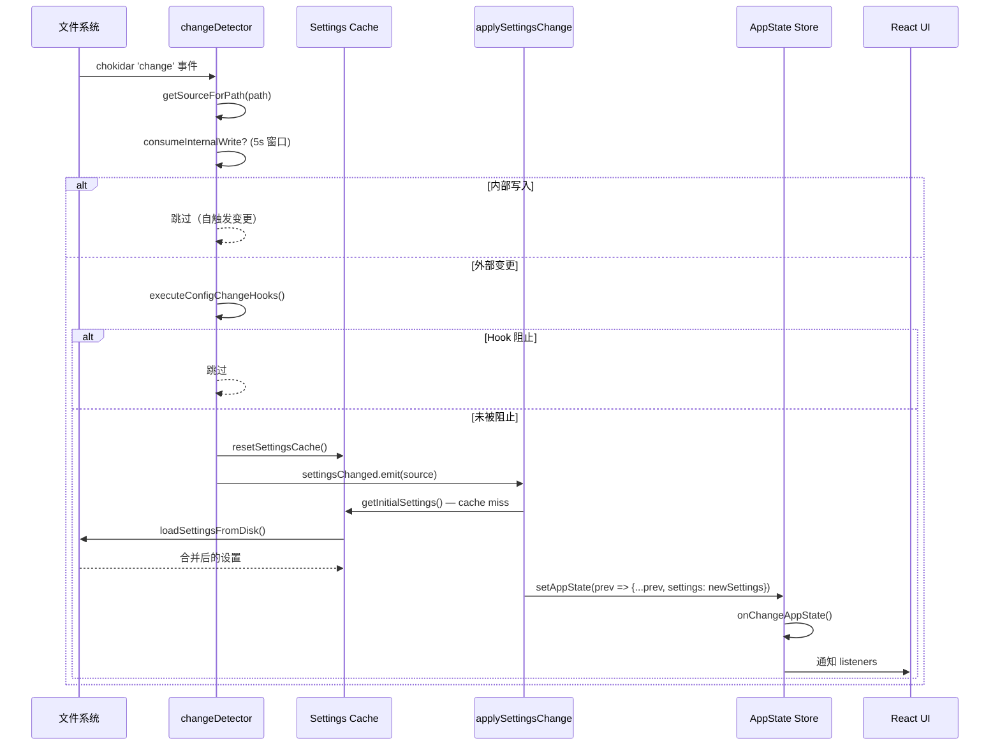

# 第二十四章：Configuration System — 多源配置的合并、热加载与迁移

> Claude Code 的配置系统绝非一个简单的"读取 JSON 文件"操作。它是一个五层优先级的多源合并引擎，支持从用户个人偏好到企业 MDM 策略的全谱系配置来源；一个基于 chokidar 的热加载管道，通过 1 秒稳定阈值、5 秒内部写入抑制和 1.5 秒删除宽限期实现精确的变更检测；一个版本门控的迁移框架，用 11 个幂等迁移文件确保跨版本升级的平滑过渡；以及一个覆盖 18 个 context、约 80 种 action 的 keybinding 系统，支持 chord 组合键和实时热加载。本章将逐层拆解这套配置基础设施的每一个机制。

---

## 24.1 Settings 来源层次结构

### 24.1.1 五层优先级模型

Claude Code 的配置合并遵循一个严格的优先级层次。**优先级从低到高**：

| 优先级 | 来源 | 文件路径 | 可编辑 | 用途 |
|--------|------|----------|--------|------|
| 0 (最低) | Plugin Settings | 插件提供的默认配置 | 否 | 插件注入的基础配置层 |
| 1 | User Settings | `~/.claude/settings.json` | 是 | 用户全局偏好 |
| 2 | Project Settings | `<cwd>/.claude/settings.json` | 是 | 项目级共享配置（提交到 git） |
| 3 | Local Settings | `<cwd>/.claude/settings.local.json` | 是 | 项目级本地覆盖（gitignored） |
| 4 | Flag Settings | `--settings` CLI 标志 + SDK 内联 | 否 | 运行时参数覆盖 |
| 5 (最高) | Policy Settings | 平台相关的托管路径 | 否 | 企业策略强制执行 |

这个层次结构的设计理念是：**个人偏好是基线，项目配置是协作层，本地覆盖是开发者的逃生舱，而企业策略拥有不可覆盖的最终裁决权。**

定义这个层次的代码非常简洁：

```typescript
export const SETTING_SOURCES = [
  'userSettings',      // ~/.claude/settings.json
  'projectSettings',   // .claude/settings.json
  'localSettings',     // .claude/settings.local.json
  'flagSettings',      // --settings CLI flag
  'policySettings',    // Managed settings (enterprise)
] as const
```

其中只有三个来源是可编辑的：

```typescript
export type EditableSettingSource = Exclude<
  SettingSource,
  'policySettings' | 'flagSettings'
>
// = 'userSettings' | 'projectSettings' | 'localSettings'
```

### 24.1.2 Policy Settings 子层次

Policy Settings 本身有一个四级内部优先级，遵循 **first-wins** 语义——第一个提供值的来源胜出：

1. **Remote**（API 远程获取的托管设置）——最高优先级
2. **HKLM/plist**（Windows 注册表 HKLM 或 macOS plist，admin-only）
3. **managed-settings.json + managed-settings.d/*.json**（文件系统，admin 所有）
4. **HKCU**（Windows 注册表 HKCU，用户可写）——最低优先级

这个子层次的设计精妙之处在于：Remote 策略允许 IT 团队通过 API 实时推送配置变更，无需等待 MDM 工具的部署周期；HKLM 和 HKCU 的分离允许管理员设定底线策略的同时给用户一定的调整空间；而 `managed-settings.d/` 的 drop-in 目录模式让多个 MDM 配置文件可以共存而不冲突。

### 24.1.3 来源过滤

`--setting-sources` CLI 标志可以限制加载哪些来源。但 Policy 和 Flag 来源始终包含：

```typescript
export function getEnabledSettingSources(): SettingSource[] {
  const allowed = getAllowedSettingSources()
  const result = new Set<SettingSource>(allowed)
  result.add('policySettings')   // 策略不可禁用
  result.add('flagSettings')     // 运行时标志不可禁用
  return Array.from(result)
}
```

```mermaid
graph BT
    A[Plugin Settings Base] -->|最低优先级| B[Merged Settings]
    C["User Settings<br/>~/.claude/settings.json"] -->|override| B
    D["Project Settings<br/>.claude/settings.json"] -->|override| B
    E["Local Settings<br/>.claude/settings.local.json"] -->|override| B
    F["Flag Settings<br/>--settings CLI flag + SDK inline"] -->|override| B
    G[Policy Settings] -->|最高优先级 override| B

    subgraph Policy 子层次 — first-wins
        G1[Remote API] -->|first-wins| G
        G2["HKLM/plist (MDM)"] -->|fallback| G
        G3["managed-settings.json<br/>+ managed-settings.d/*.json"] -->|fallback| G
        G4[HKCU Registry] -->|last resort| G
    end

    B --> H[AppState.settings]
```

---

## 24.2 SettingsJson Schema：15+ 类别的完整字段目录

### 24.2.1 Schema 设计

SettingsJson 的 schema 使用 Zod v4 定义，采用 `lazySchema()` 惰性求值。所有字段均为 optional，外层对象使用 `.passthrough()` 保留验证过程中的未知字段——这意味着旧版本的 Claude Code 不会在升级后丢弃它不认识的新配置项。

### 24.2.2 字段分类

以下按 15+ 个逻辑类别列出关键字段。

**Authentication（认证）**

| 字段 | 类型 | 用途 |
|------|------|------|
| `apiKeyHelper` | `string?` | 外部脚本路径，输出 auth 凭证 |
| `awsCredentialExport` | `string?` | AWS 凭证导出脚本 |
| `gcpAuthRefresh` | `string?` | GCP 认证刷新命令 |
| `xaaIdp` | `{issuer, clientId, callbackPort?}?` | XAA 身份提供方配置 |

**Model Configuration（模型配置）**

| 字段 | 类型 | 用途 |
|------|------|------|
| `model` | `string?` | 覆盖默认模型 |
| `availableModels` | `string[]?` | 企业模型白名单 |
| `modelOverrides` | `Record<string, string>?` | 模型 ID 映射（如 Bedrock ARN） |

**Permissions（权限）**

| 字段 | 类型 | 用途 |
|------|------|------|
| `permissions.allow` | `PermissionRule[]?` | 允许的操作规则 |
| `permissions.deny` | `PermissionRule[]?` | 拒绝的操作规则 |
| `permissions.ask` | `PermissionRule[]?` | 始终需要确认的操作 |
| `permissions.defaultMode` | `PermissionMode?` | 默认权限模式 |
| `permissions.disableBypassPermissionsMode` | `'disable'?` | 禁止 bypass 模式 |
| `permissions.additionalDirectories` | `string[]?` | 额外的文件作用域目录 |

**Hooks（钩子）**

| 字段 | 类型 | 用途 |
|------|------|------|
| `hooks` | `HooksSettings?` | 自定义事件钩子 |
| `disableAllHooks` | `boolean?` | 全局禁用钩子 |
| `allowManagedHooksOnly` | `boolean?` | 仅运行托管钩子 |
| `allowedHttpHookUrls` | `string[]?` | HTTP hook URL 白名单 |

**MCP Configuration**

| 字段 | 类型 | 用途 |
|------|------|------|
| `enableAllProjectMcpServers` | `boolean?` | 自动批准项目 MCP 服务器 |
| `allowedMcpServers` | `AllowedMcpServerEntry[]?` | 企业 MCP 白名单 |
| `deniedMcpServers` | `DeniedMcpServerEntry[]?` | 企业 MCP 黑名单 |
| `allowManagedMcpServersOnly` | `boolean?` | 仅从托管设置读取 MCP 白名单 |

**Plugin System（插件系统）**

| 字段 | 类型 | 用途 |
|------|------|------|
| `enabledPlugins` | `Record<string, boolean \| string[]>?` | 插件启用映射 |
| `strictKnownMarketplaces` | `MarketplaceSource[]?` | 企业市场白名单 |
| `strictPluginOnlyCustomization` | `boolean \| CustomizationSurface[]?` | 强制仅通过插件自定义 |

**Display / UX（显示与用户体验）**

| 字段 | 类型 | 用途 |
|------|------|------|
| `outputStyle` | `string?` | 助手响应风格 |
| `language` | `string?` | 首选响应语言 |
| `syntaxHighlightingDisabled` | `boolean?` | 禁用语法高亮 |
| `spinnerVerbs` | `{mode, verbs}?` | 自定义 spinner 动词 |
| `prefersReducedMotion` | `boolean?` | 减少动画 |

**AI Behavior（AI 行为）**

| 字段 | 类型 | 用途 |
|------|------|------|
| `alwaysThinkingEnabled` | `boolean?` | 强制开启/关闭 thinking |
| `effortLevel` | `'low' \| 'medium' \| 'high' \| 'max'?` | 模型 effort 级别 |
| `fastMode` | `boolean?` | 快速模式开关 |
| `promptSuggestionEnabled` | `boolean?` | 启用 prompt 建议 |

**Environment & Sandbox（环境与沙箱）**

| 字段 | 类型 | 用途 |
|------|------|------|
| `env` | `Record<string, string>?` | 注入的环境变量 |
| `sandbox` | `SandboxSettings?` | 沙箱配置 |
| `defaultShell` | `'bash' \| 'powershell'?` | 默认 shell |

**Session Management（会话管理）**

| 字段 | 类型 | 用途 |
|------|------|------|
| `cleanupPeriodDays` | `number?` | Transcript 保留天数 |
| `plansDirectory` | `string?` | 自定义 plans 目录 |

**Enterprise（企业）**

| 字段 | 类型 | 用途 |
|------|------|------|
| `forceLoginMethod` | `'claudeai' \| 'console'?` | 强制登录方式 |
| `otelHeadersHelper` | `string?` | OTEL header 脚本路径 |
| `allowManagedPermissionRulesOnly` | `boolean?` | 仅尊重托管权限规则 |
| `companyAnnouncements` | `string[]?` | 启动公告 |

**Attribution（归属）**

| 字段 | 类型 | 用途 |
|------|------|------|
| `attribution.commit` | `string?` | Git commit 归属文本 |
| `attribution.pr` | `string?` | PR 归属文本 |

**Memory（记忆）**

| 字段 | 类型 | 用途 |
|------|------|------|
| `autoMemoryEnabled` | `boolean?` | 启用自动记忆 |
| `autoMemoryDirectory` | `string?` | 自定义记忆目录 |
| `autoDreamEnabled` | `boolean?` | 启用后台记忆整理 |

**Channels（频道）**

| 字段 | 类型 | 用途 |
|------|------|------|
| `channelsEnabled` | `boolean?` | 启用频道通知 |
| `allowedChannelPlugins` | `{marketplace, plugin}[]?` | 频道插件白名单 |

---

## 24.3 多源合并引擎

### 24.3.1 合并管道

`loadSettingsFromDisk()` 实现了完整的合并流程：

```
1. 以 Plugin Settings 作为最低优先级基础层
2. 按 SETTING_SOURCES 顺序遍历每个启用的来源：
   a. policySettings：按 remote > HKLM > file > HKCU 顺序尝试（first-wins）
   b. 文件类来源：parseSettingsFile(path) -> Zod 验证 -> 合并
   c. flagSettings：同时合并 getFlagSettingsInline()（SDK 内联配置）
3. 数组：拼接 + 去重（settingsMergeCustomizer）
4. 对象：通过 lodash mergeWith 深度合并
5. 错误：按 file:path:message 键去重
```

### 24.3.2 自定义 Merge Customizer

合并策略的关键区分点在于读取合并与写入合并的行为差异：

```typescript
// 读取合并：数组拼接
export function settingsMergeCustomizer(objValue, srcValue): unknown {
  if (Array.isArray(objValue) && Array.isArray(srcValue)) {
    return mergeArrays(objValue, srcValue) // 拼接 + 去重
  }
  return undefined // 退回 lodash 默认深度合并
}

// 写入合并：数组替换，undefined = 删除
```

这个设计决策意味着：对于 `permissions.allow` 这样的数组字段，用户、项目和策略的权限规则会**累加**而非覆盖——这是安全策略叠加的正确语义。但在更新配置时，数组是**整体替换**的——避免了追加导致的无限膨胀。

### 24.3.3 三级缓存架构

为避免每次访问配置都触发完整的文件读取和合并，系统实现了三级缓存：

| 缓存层 | 函数 | 缓存粒度 |
|--------|------|----------|
| Level 1 | `getCachedParsedFile(path)` | 单文件解析+验证结果 |
| Level 2 | `getCachedSettingsForSource(source)` | 单来源解析后的完整设置 |
| Level 3 | `getSessionSettingsCache()` | 最终合并结果 |

所有三级缓存通过 `resetSettingsCache()` 统一失效，而该函数由 `changeDetector.fanOut()` 调用——这确保了缓存失效的原子性。

### 24.3.4 Public API

```typescript
// 获取合并后的设置（有缓存）
export function getInitialSettings(): SettingsJson

// 获取合并后的设置 + 验证错误
export function getSettingsWithErrors(): SettingsWithErrors

// 获取按来源分组的设置
export function getSettingsWithSources(): SettingsWithSources

// 更新指定来源（写入磁盘）
export function updateSettingsForSource(
  source: EditableSettingSource,
  settings: SettingsJson
): { error: Error | null }
```

---

## 24.4 Hot Reload：精密的变更检测管道

### 24.4.1 chokidar 文件监听器初始化

`changeDetector.ts` 管理着整个热加载管道。初始化流程如下：

```
1. 收集所有潜在的 settings 文件路径
2. 去重到父目录级别
3. 检查哪些目录至少有一个已存在的文件
4. 包含 managed-settings.d/ drop-in 目录
5. 启动 chokidar watcher：
   - depth: 0（仅直接子文件）
   - awaitWriteFinish: { stabilityThreshold: 1000ms, pollInterval: 500ms }
   - ignored: 过滤为仅已知的 settings 文件 + drop-in .json 文件
6. 启动 MDM settings 轮询（30 分钟间隔）
```

`awaitWriteFinish` 的 1000ms 稳定阈值是一个经过深思熟虑的选择——它确保编辑器的自动保存（通常在几百毫秒内完成多次写入）不会触发多次配置重载。

### 24.4.2 变更检测流



### 24.4.3 内部写入抑制

当 Claude Code 自身通过 `updateSettingsForSource` 写入配置文件时，它调用 `markInternalWrite(path)` 记录写入时间戳。变更检测器在处理文件变更事件时，调用 `consumeInternalWrite(path, INTERNAL_WRITE_WINDOW_MS)` 在 **5 秒窗口** 内识别并跳过自触发的变更。

5 秒窗口的设计考量：
- **太短**（如 1 秒）：在高延迟文件系统（如网络挂载的 home 目录）上可能错过自触发事件
- **太长**（如 30 秒）：会遮蔽在此期间发生的真实外部编辑
- **5 秒**：覆盖了绝大多数 I/O 延迟场景，同时保持了合理的外部变更响应性

### 24.4.4 删除宽限期

文件删除会触发一个宽限期机制，防止编辑器的"删除后重新创建"模式被误判为真实删除：

```
文件被删除 -> handleDelete(path)
  -> 设置超时 DELETION_GRACE_MS（1500ms + 200ms 缓冲 = 1700ms）
  -> 如果在宽限期内收到 'add' 或 'change' 事件：取消删除，按变更处理
  -> 如果宽限期过期：按真实删除处理
```

这个机制直接回应了 Vim 和 Emacs 的文件保存行为——这些编辑器在保存时会先删除原文件，然后写入新文件。没有宽限期，每次编辑器保存都会导致配置被临时重置到无该来源的状态。

### 24.4.5 MDM 轮询

注册表和 plist 的变更无法通过文件系统事件监听，因此 MDM 设置使用 **30 分钟轮询周期**：

```
startMdmPoll():
  1. 获取初始快照：jsonStringify({ mdm, hkcu })
  2. 每 30 分钟：
     a. 刷新 MDM 设置（重新读取注册表/plist）
     b. 与上次快照比较
     c. 如果变化：更新缓存，fanOut('policySettings')
```

30 分钟的轮询间隔反映了 MDM 策略变更的预期频率——企业策略通常在工作日内最多变更几次，30 分钟是"最终一致性"与"系统资源消耗"之间的合理平衡。

### 24.4.6 fanOut：集中式缓存失效

`fanOut(source)` 是热加载管道的汇聚点：

```typescript
fanOut(source):
  1. resetSettingsCache()     // 三级缓存全部失效
  2. settingsChanged.emit(source)  // 通知所有订阅者
```

在 React 层面，`AppStateProvider` 通过 `useSettingsChange(onSettingsChange)` 订阅这个信号。当信号触发时，`applySettingsChange(source, store.setState)` 被调用：

```typescript
export function applySettingsChange(
  source: SettingSource,
  setAppState: (f: (prev: AppState) => AppState) => void,
): void {
  const newSettings = getInitialSettings()
  const updatedRules = loadAllPermissionRulesFromDisk()
  updateHooksConfigSnapshot()

  setAppState(prev => ({
    ...prev,
    settings: newSettings,
    toolPermissionContext: syncPermissionRulesFromDisk(
      prev.toolPermissionContext, updatedRules
    ),
    // + bypass permissions 检查
    // + plan auto mode 转换
    // + effort level 同步
  }))
}
```

这个函数同时更新了设置、权限规则和 hooks 快照——确保三者始终保持一致。

---

## 24.5 Migration System：版本门控的幂等迁移

### 24.5.1 迁移模式

迁移在启动时同步运行，由版本计数器门控：

```typescript
const CURRENT_MIGRATION_VERSION = 11;

function runMigrations(): void {
  if (getGlobalConfig().migrationVersion !== CURRENT_MIGRATION_VERSION) {
    migrateAutoUpdatesToSettings();
    migrateBypassPermissionsAcceptedToSettings();
    migrateEnableAllProjectMcpServersToSettings();
    resetProToOpusDefault();
    migrateSonnet1mToSonnet45();
    migrateLegacyOpusToCurrent();
    migrateSonnet45ToSonnet46();
    migrateOpusToOpus1m();
    migrateReplBridgeEnabledToRemoteControlAtStartup();
    // ... 条件性迁移
    saveGlobalConfig(prev => ({
      ...prev,
      migrationVersion: CURRENT_MIGRATION_VERSION,
    }));
  }
}
```

关键设计决策：**所有迁移都会在每次版本跳跃时运行**，而非仅运行新增的迁移。这是因为每个迁移函数内部都有自己的前置条件检查，使其天然幂等——如果迁移条件不再满足（比如用户已经手动调整了模型设置），该迁移会自动跳过。

### 24.5.2 迁移示例

**模型字符串迁移（migrateSonnet45ToSonnet46）**

当 Claude Sonnet 从 4.5 升级到 4.6 时，用户设置中的模型字符串需要更新：

```typescript
export function migrateSonnet45ToSonnet46(): void {
  if (getAPIProvider() !== 'firstParty') return;
  if (!isProSubscriber() && !isMaxSubscriber()
      && !isTeamPremiumSubscriber()) return;

  const model = getSettingsForSource('userSettings')?.model;
  if (model !== 'claude-sonnet-4-5-20250929'
      && model !== 'claude-sonnet-4-5-20250929[1m]') {
    return;
  }

  const has1m = model.endsWith('[1m]');
  updateSettingsForSource('userSettings', {
    model: has1m ? 'sonnet[1m]' : 'sonnet',
  });

  logEvent('tengu_sonnet45_to_46_migration',
    { from_model: model, has_1m: has1m });
}
```

注意这个迁移的多层防护：先检查 API provider，再检查订阅级别，最后检查实际的模型字符串。这确保了只有真正需要迁移的用户会被影响。

**配置迁移（migrateAutoUpdatesToSettings）**

将旧的 globalConfig 标志迁移到 SettingsJson 的 `env` 字段：

```typescript
export function migrateAutoUpdatesToSettings(): void {
  const globalConfig = getGlobalConfig();
  if (globalConfig.autoUpdates !== false
      || globalConfig.autoUpdatesProtectedForNative === true) {
    return;
  }

  const userSettings = getSettingsForSource('userSettings') || {};
  updateSettingsForSource('userSettings', {
    ...userSettings,
    env: { ...userSettings.env, DISABLE_AUTOUPDATER: '1' },
  });

  saveGlobalConfig(current => {
    const { autoUpdates: _, autoUpdatesProtectedForNative: __, ...rest } = current;
    return rest;
  });
}
```

这个迁移同时执行了"写入新位置"和"清理旧位置"——是一个干净的数据迁移范式。

### 24.5.3 完整迁移文件清单

| 文件 | 用途 |
|------|------|
| `migrateAutoUpdatesToSettings.ts` | 将 autoUpdates 标志迁移到 settings.json env 变量 |
| `migrateBypassPermissionsAcceptedToSettings.ts` | 迁移 bypass permissions 标志 |
| `migrateEnableAllProjectMcpServersToSettings.ts` | 迁移 MCP 服务器启用配置 |
| `migrateFennecToOpus.ts` | 内部代号 fennec -> opus 字符串替换 |
| `migrateLegacyOpusToCurrent.ts` | 旧版 opus 模型字符串 |
| `migrateOpusToOpus1m.ts` | opus -> opus[1m]（Max/Team Premium） |
| `migrateReplBridgeEnabledToRemoteControlAtStartup.ts` | Bridge 配置重命名 |
| `migrateSonnet1mToSonnet45.ts` | sonnet[1m] -> 显式 sonnet 4.5 |
| `migrateSonnet45ToSonnet46.ts` | sonnet 4.5 -> sonnet 别名（4.6） |
| `resetAutoModeOptInForDefaultOffer.ts` | 重置 auto mode 选择状态 |
| `resetProToOpusDefault.ts` | 重置 Pro 默认模型为 Opus |

### 24.5.4 异步迁移

一个迁移是异步的，采用 fire-and-forget 模式：

```typescript
migrateChangelogFromConfig().catch(() => {
  // 静默忽略——下次启动会重试
});
```

这个设计决策表明该迁移涉及非关键数据（changelog），失败不应阻塞启动。

---

## 24.6 Keybinding System：18 个 Context、约 80 种 Action

### 24.6.1 绑定结构

Keybinding 定义为 block 结构，每个 block 关联一个 context 和一组键到 action 的映射：

```typescript
export type KeybindingBlock = {
  context: KeybindingContextName
  bindings: Record<string, string | null>
}
```

将 action 设为 `null` 可以**解绑**该键。

### 24.6.2 18 个 Context

```typescript
const KEYBINDING_CONTEXTS = [
  'Global', 'Chat', 'Autocomplete', 'Confirmation', 'Help',
  'Transcript', 'HistorySearch', 'Task', 'ThemePicker',
  'Settings', 'Tabs', 'Attachments', 'Footer', 'MessageSelector',
  'DiffDialog', 'ModelPicker', 'Select', 'Plugin',
]
```

Context 的设计对应了 UI 的不同模态状态——在 `Chat` context 中 Enter 提交消息，但在 `Confirmation` context 中它确认操作。同一个物理按键在不同 context 中绑定到完全不同的 action。

### 24.6.3 约 80 种 Action

Action 标识符遵循 `category:action` 模式：

```typescript
const KEYBINDING_ACTIONS = [
  'app:interrupt', 'app:exit', 'app:toggleTodos', 'app:toggleTranscript',
  'chat:cancel', 'chat:cycleMode', 'chat:submit', 'chat:undo',
  'autocomplete:accept', 'autocomplete:dismiss',
  'confirm:yes', 'confirm:no',
  // ... 约 80 个
]
```

此外，`command:*` 模式允许为斜杠命令绑定快捷键（如 `command:help`）。

### 24.6.4 Chord 支持

多键序列（chord）使用空格分隔的 keystroke 字符串：

```typescript
export function parseChord(input: string): Chord {
  if (input === ' ') return [parseKeystroke('space')]  // 特殊情况
  return input.trim().split(/\s+/).map(parseKeystroke)
}
```

示例：`"ctrl+x ctrl+k"` 是一个两键 chord——先按 `ctrl+x`，再按 `ctrl+k`。

Chord 解析流程：

1. 如果当前在 chord 状态中（有 `pending` keystroke）：
   - Escape 取消 chord
   - 构建测试 chord = `[...pending, currentKeystroke]`
2. 检查是否为更长绑定的 **prefix**：
   - 如果是（且该更长绑定未被 null 解绑）：进入 `chord_started` 状态
3. 检查是否 **exact match**：
   - 如果匹配：返回对应 action
4. 无匹配：取消 chord 或返回 `none`

**Null 解绑的阴影效应**：如果用户对一个 chord 绑定设置了 `null` 覆盖，该解绑会"遮蔽"默认绑定，防止 chord prefix 进入等待状态——这是一个避免"悬空 chord prefix"的精巧设计。

### 24.6.5 热加载

Keybinding 文件 `~/.claude/keybindings.json` 也有独立的 chokidar 热加载：

```typescript
export async function initializeKeybindingWatcher(): Promise<void> {
  watcher = chokidar.watch(userPath, {
    persistent: true,
    ignoreInitial: true,
    awaitWriteFinish: {
      stabilityThreshold: 500,   // 比 settings 更短的稳定阈值
      pollInterval: 200,
    },
    ignorePermissionErrors: true,
    usePolling: false,
    atomic: true,
  })
  watcher.on('add', handleChange)
  watcher.on('change', handleChange)
  watcher.on('unlink', handleDelete)
}
```

注意 keybinding 的稳定阈值是 **500ms**，比 settings 的 1000ms 更短——因为 keybinding 文件通常更小、写入更快。

合并策略是**追加覆盖**：

```typescript
const mergedBindings = [...defaultBindings, ...userParsed]
```

用户定义的绑定追加到默认绑定之后，后定义的胜出。

### 24.6.6 验证体系

五种验证类型确保 keybinding 配置的正确性：

| 类型 | 含义 |
|------|------|
| `parse_error` | 键模式语法错误 |
| `duplicate` | 同一 context 中重复的键 |
| `reserved` | 保留快捷键（ctrl+c, ctrl+d） |
| `invalid_context` | 未知的 context 名称 |
| `invalid_action` | 未知的 action 标识符 |

特别值得注意的是 `checkDuplicateKeysInJson()` 函数——由于 `JSON.parse` 对重复键会静默使用最后一个值，该函数直接扫描原始 JSON 字符串来检测重复键，这是一个超越了标准 JSON 解析能力的验证。

---

## 24.7 MDM 支持：企业级设备管理集成

### 24.7.1 Windows 注册表

在 Windows 上，Claude Code 从两个注册表路径读取策略：

- **HKLM**（`HKEY_LOCAL_MACHINE`）：需要管理员权限写入，代表组织级策略
- **HKCU**（`HKEY_CURRENT_USER`）：用户可写入，代表用户级覆盖

HKLM 优先于 HKCU，确保组织策略不可被用户绕过。

### 24.7.2 macOS plist

在 macOS 上，对应的机制是 plist 文件，通常由 MDM 工具（如 Jamf、Mosyle）部署。

### 24.7.3 文件系统策略

跨平台通用的方案是 `managed-settings.json` 文件和 `managed-settings.d/` drop-in 目录。Drop-in 模式允许多个 MDM 工具各自部署自己的配置文件，而不会互相冲突。

### 24.7.4 Remote 策略

最高优先级的 Remote 策略通过 API 获取，在 `init.ts` 阶段异步加载：

```typescript
if (isEligibleForRemoteManagedSettings()) {
  initializeRemoteManagedSettingsLoadingPromise();
}
```

Remote 策略的加载是异步的，但在需要使用策略值之前会等待完成。这个设计允许策略加载与其他初始化步骤并行进行，不阻塞启动。

---

## 24.8 架构总结：配置系统的设计哲学

Claude Code 的配置系统展现了一种"**层叠式确定性**"的设计哲学：

1. **确定性合并**：给定相同的配置文件集合，合并结果是完全确定的。没有随机性，没有时序依赖。
2. **渐进式覆盖**：从最通用（插件默认）到最具体（企业策略），每一层都可以覆盖前一层的任意字段。
3. **安全默认**：Policy Settings 始终生效，不可被 `--setting-sources` 禁用。企业策略是不可绕过的护栏。
4. **弹性热加载**：1 秒稳定阈值、5 秒内部写入窗口和 1.7 秒删除宽限期三重保护，确保热加载既及时又不会产生误触发。
5. **幂等迁移**：每个迁移函数内置前置条件检查，可以安全地重复运行。版本门控只是一个性能优化——跳过"全部迁移都已完成"的常见路径。

这套系统的复杂度反映了一个真实的工程约束：一个同时服务个人开发者和企业组织的 CLI 工具，其配置系统必须在"简单上手"和"企业管控"之间找到平衡。Claude Code 的答案是**层叠式优先级**——简单用例只需要关心 `~/.claude/settings.json` 一个文件，而企业部署可以通过 Policy Settings 在不触碰用户文件的前提下强制执行安全策略。
