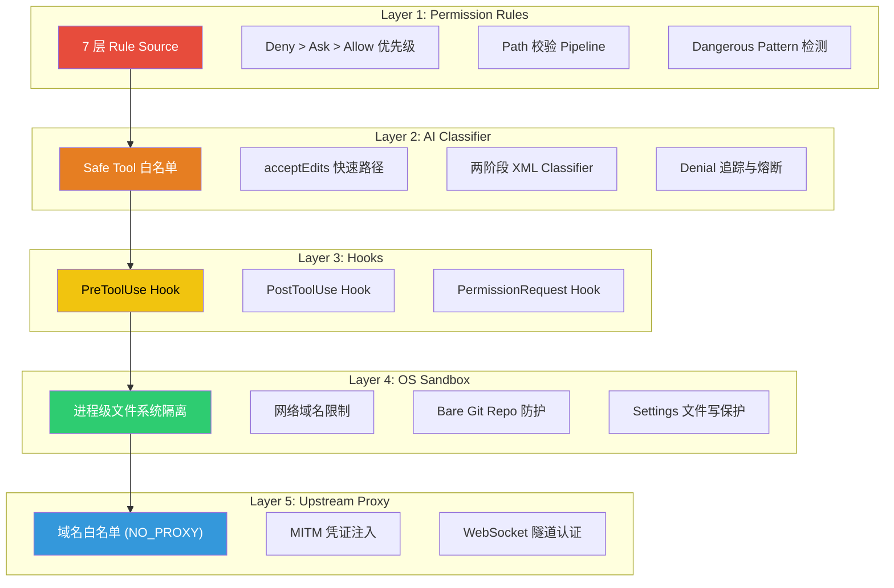
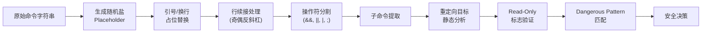
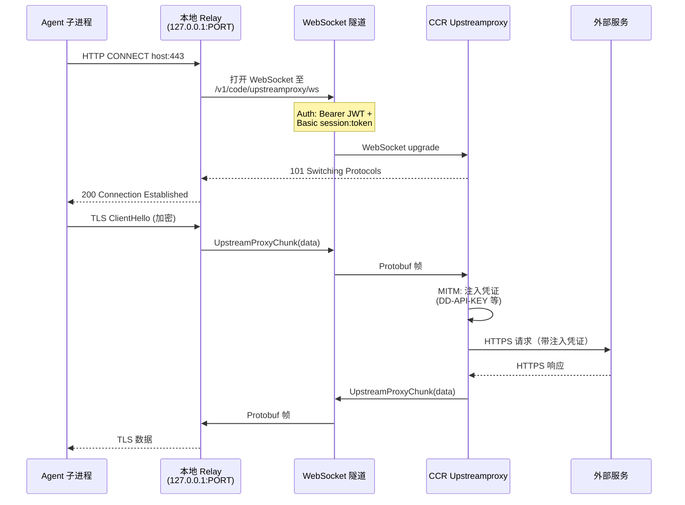
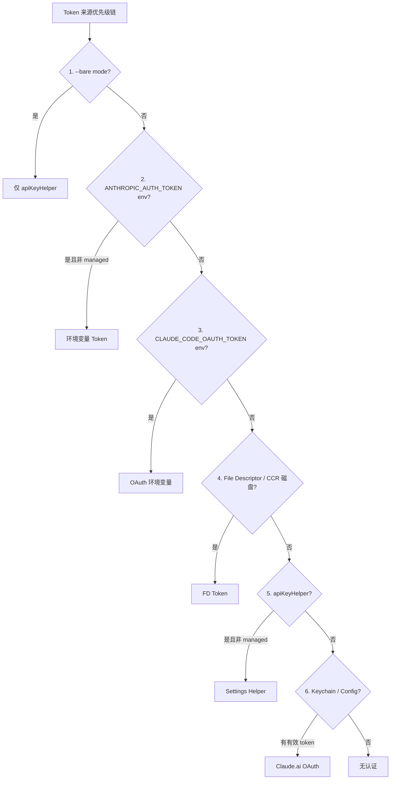
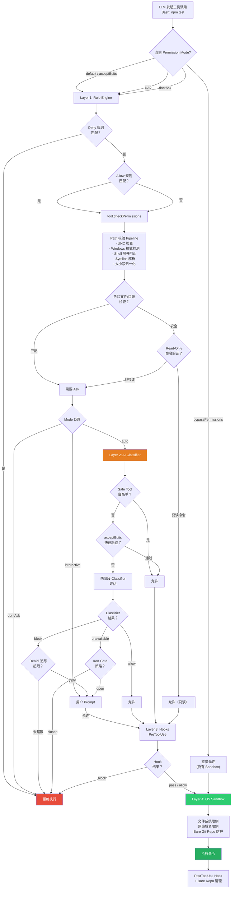

# 第二十五章：Security Model — 全景安全架构

> Claude Code 的安全不是单一关卡，而是一座由五层纵深防线构成的堡垒。从 Permission Rule 的静态规则匹配，到 AI Classifier 的动态行为判断，再到 OS 级 Sandbox 的进程隔离，每一层都独立运作、互为补充。即使某一层被突破，后续层仍然可以阻止攻击。本章将这些散布在第 10、15 章及基础设施层的安全机制统一呈现，构成 Claude Code 安全模型的完整画面。

---

## 25.1 五层安全纵深

Claude Code 的安全架构遵循经典的 **defense-in-depth** 原则：不依赖任何单一机制，而是通过层层叠加的检查确保即使某一环节失效，整体安全性不被突破。



**每一层的职责边界：**

| 层级 | 检查时机 | 防护目标 | 失效后果 |
|------|---------|---------|---------|
| Permission Rules | 工具调用前，静态规则匹配 | 阻止已知危险操作 | 交给 Classifier 判断 |
| AI Classifier | auto mode 下规则无法决定时 | 动态判断操作意图安全性 | fail-closed（默认拒绝） |
| Hooks | 工具执行前后 | 组织自定义策略执行 | 跳过自定义策略 |
| OS Sandbox | 进程执行时 | 限制文件系统和网络访问 | 进程可访问全部资源 |
| Upstream Proxy | 网络请求时（CCR 环境） | 凭证注入与域名控制 | 无凭证注入，直连外部服务 |

这五层并非串行"管道"——它们在不同阶段独立生效。Permission Rules 和 Classifier 在工具调用前做出 allow/deny 决策；Sandbox 在 Bash 命令实际执行时施加 OS 级约束；Proxy 在网络流量离开容器时控制访问。即使 Classifier 错误地允许了一个危险命令，Sandbox 仍然会阻止该命令写入受保护的目录。

---

## 25.2 Bash 命令安全深度解析

Bash 工具是 Claude Code 中攻击面最大的入口——它可以执行任意 Shell 命令。安全系统对 Bash 命令的分析达到了 AST 级别的精度。

### 25.2.1 命令解析 Pipeline



**注入防御 Placeholder 生成：**

命令解析的第一步是将引号和换行替换为带随机盐的 placeholder：

```typescript
function generatePlaceholders() {
  const salt = randomBytes(8).toString('hex')
  return {
    SINGLE_QUOTE: `__SINGLE_QUOTE_${salt}__`,
    DOUBLE_QUOTE: `__DOUBLE_QUOTE_${salt}__`,
    NEW_LINE: `__NEW_LINE_${salt}__`,
  }
}
```

为什么需要随机盐？因为攻击者可以构造包含字面量 `__SINGLE_QUOTE__` 的命令来干扰解析。随机盐使得 placeholder 不可预测，从根本上消除了这种注入向量。

**行续接安全处理：**

Shell 中反斜杠+换行表示行续接，但如果反斜杠本身被转义（偶数个反斜杠），换行就是命令分隔符。解析器通过计算反斜杠的奇偶性来正确处理：

```typescript
// 奇数反斜杠：最后一个转义换行（行续接）
// 偶数反斜杠：反斜杠互相配对，换行是命令分隔符
const backslashCount = match.length - 1
if (backslashCount % 2 === 1) {
  return '\\'.repeat(backslashCount - 1) // 移除转义反斜杠+换行
}
```

这防止了一类精妙的攻击：攻击者构造 `\\<newline>rm -rf /`，如果解析器错误地将 `\\` 视为行续接，就会把 `rm -rf /` 误判为前一行的延续而非独立命令。

### 25.2.2 重定向目标验证

`isStaticRedirectTarget` 拒绝所有包含动态内容的重定向目标：

| 被拒绝的模式 | 示例 | 风险 |
|-------------|------|------|
| Shell 变量 | `$HOME`, `${VAR}` | 运行时路径注入 |
| 命令替换 | `` `pwd` `` | 任意命令执行 |
| Glob 模式 | `*`, `?`, `[` | 非确定性文件目标 |
| 花括号展开 | `{1,2}` | 多目标写入 |
| Tilde 展开 | `~` | 用户目录探测 |
| 进程替换 | `>(cmd)`, `<(cmd)` | 隐式命令执行 |
| 历史展开 | `!!`, `!-1` | 重放历史命令 |
| Zsh 等号展开 | `=cmd` | 路径查找注入 |
| 空字符串 | `""` | 解析为 CWD |
| 注释前缀 | `#file` | 解析器差异利用 |

### 25.2.3 Dangerous Pattern 数据库

系统维护了一个全面的危险 Shell 模式数据库，覆盖跨平台的代码执行入口点：

```typescript
export const CROSS_PLATFORM_CODE_EXEC = [
  // 解释器
  'python', 'python3', 'python2', 'node', 'deno', 'tsx', 'ruby', 'perl', 'php', 'lua',
  // 包运行器
  'npx', 'bunx', 'npm run', 'yarn run', 'pnpm run', 'bun run',
  // Shell
  'bash', 'sh', 'zsh', 'fish',
  // 执行原语
  'eval', 'exec', 'env', 'xargs', 'sudo',
  // 远程
  'ssh',
]
```

对于 PowerShell 环境，额外检测 `iex`、`invoke-expression`、`invoke-command`、`start-process`、`add-type` 等 cmdlet，并匹配 `.exe` 后缀变体。

当用户在 auto mode 下配置了 `Bash(*)`、`python:*` 等宽泛的 allow rule 时，系统在进入 auto mode 时会自动 **剥离** 这些规则，防止它们绕过 Classifier 的安全判断。

---

## 25.3 文件系统安全边界

### 25.3.1 Path 校验 Pipeline

每一次文件操作（读写）都经过统一的 `validatePath` 校验链：

```
validatePath(path, cwd, context, operationType)
  |
  +-- expandTilde: ~ -> $HOME; ~user 被阻止
  +-- 阻止 UNC 路径 (\\server\share, //server/share)
  +-- 阻止 tilde 变体 (~root, ~+, ~-, ~N) -> TOCTOU 风险
  +-- 阻止 shell 展开语法 ($, %, =cmd) -> TOCTOU 风险
  +-- 写操作时阻止 glob 模式
  +-- 读操作 glob: validateGlobPattern (检查基目录)
  +-- 路径解析 (绝对化 + symlink 解析)
  +-- isPathAllowed(resolvedPath, context, operationType)
```

### 25.3.2 Windows 路径攻击向量

`hasSuspiciousWindowsPathPattern` 在 **所有平台** 上运行（因为 NTFS 可通过 ntfs-3g 挂载到 Linux/macOS），检测以下攻击模式：

| 攻击模式 | 示例 | 风险 |
|---------|------|------|
| NTFS 备选数据流 | `file.txt::$DATA` | 隐藏数据访问 |
| 8.3 短文件名 | `GIT~1`, `SETTIN~1.JSON` | 绕过字符串匹配 |
| 长路径前缀 | `\\?\C:\...` | 绕过路径验证 |
| 尾随点/空格 | `.git.`, `.claude ` | Windows 解析时自动剥离 |
| DOS 设备名 | `.git.CON`, `settings.json.PRN` | 特殊设备访问 |
| 三点号 | `.../file.txt` | 路径混淆 |
| UNC 路径 | `\\server\share` | 网络凭证泄露 |

### 25.3.3 危险文件与目录

系统对以下文件和目录施加额外保护：

```typescript
// 修改这些文件可能改变系统行为或泄露凭证
export const DANGEROUS_FILES = [
  '.gitconfig', '.gitmodules',
  '.bashrc', '.bash_profile', '.zshrc', '.zprofile', '.profile',
  '.ripgreprc', '.mcp.json', '.claude.json',
]

// 修改这些目录下的文件可能导致安全绕过
export const DANGEROUS_DIRECTORIES = [
  '.git', '.vscode', '.idea', '.claude',
]
```

特殊例外：`.claude/worktrees/` 被显式排除在 `.claude` 目录保护之外，因为它是 git worktree 的结构路径。

### 25.3.4 Symlink 解析与大小写归一化

两项关键的防绕过措施：

1. **Symlink 解析**：对文件路径和工作目录都做 `realpathSync` 解析，防止通过 symlink 指向受保护文件
2. **大小写归一化**：所有路径比较都经过 `toLowerCase()`，防止在 macOS/Windows 的大小写不敏感文件系统上用 `.cLauDe/Settings.locaL.json` 绕过保护

---

## 25.4 网络安全

### 25.4.1 域名白名单

Sandbox 层从 `WebFetch` 权限规则中提取域名白名单：

- Allow 规则：`WebFetch(domain:example.com)` -> 允许该域名
- Deny 规则：`WebFetch(domain:evil.com)` -> 拒绝该域名
- `allowManagedDomainsOnly` 模式：只允许组织策略（policySettings）中声明的域名

### 25.4.2 Upstream Proxy（CCR 环境）

在 Claude Code Remote（CCR）容器中运行时，系统部署了一个完整的 MITM proxy 架构：



**为什么使用 WebSocket？** CCR 的 ingress 使用 GKE L7 路径前缀路由，不支持原始 CONNECT。WebSocket 隧道复用了已有的 session-ingress 通道。

**NO_PROXY 排除列表**确保关键服务不经过代理：

- Anthropic API（`anthropic.com`, `*.anthropic.com`）
- GitHub（`github.com`, `api.github.com`, `*.githubusercontent.com`）
- 包管理器（`registry.npmjs.org`, `pypi.org`, `index.crates.io` 等）
- 本地地址（`localhost`, `127.0.0.1`, RFC 1918 私有网段）

---

## 25.5 凭证安全

### 25.5.1 Heap 内存隔离

CCR 容器中的 upstream proxy 在初始化时执行关键的内存隔离步骤：

```
1. 从 /run/ccr/session_token 读取 session token
2. 调用 prctl(PR_SET_DUMPABLE, 0)  -- 阻止同 UID 进程 ptrace 堆内存
3. 下载 upstream proxy CA 证书，拼接系统 CA bundle
4. 启动本地 CONNECT->WebSocket relay
5. unlink token 文件 -- token 仅存在于堆内存中
6. 暴露 HTTPS_PROXY / SSL_CERT_FILE 环境变量给子进程
```

**`prctl(PR_SET_DUMPABLE, 0)`** 是 Linux 特有的安全措施：即使同一用户的其他进程也无法通过 `/proc/{pid}/mem` 读取 token。

**Token 文件 unlinking** 确保 token 在磁盘上的生命周期最短——relay 启动后立即删除文件，token 仅存活在进程堆内存中。

### 25.5.2 认证头分离

upstream proxy 使用两种不同的认证机制：
- **WebSocket upgrade**：Bearer JWT（session 级别认证）
- **CONNECT 隧道**：Basic auth，使用 session ID + token（请求级别认证）

这种分离确保即使一种认证机制被截获，也无法用于另一种用途。

### 25.5.3 OAuth Token 存储



关键安全决策：**Managed OAuth Context**（CCR 和 Claude Desktop）中，系统跳过 `ANTHROPIC_AUTH_TOKEN` 环境变量和 `apiKeyHelper`，防止用户的终端 API key 配置覆盖 OAuth token。

启动时的 **Keychain Prefetch** 将 OAuth 和 legacy API key 的 macOS Keychain 读取并行化，节省约 65ms 的串行等待。

---

## 25.6 Read-Only 命令验证

### 25.6.1 Git 安全标志映射

系统为 20+ 个 git 子命令维护了详尽的安全标志映射：

```typescript
export type ExternalCommandConfig = {
  safeFlags: Record<string, FlagArgType>
  additionalCommandIsDangerousCallback?: (rawCommand: string, args: string[]) => boolean
  respectsDoubleDash?: boolean
}
```

覆盖的 git 子命令包括：`diff`、`log`、`show`、`shortlog`、`reflog`、`stash list`、`ls-remote`、`status`、`blame`、`ls-files`、`ls-tree`、`config --get`、`remote`、`remote show`、`merge-base`、`rev-parse`、`rev-list`、`describe`、`cat-file` 等。

### 25.6.2 Parser Differential 攻击防御

标志参数类型的精确定义至关重要。一个真实案例：

> `git diff` 的 `-S`、`-G`、`-O` 标志最初被标记为 `'none'`（无参数），但 git 实际上将它们视为需要参数的标志。攻击者可以构造：`git diff -S -- --output=/tmp/pwned`。验证器以为 `-S` 不接受参数，前进一个 token，遇到 `--` 停止检查，`--output` 未被检查。但 git 以为 `-S` 需要参数，将 `--` 作为 pickaxe 字符串消费，然后将 `--output=...` 解析为长选项 -> **任意文件写入**。

修复方案：将这些标志的类型从 `'none'` 更正为 `'string'`。

### 25.6.3 危险子命令检测

对于有写能力的子命令（如 `git reflog`），系统使用回调函数进行精细控制：

```typescript
// 阻止 expire、delete、exists 子命令
// 允许：show、ref 名称（HEAD, refs/*, 分支名）
additionalCommandIsDangerousCallback: (_rawCommand, args) => {
  const DANGEROUS_SUBCOMMANDS = new Set(['expire', 'delete', 'exists'])
  for (const token of args) {
    if (!token || token.startsWith('-')) continue
    if (DANGEROUS_SUBCOMMANDS.has(token)) return true
    return false
  }
  return false
}
```

标志参数类型的完整枚举：

| 类型 | 含义 | 示例 |
|------|------|------|
| `'none'` | 无参数 | `--color` |
| `'number'` | 整数参数 | `--context=3` |
| `'string'` | 字符串参数 | `--relative=path` |
| `'char'` | 单字符 | delimiter |
| `'{}'` | 字面量 `{}` | xargs 占位符 |
| `'EOF'` | 字面量 `EOF` | heredoc 终止符 |

---

## 25.7 十三条安全不变量

以下是 Claude Code 安全模型的核心不变量——系统在所有代码路径中维护这些属性，任何违反都被视为安全漏洞：

| # | 不变量 | 原理 | 防护层 |
|---|--------|------|--------|
| 1 | **Deny 规则始终优先于 Allow 规则** | 在每个权限检查流程中首先检查 deny 规则，确保安全策略不被宽泛的 allow 覆盖 | Rules |
| 2 | **写操作的 Safety Check 在 Allow 规则之前执行** | 防止对受保护文件的意外授权——即使有 allow 规则，`.gitconfig` 等危险文件仍需明确确认 | Rules |
| 3 | **路径和工作目录都做 Symlink 解析** | 防止通过 symlink 指向受保护文件或目录来绕过路径检查 | Filesystem |
| 4 | **所有路径比较做大小写归一化** | 防止在大小写不敏感的文件系统（macOS HFS+/APFS, Windows NTFS）上的大小写绕过 | Filesystem |
| 5 | **命令解析 Placeholder 使用随机盐** | 防止攻击者在命令中嵌入字面量 placeholder 字符串来干扰解析流程 | Bash |
| 6 | **行续接使用奇偶反斜杠计数** | 防止通过反斜杠转义混淆来隐藏命令——确保解析器对行边界的判断与 Shell 一致 | Bash |
| 7 | **标志参数类型必须精确** | 防止 validator 与 Shell 之间的 parser differential——类型错误可导致任意文件写入 | Read-Only |
| 8 | **Classifier 默认 fail-closed** | `tengu_iron_gate_closed` gate 确保 API 不可用时拒绝操作而非放行——安全的默认姿态 | Classifier |
| 9 | **进入 Auto Mode 时剥离危险规则** | `Bash(*)`、`python:*` 等宽泛规则被临时移除，防止它们绕过 Classifier 的安全评估 | Rules |
| 10 | **Per-user 临时目录使用 UID** | 格式 `claude-{uid}`，防止多用户环境下的权限冲突和跨用户文件访问 | Filesystem |
| 11 | **Bundled skills root 使用 per-process 随机 nonce** | 格式 `bundled-skills/{VERSION}/{nonce}`，防止 symlink 预创建攻击 | Filesystem |
| 12 | **Bare Git Repo 文件清理** | 检测并清除 `HEAD` + `objects/` + `refs/` 组合，防止攻击者通过植入 bare repo 文件实现 sandbox 逃逸 | Sandbox |
| 13 | **Settings 文件始终禁止 Sandbox 内写入** | 所有层级的 settings.json 文件和 `.claude/skills/` 目录都被 deny-write，防止通过配置修改实现 sandbox 逃逸 | Sandbox |

---

## 25.8 纵深防御架构图

下图展示了一个 Bash 工具调用从发起到执行的完整安全检查路径：



---

## 25.9 安全模型的设计哲学

### 25.9.1 静态与动态的互补

Permission Rules 是 **静态** 防线——基于已知的模式和路径做出确定性判断。AI Classifier 是 **动态** 防线——理解操作的上下文和意图来做出概率性判断。两者互补：

- 静态规则处理已知的危险模式（`rm -rf /`、写 `.gitconfig`），速度极快（微秒级）
- 动态 Classifier 处理新颖的攻击场景（利用合法工具链的迂回攻击），但有延迟成本

### 25.9.2 Fail-Closed 原则

系统在不确定时选择拒绝而非放行：

- Classifier API 不可用 -> 默认拒绝（`tengu_iron_gate_closed`）
- 标志类型不确定 -> 视为危险
- 路径包含动态内容 -> 拒绝解析
- 连续拒绝超限 -> 回退到人工审核

### 25.9.3 最小权限演进

auto mode 的权限不是 "bypass all"，而是经过精心裁剪的：

1. 进入 auto mode 时剥离所有危险的宽泛规则
2. Safe tool 白名单只包含真正的只读工具
3. acceptEdits 快速路径排除了 Agent 和 REPL 工具（它们的 `checkPermissions` 在 acceptEdits 下直接返回 allow，会绕过 Classifier）
4. Denial 追踪确保 Classifier 不会无限拒绝——超过阈值后回退到人工判断

### 25.9.4 跨平台一致性

安全检查不假设当前平台：

- Windows 路径模式检测在 **所有** 平台运行（NTFS 可通过 ntfs-3g 挂载到 Linux/macOS）
- UNC 路径检测覆盖 `\\` 和 `//` 两种格式
- PowerShell 危险模式包含 `.exe` 后缀变体
- 大小写归一化在所有平台一致应用

---

## 25.10 本章小结

Claude Code 的安全模型不是一个单点检查，而是一套由 13 条不变量支撑的五层纵深防御体系。从 Permission Rules 的静态模式匹配，到 AI Classifier 的动态意图判断，再到 OS Sandbox 的进程级隔离，每一层都独立运作、互为补充。

这套架构的核心设计哲学是：**永远不依赖单一机制**。即使 Classifier 被欺骗、即使规则被错误配置，Sandbox 仍然会阻止对受保护资源的访问。即使 Sandbox 被绕过，Settings 文件的写保护和 bare git repo 清理仍然会阻止持久化的安全逃逸。

对于构建类似 AI Agent 安全系统的工程师，Claude Code 的安全模型提供了一个关键洞见：**安全不是一个 boolean 开关，而是一个多层概率函数——每增加一层，攻击成功的概率就指数级下降。**
