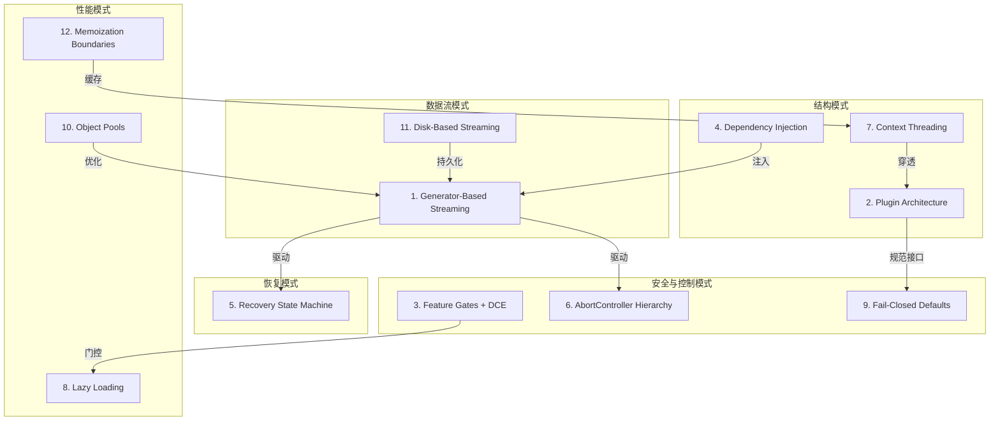
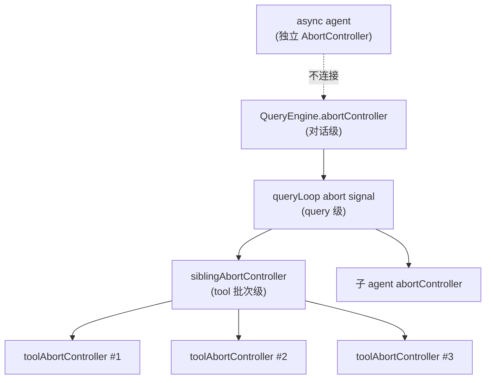

# 第26章：设计模式目录

> 本章是一份参考手册。前面各章按子系统逐一拆解了 Claude Code 的架构，本章则换一个视角——横切整个 513K 行 TypeScript 代码库，提炼出 12 种反复出现的设计模式。每种模式遵循统一结构：**问题 → 方案 → 使用位置 → 代码示例 → 权衡**。

---

## 模式总览



---

## 1. Generator-Based Streaming

### 问题

一个 LLM 交互回合可能产生数十条消息——API stream event、assistant 回复、tool_use 请求、tool_result、progress 更新、attachment。如果把这些消息攒成一批再返回，UI 会长时间无响应；如果用 callback 逐条回调，调用方需要管理大量中间状态和回调地狱。

### 方案

整个 query 管线构建在 `AsyncGenerator` 之上。`queryLoop()` 是一个 `async function*`，逐条 `yield` 消息；`QueryEngine.submitMessage()` 也是 `async function*`，消费 `queryLoop` 的产出并二次派发；最外层的 `ask()` 同样是 generator。消费方用 `for await...of` 即可逐条拿到消息，背压天然由 JavaScript 引擎的 generator 协议控制。

### 使用位置

- `query()` / `queryLoop()` — 核心 agentic 循环
- `QueryEngine.submitMessage()` — 每轮入口
- `runAgent()` — 子 agent 执行
- `runTools()` / `runToolsConcurrently()` — 工具编排
- `streamedCheckPermissionsAndCallTool()` — 单个工具执行的 stream 适配

### 代码示例

```typescript
// queryLoop 的简化签名
async function* queryLoop(
  params: QueryParams,
  consumedCommandUuids: string[],
): AsyncGenerator<
  StreamEvent | Message | TombstoneMessage | ToolUseSummaryMessage,
  Terminal
> {
  while (true) {
    // Phase 3: API streaming
    for await (const message of deps.callModel({...})) {
      yield message;  // 逐条向上传播
    }
    // Phase 6: tool execution
    for await (const update of runTools(toolUseBlocks, ...)) {
      yield update.message;
    }
    // 组装下一轮 State，continue
  }
}
```

### 权衡

**优势**：背压免费获得；生命周期清晰（generator return/throw 自动清理）；组合简单——generator 可以 `yield*` 委托给子 generator。

**代价**：调试堆栈较长（每层 generator 加一帧）；错误边界需要显式 try/catch（不像 callback 可以在注册时统一捕获）；`return()` 语义对资源清理有微妙影响——必须在 `finally` 中释放。

---

## 2. Plugin Architecture（插件化架构）

### 问题

系统需要同时支持内置工具、MCP 工具、用户自定义 agent、slash command、task 类型等多种扩展点。如果每种扩展用不同的注册和调用方式，核心代码中将充斥大量 `if-else` 分支。

### 方案

统一接口 + 注册表模式。以 Tool 系统为例，所有工具——无论是内置 `BashTool` 还是 MCP 远程工具——都必须实现 `Tool<Input, Output, Progress>` 接口（约 40 个方法/属性）。`getAllBaseTools()` 作为单一注册中心返回工具列表，`assembleToolPool()` 将内置工具与 MCP 工具合并后按名称排序，保证 prompt cache 稳定。

同一模式在 Agent 系统（`AgentDefinition` 接口 + `getActiveAgentsFromList()`）、Task 系统（`Task` 接口 + `getAllTasks()`）和 Command 系统中均有体现。

### 代码示例

```typescript
// Tool 接口的核心约束（简化）
export type Tool<I, O, P> = {
  readonly name: string
  readonly inputSchema: I
  call(args: z.infer<I>, context: ToolUseContext, ...): Promise<ToolResult<O>>
  checkPermissions(input: z.infer<I>, ctx: ToolUseContext): Promise<PermissionResult>
  isEnabled(): boolean
  isConcurrencySafe(input: z.infer<I>): boolean
  isReadOnly(input: z.infer<I>): boolean
  // ... 30+ 其他方法
}

// 注册表
export function getAllBaseTools(): Tools {
  return [
    AgentTool, BashTool, FileReadTool, FileEditTool,
    ...(isToolSearchEnabledOptimistic() ? [ToolSearchTool] : []),
    // ... feature-gated 工具
  ]
}
```

### 权衡

**优势**：新工具只需实现接口、加入注册表，核心循环零修改；MCP 工具与内置工具走完全相同的权限和执行管线。

**代价**：接口面很宽（40+ 成员），新增一个可选方法需要检查所有工具实现；`buildTool()` 工厂需要填充大量默认值。

---

## 3. Feature Gates + Dead Code Elimination (DCE)

### 问题

产品需要同时维护面向 Anthropic 内部（`ant`）和面向外部用户的同一套代码，并且随时通过功能开关灰度新功能。但外部发布包不应包含任何内部功能的代码——哪怕是死代码也可能泄漏产品方向。

### 方案

双层门控：

1. **编译时门控**：`import { feature } from 'bun:bundle'`。`feature()` 在 Bun 打包时被求值为 `true` 或 `false`，打包器随后做死代码消除（DCE）。外部构建中，`feature('BRIDGE_MODE')` 返回 `false`，整个 `if` 块（包括 `await import(...)` 的模块图）从产物中彻底移除。
2. **运行时门控**：Statsig / GrowthBook feature gate，通过 `checkStatsigFeatureGate_CACHED_MAY_BE_STALE()` 读取，结果被快照到 `QueryConfig.gates` 中，在整个 query 循环生命周期内不变。

### 使用位置

- `cli.tsx` 的快速路径分发表：30+ 个 `feature()` 守卫
- `getAllBaseTools()` 中的条件工具注册
- `queryLoop` 中的 `HISTORY_SNIP`、`CONTEXT_COLLAPSE`、`TOKEN_BUDGET` 等
- `buildQueryConfig()` 中的运行时 gate 快照

### 代码示例

```typescript
// 编译时 DCE
import { feature } from 'bun:bundle';

if (feature('BRIDGE_MODE') && args[0] === 'remote-control') {
  const { bridgeMain } = await import('../bridge/bridgeMain.js');
  await bridgeMain(args.slice(1));
  return;
}
// 外部构建中上述代码 = 零字节

// 运行时门控快照
export function buildQueryConfig(): QueryConfig {
  return {
    sessionId: getSessionId(),
    gates: {
      streamingToolExecution: checkStatsigFeatureGate_CACHED_MAY_BE_STALE(
        'tengu_streaming_tool_execution2',
      ),
      fastModeEnabled: !isEnvTruthy(process.env.CLAUDE_CODE_DISABLE_FAST_MODE),
    },
  }
}
```

### 权衡

**优势**：外部包体积显著缩小；内部功能代码不会泄漏；运行时 gate 快照消除了循环内的多次查询开销。

**代价**：`feature()` 必须在 `if` 的顶层（不能赋值给变量）才能被 DCE 识别；测试环境中 `feature()` 返回 `false`，导致被门控的代码路径需要特殊测试策略（如 `snipReplay` 注入模式）。

---

## 4. Dependency Injection（依赖注入）

### 问题

`queryLoop` 是核心循环，直接依赖 API 调用（`callModel`）、自动压缩（`autocompact`）、微压缩（`microcompact`）等重量级副作用函数。单元测试需要频繁 mock 这些函数，但使用 `spyOn` 模块级 mock 会导致 6-8 个测试文件出现重复样板代码并引入模块加载顺序问题。

### 方案

定义一个窄接口 `QueryDeps`，使用 `typeof fn` 保持签名同步。生产代码通过 `productionDeps()` 工厂获取实际实现，测试通过 `params.deps` 注入 fake。

### 代码示例

```typescript
export type QueryDeps = {
  callModel: typeof queryModelWithStreaming
  microcompact: typeof microcompactMessages
  autocompact: typeof autoCompactIfNeeded
  uuid: () => string
}

export function productionDeps(): QueryDeps {
  return {
    callModel: queryModelWithStreaming,
    microcompact: microcompactMessages,
    autocompact: autoCompactIfNeeded,
    uuid: randomUUID,
  }
}

// queryLoop 内部
const deps = params.deps ?? productionDeps()
```

### 权衡

**优势**：测试可直接注入 `{ callModel: mockFn }`，无需全局 spy；`typeof fn` 保证签名编译期同步。

**代价**：作用域有意控制在 4 个 dep——如果放开，可能演化为全局 DI 容器，增加理解成本。

---

## 5. Recovery State Machine（恢复状态机）

### 问题

LLM 调用可能遇到多种可恢复错误：prompt 过长（413）、输出被截断（`max_output_tokens`）、媒体尺寸超限。如果简单地将错误抛给用户，agent 循环将频繁中断。

### 方案

`queryLoop` 将自身建模为一个显式的状态机。每轮迭代结束时产生一个 `Continue` 或 `Terminal` 类型标签。恢复逻辑通过 **withhold-then-recover** 模式实现：

1. 在 streaming 阶段 **扣留（withhold）** 可恢复错误，不 yield 给消费方
2. 在 post-streaming 阶段依次尝试恢复策略
3. 恢复成功 → 组装新 State + `continue`（带相应的 transition 标签）
4. 恢复失败 → yield 被扣留的错误 → `return Terminal`

### 代码示例

```typescript
// max_output_tokens 恢复链
// 1. 升级：从 8k 重试到 64k（一次性）
if (canEscalate) {
  state = { ...state, maxOutputTokensOverride: ESCALATED_MAX_TOKENS }
  continue  // transition: max_output_tokens_escalate
}
// 2. 多轮恢复：注入 "resume" meta 消息（最多 3 次）
if (recoveryCount < MAX_OUTPUT_TOKENS_RECOVERY_LIMIT) {
  messages.push(resumeMessage)
  state = { ...state, maxOutputTokensRecoveryCount: recoveryCount + 1 }
  continue  // transition: max_output_tokens_recovery
}
// 3. 用尽 → yield 被扣留的错误
yield withheldMessage
return { reason: 'prompt_too_long' }
```

完整 transition 表：

| Transition | 触发条件 | 关键 State 变化 |
|---|---|---|
| `collapse_drain_retry` | 413 + context collapse 可用 | messages = drained |
| `reactive_compact_retry` | 413/media + reactive compact 成功 | `hasAttemptedReactiveCompact = true` |
| `max_output_tokens_escalate` | 8k cap | `maxOutputTokensOverride = 64k` |
| `max_output_tokens_recovery` | 输出截断 | recoveryCount++ |
| `stop_hook_blocking` | stop hook 返回 blocking errors | messages += blocking errors |
| `token_budget_continuation` | 未达 90% 预算 | messages += nudge |

### 权衡

**优势**：用户不会因中间错误而丢失整个对话上下文；恢复策略可组合（先 collapse，再 reactive compact，再 yield）。

**代价**：状态空间较大（`hasAttemptedReactiveCompact`、`maxOutputTokensRecoveryCount` 等多个标志位），需要仔细防止恢复死循环。

---

## 6. AbortController Hierarchy（中断控制器层级）

### 问题

用户按 Ctrl+C 时，系统需要取消正在进行的 API 调用、并行工具执行、子 agent、后台任务。简单地共享一个全局 AbortController 无法区分"取消当前工具"和"取消整个对话"。

### 方案

构建树状 AbortController 层级。父级 abort 自动级联到所有子级；子级可以因局部原因 abort 而不影响兄弟。



### 代码示例

```typescript
// StreamingToolExecutor 中的三层 abort
// Level 1: query-level (from toolUseContext)
// Level 2: sibling-level (per batch)
this.siblingAbortController = new AbortController()
// Level 3: per-tool
const toolAbortController = new AbortController()

// Bash 错误触发兄弟取消
if (tool.block.name === BASH_TOOL_NAME) {
  this.hasErrored = true
  this.siblingAbortController.abort('sibling_error')
}

// 子级异常可以向上冒泡到 query 级
if (reason !== 'sibling_error' && !parentAborted && !this.discarded) {
  toolUseContext.abortController.abort(reason)
}
```

### 权衡

**优势**：精确粒度的取消控制；async agent 使用独立 controller，不会因主对话取消而中断。

**代价**：abort reason 的传播方向需要仔细设计（子→父 vs 父→子）；`discard()` 机制用于 streaming fallback 场景，增加了额外的状态维度。

---

## 7. Context Threading（上下文穿透）

### 问题

每个工具执行都需要访问：当前工具列表、abort signal、应用状态、文件缓存、MCP 客户端、agent 定义、权限上下文、各种 setter 回调。如果把这些逐一作为函数参数传递，函数签名将膨胀到无法维护。

### 方案

定义 `ToolUseContext` 作为"环境对象"（ambient context），在每次工具调用时整体传递。它包含约 40 个字段，涵盖选项、状态访问器、回调函数和跟踪数据。修改通过函数式 updater（`setAppState(prev => ...)`)流动，而非直接赋值。

工具执行后可通过 `ToolResult.contextModifier` 返回一个 `context => context` 函数，在串行批次中立即应用，在并行批次中排队后按顺序应用。

### 代码示例

```typescript
export type ToolUseContext = {
  options: {
    commands: Command[]
    tools: Tools
    mcpClients: MCPServerConnection[]
    agentDefinitions: AgentDefinitionsResult
    // ... 10+ 其他选项
  }
  abortController: AbortController
  readFileState: FileStateCache
  getAppState(): AppState
  setAppState(f: (prev: AppState) => AppState): void
  messages: Message[]
  // ... 30+ 其他字段
}

// 子 agent 通过 createSubagentContext() 派生独立上下文
const agentToolUseContext = createSubagentContext(toolUseContext, {
  options: agentOptions,
  agentId,
  abortController: agentAbortController,
  getAppState: agentGetAppState,
  shareSetAppState: !isAsync,
})
```

### 权衡

**优势**：函数签名保持简洁；新增上下文字段只需扩展类型，不需要修改所有调用站点。

**代价**：`ToolUseContext` 是事实上的 "god object"——任何对它的不当修改都可能产生难以追踪的副作用；子 agent 必须通过 `createSubagentContext` 显式控制哪些字段共享、哪些隔离。

---

## 8. Lazy Loading（延迟加载）

### 问题

Claude Code 的 `main.tsx` 导入了 200+ 模块。如果在启动时同步加载所有模块，冷启动时间将达到数秒。此外，某些模块之间存在循环依赖。

### 方案

三层延迟加载策略：

1. **快速路径分发**：`cli.tsx` 的分发表中所有 `import()` 都是动态的。`--version` 只需要零模块；`-p` 模式跳过 Ink UI 的整个模块图。
2. **条件 require**：`feature()` + `require()` 组合，被 DCE 移除时不产生任何加载。
3. **运行时延迟**：OpenTelemetry (~400KB) + gRPC (~700KB) 在 `doInitializeTelemetry()` 中延迟加载；MCP server 在首次使用时连接。

### 代码示例

```typescript
// cli.tsx — 快速路径，零模块加载
if (args.includes('--version') || args.includes('-v')) {
  process.stdout.write(MACRO.VERSION + '\n')
  process.exit(0)
}

// 条件 require — DCE 友好
const coordinatorModeModule = feature('COORDINATOR_MODE')
  ? require('./coordinator/coordinatorMode.js')
  : null

// 并行 I/O 与 import 重叠
profileCheckpoint('main_tsx_entry')
startMdmRawRead()           // 磁盘 I/O，~135ms
startKeychainPrefetch()      // keychain I/O，~65ms
// 上述 I/O 与后续 200+ 模块 import 并行执行
```

### 权衡

**优势**：冷启动时间大幅缩短；外部构建包体积因 DCE 而减少。

**代价**：`import()` 路径中的错误只在运行时暴露；条件 `require()` 需要类型断言（`as typeof import(...)`)；I/O 预取的时序需要精心编排。

---

## 9. Fail-Closed Defaults（安全失败默认值）

### 问题

工具作者可能遗忘声明某些安全关键属性。例如，一个写文件的工具如果忘记声明 `isConcurrencySafe: false`，可能被并行执行从而导致竞态条件。

### 方案

`buildTool()` 工厂为所有安全关键属性填充**保守默认值**：

| 属性 | 默认值 | 含义 |
|---|---|---|
| `isConcurrencySafe` | `false` | 假设不安全，串行执行 |
| `isReadOnly` | `false` | 假设有写操作 |
| `isDestructive` | `false` | 不标记为破坏性 |
| `checkPermissions` | `allow + passthrough` | 交给通用权限系统 |

### 代码示例

```typescript
const TOOL_DEFAULTS = {
  isEnabled: () => true,
  isConcurrencySafe: (_input?: unknown) => false,  // 安全优先
  isReadOnly: (_input?: unknown) => false,          // 安全优先
  isDestructive: (_input?: unknown) => false,
  checkPermissions: (input, _ctx?) =>
    Promise.resolve({ behavior: 'allow', updatedInput: input }),
}

export function buildTool<D extends AnyToolDef>(def: D): BuiltTool<D> {
  return {
    ...TOOL_DEFAULTS,
    userFacingName: () => def.name,
    ...def,  // 作者的显式声明覆盖默认值
  } as BuiltTool<D>
}
```

### 权衡

**优势**：新工具在没有显式声明的情况下走最安全的路径；TypeScript 类型系统保证 BuiltTool 的所有字段都非可选。

**代价**：默认行为可能与工具作者的预期不同（如 GrepTool 本可以并发但需要显式 opt-in）；安全与性能的天然矛盾。

---

## 10. Object Pools（对象池）

### 问题

终端 UI 每帧需要处理数万个 cell，每个 cell 包含字符、样式、超链接。如果每帧为每个 cell 创建新对象，GC 压力会导致帧率抖动。

### 方案

使用三个对象池：`CharPool`、`StylePool`、`HyperlinkPool`。每个 pool 将对象内容映射到整数 ID，cell 存储中使用 `Int32Array` 的 packed 布局存储 ID。`StylePool.transition()` 还维护一个 transition cache，缓存 `(fromStyleId, toStyleId) → ANSI escape string`。

每 5 分钟，Ink 引擎用新的 pool 实例替换旧实例，释放不再使用的条目。

### 代码示例

```typescript
// Screen 的 packed cell 布局
export type Screen = {
  cells: Int32Array      // 每 cell 2 个 Int32: [charId, packed]
  cells64: BigInt64Array  // 同一 buffer 的 BigInt64 视图，用于批量填充
  charPool: CharPool
  hyperlinkPool: HyperlinkPool
  emptyStyleId: number
}
// packed word 布局:
// Bits [31:17] = styleId (15 bits, max 32767)
// Bits [16:2]  = hyperlinkId (15 bits)
// Bits [1:0]   = width (2 bits)

// 样式转换缓存
transition(fromId: number, toId: number): string {
  if (fromId === toId) return ''
  const key = fromId * 0x100000 + toId
  let str = this.transitionCache.get(key)
  if (str === undefined) {
    str = ansiCodesToString(diffAnsiCodes(this.get(fromId), this.get(toId)))
    this.transitionCache.set(key, str)
  }
  return str
}
```

### 权衡

**优势**：零 GC 的 cell 存储；transition cache 将 O(n) 的 ANSI diff 降为 O(1) 的 Map 查找。

**代价**：pool 的整数 ID 使调试变困难（需要反查 pool 才能看到实际内容）；5 分钟重置策略是经验值，过频浪费 CPU，过稀浪费内存。

---

## 11. Disk-Based Streaming（基于磁盘的流式输出）

### 问题

后台 agent（async agent、task）的输出可能非常大，但主对话不一定需要实时消费这些输出。如果将输出全部存储在内存中，大量并发 agent 会导致内存爆炸（实测：292 个并发 agent 消耗 36.8GB RSS）。

### 方案

每个 Task 都有一个 `outputFile`（磁盘路径）和 `outputOffset`（当前读取偏移）。输出写入磁盘文件，读取方通过 `tailFile()` 从上次偏移开始增量读取。UI 层维护一个 capped message 数组（`TEAMMATE_MESSAGES_UI_CAP = 50`），老消息被丢弃。

### 代码示例

```typescript
export type TaskStateBase = {
  id: string
  type: TaskType
  status: TaskStatus
  description: string
  outputFile: string      // 磁盘路径
  outputOffset: number    // 当前读取偏移
  // ...
}

// 内存 cap：防止 UI 层积累过多消息
export const TEAMMATE_MESSAGES_UI_CAP = 50

export function appendCappedMessage<T>(prev: T[] | undefined, item: T): T[] {
  if (prev === undefined || prev.length === 0) return [item]
  if (prev.length >= TEAMMATE_MESSAGES_UI_CAP) {
    const next = prev.slice(-(TEAMMATE_MESSAGES_UI_CAP - 1))
    next.push(item)
    return next
  }
  return [...prev, item]
}
```

### 权衡

**优势**：内存使用与并发 agent 数量脱钩；输出可持久化用于断线恢复。

**代价**：磁盘 I/O 引入延迟；`outputOffset` 的并发读写需要小心同步；capped message 意味着 UI 无法回看所有历史。

---

## 12. Memoization Boundaries（记忆化边界）

### 问题

不同数据有不同的有效期：session 配置在整个会话期间不变；query 配置在一个 query 循环内不变；UI 样式在每帧可能变化。如果用同一种缓存策略处理所有数据，要么缓存过期太快导致性能差，要么缓存太久导致使用过时数据。

### 方案

建立三层缓存边界：

1. **Session 级**：`init()` 被 `memoize()` 包装，整个进程生命周期只执行一次。Feature gate 结果（`checkStatsigFeatureGate_CACHED_MAY_BE_STALE`）在 session 级缓存。
2. **Per-query 级**：`QueryConfig` 在 `query()` 入口被快照（`buildQueryConfig()`），在整个循环内不变。`FileStateCache` 在 `QueryEngine` 生命周期内跨 turn 共享。
3. **Per-frame 级**：`StylePool.transition()` 的 transition cache 在帧间累积，每 5 分钟重置。Yoga layout 每帧重新计算，但通过 dirty 标记避免不必要的子树计算。

### 代码示例

```typescript
// Session 级 memoization
export const init = memoize(async (): Promise<void> => {
  enableConfigs()
  setupGracefulShutdown()
  // ... 只执行一次
})

// Per-query 级快照
export function buildQueryConfig(): QueryConfig {
  return {
    sessionId: getSessionId(),
    gates: {
      streamingToolExecution: checkStatsigFeatureGate_CACHED_MAY_BE_STALE(
        'tengu_streaming_tool_execution2',
      ),
      // ... 其他 gate
    },
  }
}
// 设计注释: "Immutable values snapshotted once at query() entry.
// Separating these from per-iteration State and mutable ToolUseContext
// makes future step() extraction tractable."

// Per-frame 级：pool 定期重置
// 在 Ink.onRender() 中，每 5 分钟：
this.charPool = new CharPool()
this.hyperlinkPool = new HyperlinkPool()
```

### 权衡

**优势**：每层缓存的失效策略与数据的实际变化频率匹配；`QueryConfig` 的不变性为未来提取纯函数 `step()` 铺路。

**代价**：`CACHED_MAY_BE_STALE` 函数名本身就在提醒调用者——缓存值可能已过时；三层边界增加了"这个值在哪一层缓存"的认知负担。

---

## 模式之间的关联

这 12 种模式并非孤立存在，而是相互支撑：

- **Generator-Based Streaming** 是脊柱——Recovery State Machine、AbortController Hierarchy、Disk-Based Streaming 都构建在它之上。
- **Plugin Architecture** 定义接口规范，**Fail-Closed Defaults** 确保接口的安全默认行为。
- **Context Threading** 是 Plugin Architecture 和 Dependency Injection 的桥梁——`ToolUseContext` 携带 DI 容器般的环境，`QueryDeps` 注入核心依赖。
- **Feature Gates + DCE** 与 **Lazy Loading** 协同工作：编译时 DCE 移除代码，运行时 lazy loading 延迟加载。
- **Object Pools** 和 **Memoization Boundaries** 共同服务于性能目标，但作用于不同层级（渲染层 vs 数据层）。

理解这些模式之间的张力——安全性（Fail-Closed）与性能（Object Pools）、灵活性（Plugin Architecture）与简洁性（Dependency Injection）——是深入理解 Claude Code 架构决策的关键。
