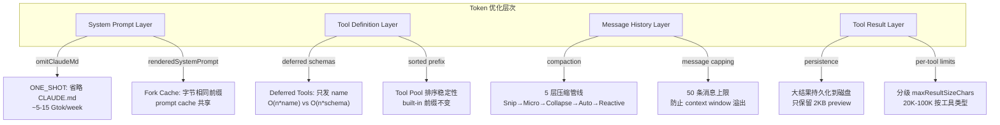
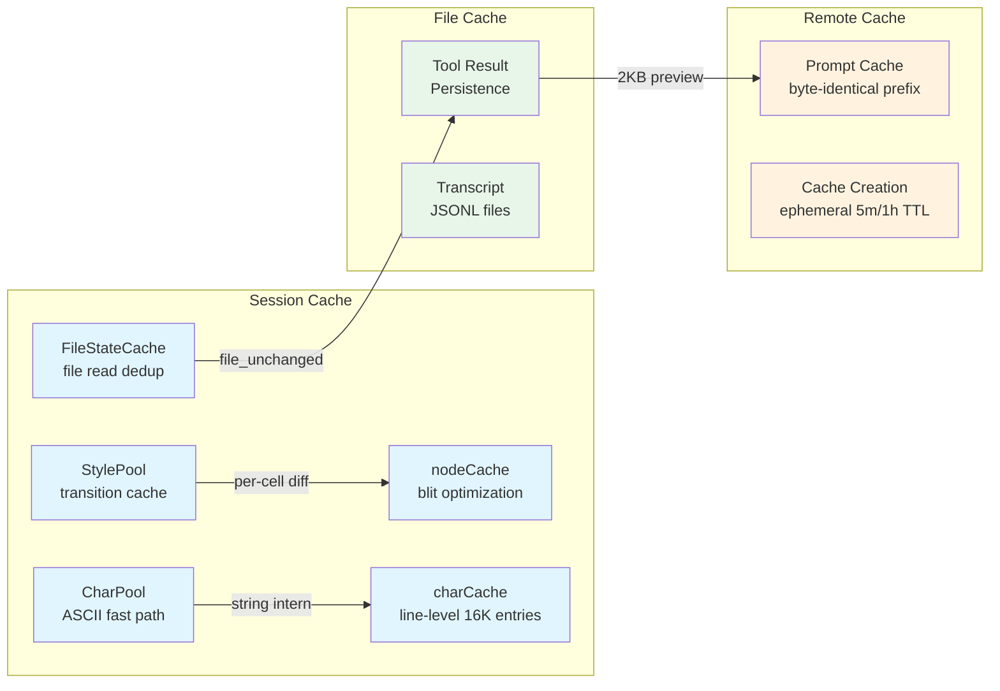

# 第27章 性能优化策略

> 一个运行在终端中的应用，如何在启动延迟、渲染帧率、内存占用和 API 成本之间找到精确的平衡点？Claude Code 的性能工程覆盖了从进程启动的第一个微秒到 API token 的最后一分钱，构建了一个跨越七个维度的优化体系。

---

## 27.1 启动性能：冷启动时间的战争

对于 CLI 工具而言，启动延迟直接决定用户体验。Claude Code 的启动链 `cli.tsx -> init.ts -> main.tsx` 在每一层都实施了激进的优化。

### 27.1.1 Fast-Path Dispatch：200 倍加速

`cli.tsx` 的核心设计原则是 **fast-path dispatch**——在加载完整 CLI 之前，先检查是否有特殊标志可以提前退出。这个分发表有 15 个优先级层级：

| 优先级 | 条件 | 加载的模块 | 典型延迟 |
|--------|------|-----------|---------|
| 1 | `--version` / `-v` | 零模块 | < 5ms |
| 2 | `--dump-system-prompt` | config, model, prompts | ~50ms |
| 3-6 | MCP/Daemon 子命令 | 单个入口模块 | ~100ms |
| DEFAULT | 无特殊标志 | 全部 200+ 模块 | ~1000ms |

关键的工程决策是**所有 import 都是动态的** (`await import(...)`)。当用户仅执行 `claude --version` 时，只需读取一个编译期常量 `MACRO.VERSION` 即可退出，无需加载任何业务模块。这意味着最快路径比默认路径快约 **200 倍**。

此外，`feature()` 函数来自 `bun:bundle`，是一个 **build-time macro**。在编译阶段，Bun 的 bundler 会将禁用的 feature gate 块完全移除（Dead Code Elimination）。生产构建中约有 30+ 个 feature flag 控制着不同代码路径的存活：

```
BRIDGE_MODE, DAEMON, BG_SESSIONS, TEMPLATES, FORK_SUBAGENT,
COORDINATOR_MODE, HISTORY_SNIP, VOICE_MODE, TEAMMEM ...
```

当某个 feature 在外部构建中被禁用时，相关的整个代码块——包括 `await import(...)` 语句——在产物中为零字节。

### 27.1.2 Lazy Loading：~1.1MB 的 OpenTelemetry 延迟加载

`init.ts` 的初始化序列被设计为严格的分层加载：

```
Phase 1: Configuration     (同步，几乎无开销)
Phase 2: Shutdown handlers  (同步)
Phase 3: Analytics          (fire-and-forget，不阻塞)
Phase 4: Auth & Settings    (void Promise，不阻塞)
Phase 5: Network            (preconnect，不阻塞)
Phase 6-8: Platform setup   (条件性)
```

其中最关键的优化是 **telemetry 延迟加载**。~400KB 的 OpenTelemetry + protobuf 模块被推迟到 `doInitializeTelemetry()` 运行时才加载；gRPC exporters (~700KB via `@grpc/grpc-js`) 在 `instrumentation.ts` 内部进一步延迟加载。总计约 **1.1MB** 的模块不在启动关键路径上。

### 27.1.3 I/O Overlap：MDM + Keychain 预取

`main.tsx` 在顶部执行了三个 **performance-critical side-effects**——在常规 import 之前：

```typescript
profileCheckpoint('main_tsx_entry');
startMdmRawRead();        // MDM 子进程读取 (~135ms)
startKeychainPrefetch();  // macOS Keychain 预取 (~65ms)
```

这三条语句与随后 ~135ms 的 200+ 模块 import 评估**并行执行**。当 import 完成时，MDM 数据和 Keychain credential 已经在内存中等待使用。

```mermaid
gantt
    title 启动时间线优化
    dateFormat X
    axisFormat %Lms
    section Critical Path
    cli.tsx entry          :a1, 0, 5
    Feature gate check     :a2, after a1, 10
    Dynamic import main.js :a3, after a2, 135
    Commander.js setup     :a4, after a3, 50
    section Parallel I/O
    MDM subprocess read    :b1, 15, 150
    Keychain prefetch      :b2, 15, 80
    preconnectAnthropicApi :b3, 15, 120
    section Deferred
    OpenTelemetry load     :c1, 200, 400
    gRPC exporter load     :c2, 400, 300
    Deferred prefetches    :c3, 250, 500
```



`preconnectAnthropicApi()` 在 init 阶段提前发起 TCP+TLS handshake，节省约 **100-200ms** 的网络延迟。`startDeferredPrefetches()` 在首次渲染后才启动，避免与启动关键路径竞争。

---

## 27.2 渲染性能：终端作为 GPU-less 显示服务器

Claude Code 的终端 UI 框架将 Unix 终端变成了一个无 GPU 的显示服务器：React 组件绘制到虚拟 framebuffer，diff 引擎生成最小化的 ANSI 序列更新物理屏幕。

### 27.2.1 Differential Updates：Cell-Level Diff

渲染管线的核心是 `LogUpdate.render()` 方法，它比较两帧并生成最小 patch 列表：

```
React Tree -> Yoga Layout -> renderNodeToOutput() -> Frame
-> Selection Overlay -> LogUpdate.render(prev, next) -> Diff[]
-> Optimizer -> writeDiffToTerminal()
```

`diffEach()` 在 cell 级别比较前后帧。每个 cell 是两个 `Int32`（charId + packed style/hyperlink/width），diff 只在 damage region 内迭代：

```typescript
diffEach(prev.screen, next.screen, (x, y, removed, added) => {
  moveCursorTo(screen, x, y);
  if (added) {
    const styleStr = stylePool.transition(currentStyleId, added.styleId);
    writeCellWithStyleStr(screen, added, styleStr);
  }
});
```

在稳态帧（spinner tick、时钟更新）中，只有脏节点的 cell 被重新渲染，其余全部通过 `TypedArray.set()` 从前一帧 bulk copy。

### 27.2.2 Hardware Scroll：DECSTBM

在 alt-screen 模式下，当内容滚动时使用 VT100 硬件滚动指令而非重绘全部行：

```typescript
if (altScreen && next.scrollHint && decstbmSafe) {
  const { top, bottom, delta } = next.scrollHint;
  shiftRows(prev.screen, top, bottom, delta);
  scrollPatch = [{
    content: setScrollRegion(top + 1, bottom + 1) +
      (delta > 0 ? csiScrollUp(delta) : csiScrollDown(-delta)) +
      RESET_SCROLL_REGION + CURSOR_HOME,
  }];
}
```

终端硬件在一条 ANSI 指令中完成行移动，而 diff 引擎只需要重新绘制新暴露的行，将滚动操作的 I/O 量从 O(rows * cols) 降低到 O(cols)。

### 27.2.3 Object Pools：CharPool 和 StylePool

**CharPool** 使用 string interning 避免重复创建字符串对象。关键优化是 ASCII fast path：

```typescript
class CharPool {
  private ascii: Int32Array = new Int32Array(128).fill(-1);

  intern(char: string): number {
    if (char.length === 1) {
      const code = char.charCodeAt(0);
      if (code < 128) {
        const cached = this.ascii[code]!;
        if (cached !== -1) return cached;  // O(1) 数组直接查找
      }
    }
    return this.stringMap.get(char) ?? this.allocate(char);
  }
}
```

对于 ASCII 字符（终端内容中的绝大多数），直接通过数组索引查找（O(1)），绕过 `Map.get` 的哈希计算。

**StylePool** 缓存任意两个 style ID 之间的 ANSI 转义序列：

```typescript
transition(fromId: number, toId: number): string {
  const key = fromId * 0x100000 + toId;  // Pack into single number
  let str = this.transitionCache.get(key);
  if (!str) {
    str = ansiCodesToString(diffAnsiCodes(this.get(fromId), this.get(toId)));
    this.transitionCache.set(key, str);
  }
  return str;
}
```

两个 style ID 被 pack 成一个数字作为 cache key，避免对象分配。一旦两种样式之间的转换被计算过一次，后续帧直接命中缓存。

### 27.2.4 Frame Scheduling

帧调度采用 throttled microtask 模式：

- 正常渲染：以 `FRAME_INTERVAL_MS` 节流（leading + trailing edge）
- 滚动 drain 帧：`FRAME_INTERVAL_MS >> 2`（四分之一间隔，~250fps 实际上限）
- `scheduleRender` 是 lodash `throttle` 包裹的 `queueMicrotask`，确保 layout effects 在渲染前已 commit

---

## 27.3 内存效率：每个字节都精打细算

### 27.3.1 Packed Int32Array Cells

Screen buffer 使用 packed `Int32Array` 实现零 GC 压力的 cell 存储：

```typescript
type Screen = {
  cells: Int32Array;       // 2 Int32s per cell: [charId, packed]
  cells64: BigInt64Array;  // 同一 buffer 的 BigInt64 视图，用于 bulk fills
};
```

Cell packing 布局（word1）：

| 位范围 | 字段 | 最大值 |
|--------|------|--------|
| [31:17] | styleId | 32,767 styles |
| [16:2] | hyperlinkId | 32,767 links |
| [1:0] | width | 4 种 (Narrow/Wide/SpacerTail/SpacerHead) |

对于 200x120 的终端，使用对象数组需要分配 **24,000+ 个对象**；`Int32Array` 将其压缩为一块连续内存。`cells64` 视图使得全屏清空只需一条 `screen.cells64.fill(0n)` 调用。

### 27.3.2 Message Capping：从 36.8GB 事故中学到的教训

InProcessTeammateTask 引入了 **50 条消息上限**，这源于一次真实的生产事故：

> 一个 whale session 中 292 个并发 agent 在 500+ 轮对话后，RSS 达到 36.8GB。

```typescript
export const TEAMMATE_MESSAGES_UI_CAP = 50;

export function appendCappedMessage<T>(prev: T[] | undefined, item: T): T[] {
  if (prev && prev.length >= TEAMMATE_MESSAGES_UI_CAP) {
    const next = prev.slice(-(TEAMMATE_MESSAGES_UI_CAP - 1));
    next.push(item);
    return next;
  }
  return [...prev ?? [], item];
}
```

每个 agent 按约 ~20MB RSS/500 turns 计算，50 条上限将单个 agent 的 UI 消息内存稳定在约 **~2MB**。

### 27.3.3 Pool Reset：防止无限增长

CharPool 和 HyperlinkPool 在长会话中会无限增长。每 5 分钟执行一次 pool 重置：

```typescript
resetPools(): void {
  this.charPool = new CharPool();
  this.hyperlinkPool = new HyperlinkPool();
  migrateScreenPools(this.frontFrame.screen, this.charPool, this.hyperlinkPool);
}
```

frontFrame 的 screen 被迁移到新 pool，backFrame 的 pool 引用被更新，旧 pool 交给 GC。charCache（行级别缓存）在超过 16,384 条目时被清除。

---

## 27.4 Token Economics：API 成本的精密控制

对于 LLM 应用，API 调用成本往往是最大的运营开支。Claude Code 在多个层面优化 token 消耗。

### 27.4.1 Prompt Cache Sharing：Fork 子进程的字节相同前缀

Fork subagent 的核心优化是确保所有 fork 子进程产生 **byte-identical** 的 API 请求前缀：

```
[...history, assistant(all_tool_uses), user(placeholder_results..., directive)]
```

1. 保留完整的父 assistant 消息（所有 tool_use blocks、thinking、text）
2. 为每个 tool_use block 构建一条 user 消息，使用**相同的 placeholder**：`'Fork started -- processing in background'`
3. 仅在最后一个 text block 添加 per-child 的 directive

这确保了 Anthropic API 的 prompt cache 对所有 fork 子进程的前缀部分只收费一次。fork agent 的 `getSystemPrompt` 是空函数——它继承父进程**已渲染的 system prompt bytes**（通过 `renderedSystemPrompt` 传递），避免 GrowthBook 冷/热启动差异导致 cache 失效。

### 27.4.2 ONE_SHOT 优化：Explore Agent 的 CLAUDE.md 省略

Explore agent 设置了 `omitClaudeMd: true`，在子 agent 的 system prompt 中跳过 CLAUDE.md 注入。考虑到 CLAUDE.md 典型长度约 **~135 chars**，乘以每周 **34M+** 的 Explore 调用量：

```
节省量 ≈ 135 chars × 34,000,000 calls/week ≈ 4.6 Gtok/week (估算)
```

实际节省在 **~5-15 Gtok/week** 范围（取决于项目 CLAUDE.md 的实际大小）。

### 27.4.3 Tool Pool 排序的 Cache 稳定性

`assembleToolPool()` 将 built-in tools 和 MCP tools 分开排序后拼接：

```typescript
const byName = (a, b) => a.name.localeCompare(b.name);
return uniqBy(
  [...builtInTools].sort(byName).concat(allowedMcpTools.sort(byName)),
  'name',
);
```

built-in tools 作为连续的排序前缀保持稳定。当 MCP tools 被添加或移除时，前缀不变，prompt cache 对 built-in 工具定义部分保持命中。

### 27.4.4 Result Budgeting：分级大小限制

工具结果有三级大小控制：

| 控制层 | 限制 | 作用 |
|--------|------|------|
| Per-tool `maxResultSizeChars` | 20K-100K (Infinity for Read) | 工具级别截断 |
| Global `DEFAULT_MAX_RESULT_SIZE_CHARS` | 50,000 chars | 全局上限 |
| `MAX_TOOL_RESULTS_PER_MESSAGE_CHARS` | 200,000 chars | 单条消息聚合上限 |

超过阈值的结果被持久化到磁盘，只在 prompt 中保留 preview：

```
<persisted-output>
Output too large (42.3 KB). Full output saved to: /path/to/file.txt
Preview (first 2.0 KB):
[前 2000 bytes]
...
</persisted-output>
```

### 27.4.5 Deferred Tool Schemas

当工具总数超过阈值时，系统切换到 deferred tools 模式。延迟工具只将 name 发送给 API（带 `defer_loading: true`），模型必须先调用 `ToolSearch` 加载完整 schema：

```typescript
function isDeferredTool(tool: Tool): boolean {
  if (tool.alwaysLoad) return false;
  if (tool.isMcp) return true;       // MCP 工具始终延迟
  if (tool.shouldDefer) return true;  // 显式声明延迟
  return false;
}
```

这将 system prompt 中的工具定义 token 数从 O(n * avg_schema_size) 降低到 O(n * name_length)，在有大量 MCP 工具的环境中可节省数千 tokens。



---

## 27.5 并发执行：工具并行与 Agent 分发

### 27.5.1 Tool Parallel Execution：分区批处理

工具执行的并发模型遵循三条规则：

1. **Concurrent-safe** 工具可以与其他 concurrent-safe 工具并行执行
2. **Non-concurrent** 工具必须独占执行
3. 结果按接收顺序缓冲并有序输出

`partitionToolCalls()` 将工具调用划分为交替的并发/串行批次：

```
[Glob, Grep, Read] -> 一个并发批次 (max concurrency: 10)
[FileEdit]         -> 一个串行批次
[Glob, Read]       -> 一个并发批次
```

| 工具 | isConcurrencySafe | 原因 |
|------|------------------|------|
| FileReadTool | `true` | 纯读取 |
| GlobTool | `true` | 纯搜索 |
| GrepTool | `true` | 纯搜索 |
| WebFetchTool | `true` | 网络读取 |
| BashTool | `isReadOnly(input)` | 仅只读命令并发 |
| FileEditTool | `false` (default) | 写入文件 |

默认并发上限为 **10**（可通过 `CLAUDE_CODE_MAX_TOOL_USE_CONCURRENCY` 配置）。设计遵循 fail-closed 原则：忘记声明 `isConcurrencySafe` 的工具被视为串行执行。

### 27.5.2 StreamingToolExecutor：流式并行

在启用 streaming tool execution 时，`StreamingToolExecutor` 在 API 流式输出 tool_use block 的同时就开始执行工具：

```
API streaming: [tool_use_1] [tool_use_2] [tool_use_3] ...
Execution:      |--exec_1--|
                            |--exec_2--|--exec_3--|  (并发)
Result yield:   [result_1]  [result_2]  [result_3]  (有序)
```

Abort 传播机制设计为三层 AbortController 链：

```
query-level (parent)
  -> siblingAbortController (中间层：Bash 错误取消同级)
    -> toolAbortController (per-tool)
```

仅 Bash 工具的错误会级联取消同级工具（因为 Bash 命令通常有隐式依赖链），Read/WebFetch 等工具的失败不会影响同级。

### 27.5.3 I/O Prefetch Parallelization

启动阶段的 I/O 并行化不仅限于 MDM 和 Keychain。`init.ts` 中 Phase 3-5 的所有操作都以 `void Promise` 方式启动，不阻塞初始化主线程：

```typescript
// Phase 3: Analytics (fire-and-forget)
void Promise.all([
  import('../services/analytics/firstPartyEventLogger.js'),
  import('../services/analytics/growthbook.js'),
]).then(([fp, gb]) => { ... });

// Phase 4: Auth & Remote Settings (void, non-blocking)
void populateOAuthAccountInfoIfNeeded();
void detectCurrentRepository();

// Phase 5: Network (overlap with module evaluation)
preconnectAnthropicApi();
```

---

## 27.6 网络性能：连接建立的优化

### 27.6.1 DNS 预连接

`preconnectAnthropicApi()` 在 init 阶段就发起到 Anthropic API 的 TCP+TLS 握手。这利用了初始化序列中 module evaluation (~135ms) 和 Commander.js setup (~50ms) 的时间窗口，使得首次 API 调用时连接已经就绪。

### 27.6.2 Transport Selection

远程模式根据 URL 协议自动选择最优传输：

| 传输层 | 读路径 | 写路径 | 使用场景 |
|--------|--------|--------|---------|
| WebSocket | WebSocket | WebSocket | 低延迟双向 |
| SSE | SSE (GET) | HTTP POST | CCR v2 |
| Hybrid | WebSocket (低延迟) | HTTP POST (可靠) | 最佳组合 |

Hybrid Transport 对 `stream_event` 消息使用 100ms 批量窗口，将多个小消息合并为单次 HTTP POST，减少请求数。写操作被序列化以避免 Firestore 文档的并发写入冲突。

### 27.6.3 WebSocket 重连与消息重放

WebSocket transport 使用 circular buffer 缓存已发送消息。重连时通过 `X-Last-Request-Id` 请求服务端重放，实现断点续传：

```typescript
// 重连时携带最后发送的消息 ID
if (this.lastSentId) {
  headers['X-Last-Request-Id'] = this.lastSentId;
}
```

重连策略：1s-30s 指数退避，10 分钟后放弃。睡眠检测（>60s 间隔）会重置退避预算。

---

## 27.7 缓存策略：三级缓存架构

### 27.7.1 Session Level Cache

| 缓存 | 作用域 | 生命周期 | 失效策略 |
|------|--------|---------|---------|
| StylePool transitionCache | per-Ink instance | 渲染生命周期 | Pool reset (5min) |
| CharPool ASCII fast path | per-Ink instance | 渲染生命周期 | Pool reset (5min) |
| nodeCache (blit) | per-frame | 每帧重建 | 脏标记 |
| charCache (行级别) | per-Output | 跨帧持久 | 16,384 条目溢出 |
| FileStateCache | per-QueryEngine | 对话生命周期 | 手动更新 |
| ContentReplacementState | per-conversation | 永不重置 | UUID 键自然过期 |

### 27.7.2 File Level Cache

工具结果的磁盘持久化（`{projectDir}/{sessionId}/tool-results/{toolUseId}.txt`）既是内存优化也是缓存：大结果只在磁盘上存在一份，prompt 中只保留 2KB preview。当模型需要完整结果时可以通过 Read 工具读取持久化文件。

### 27.7.3 Remote Cache

Prompt cache 是 Anthropic API 层面的远程缓存。Claude Code 通过以下机制最大化 cache hit rate：

- **Fork byte-identical prefix**：所有 fork 子进程共享相同的消息前缀
- **Tool pool sorted prefix**：built-in 工具定义在所有会话中排序一致
- **renderedSystemPrompt**：fork 复用父进程已渲染的 system prompt bytes，避免重新渲染导致的微小差异



### 27.7.4 Memoization 边界

系统中的多个关键函数使用 memoization：

- `init()` 被 `memoize()` 包裹——无论调用多少次，只执行一次
- `stringWidth()` 优先使用 `Bun.stringWidth`（native 实现，单次调用），JavaScript fallback 有三级 fast path：纯 ASCII、简单 Unicode、完整 grapheme segmentation
- React Compiler 在组件级别生成 `_c` memoization slots，最大化跨渲染 cache hits

---

## 27.8 性能对比总结

| 优化领域 | 优化手段 | 量化效果 |
|---------|---------|---------|
| 启动：fast-path | 动态 import + 分发表 | `--version` < 5ms vs 默认 ~1000ms |
| 启动：lazy load | OpenTelemetry 延迟 | ~1.1MB 不在关键路径 |
| 启动：I/O overlap | MDM/Keychain 并行 | 节省 ~135ms + ~65ms |
| 启动：preconnect | TCP+TLS 预连接 | 节省 ~100-200ms |
| 渲染：diff | Cell-level differential | 稳态帧只更新脏 cells |
| 渲染：hardware scroll | DECSTBM | 滚动 I/O: O(cols) vs O(rows*cols) |
| 渲染：pools | CharPool ASCII O(1) | 绕过 Map.get 哈希 |
| 内存：packed cells | Int32Array | 消除 24,000+ 对象/屏 |
| 内存：message cap | 50 条上限 | 从 36.8GB 降至可控水平 |
| Token：fork cache | Byte-identical prefix | Prompt cache 共享 |
| Token：ONE_SHOT | omitClaudeMd | ~5-15 Gtok/week 节省 |
| Token：deferred | 只发 tool name | 节省数千 tokens/请求 |
| 并发：tool parallel | 分区批处理 | Max 10 并发工具 |
| 网络：transport | Hybrid WebSocket+POST | 100ms 批量窗口 |

---

## 27.9 本章小结

Claude Code 的性能优化不是一组孤立的技巧，而是一个跨越七个维度的系统工程：

1. **启动性能**通过 fast-path dispatch、lazy loading 和 I/O overlap 实现亚秒级冷启动
2. **渲染性能**通过 cell-level diff、hardware scroll 和 object pools 实现终端帧率上限
3. **内存效率**通过 packed arrays、message capping 和 pool reset 避免长会话的内存膨胀
4. **Token economics**通过 cache sharing、ONE_SHOT 优化和 result budgeting 控制 API 成本
5. **并发执行**通过分区批处理和流式执行最大化工具吞吐量
6. **网络性能**通过预连接、传输层选择和消息批量化减少延迟
7. **缓存策略**通过三级缓存架构在不同时间尺度上复用计算结果

这些优化的共同特征是 **fail-closed 设计**和**可量化的 tradeoff**。每个优化都有明确的成本（代码复杂度）和收益（延迟/内存/成本的量化改善），使得性能工程从"感觉快"变成"证明快"。
