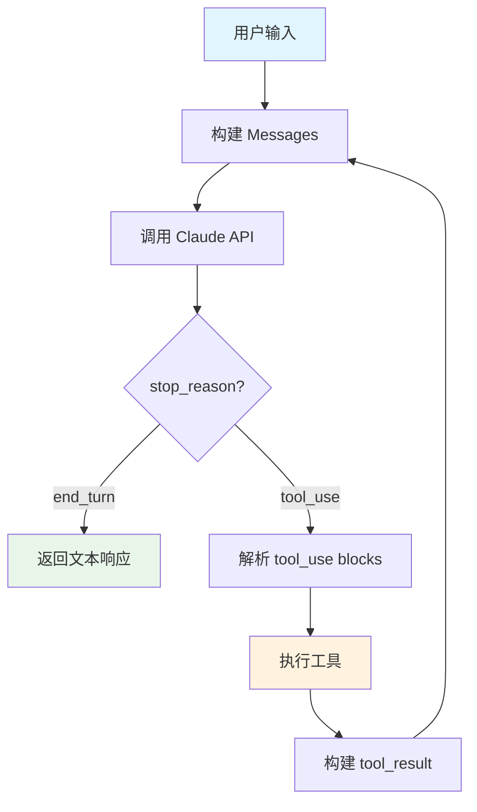
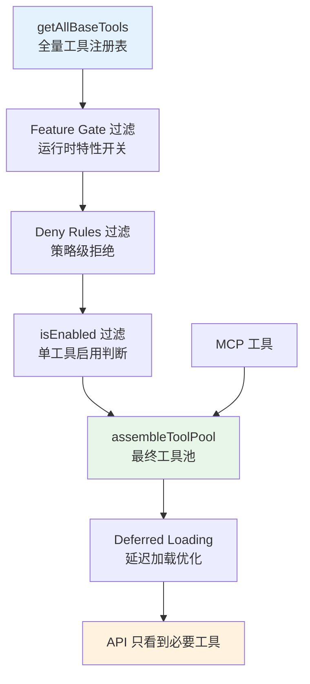
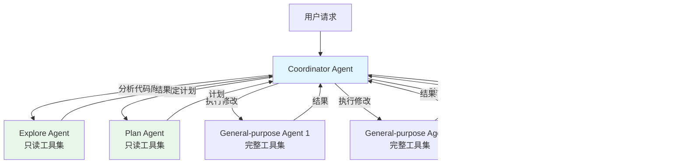
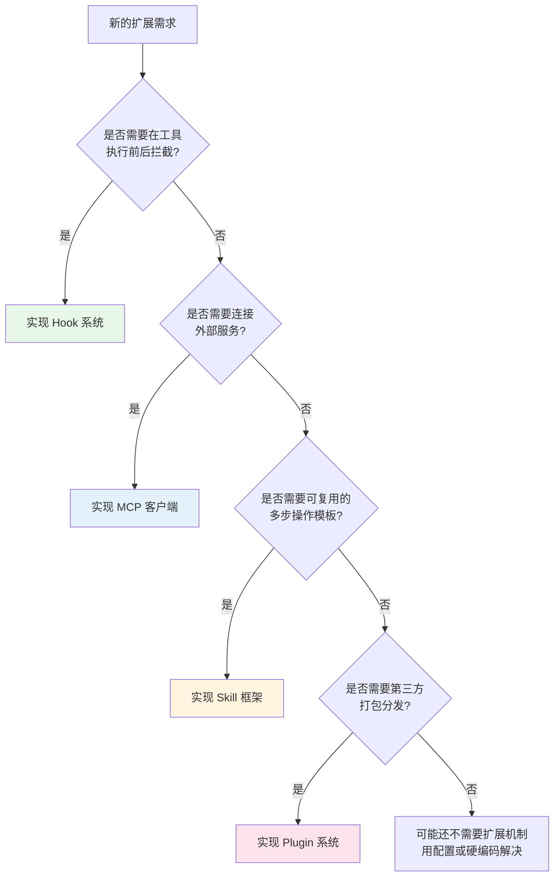

# 第二十八章：构建你自己的 AI Harness

> **本章摘要**
>
> 前面 27 章，我们从内到外拆解了 Claude Code 这个 50 万行生产级 AI Harness 的每一个子系统。现在是时候把这些知识转化为行动了。本章从一个 50 行的最小可行 Harness 开始，逐步添加多轮对话、工具系统、Agent 能力、UI 层和扩展机制，最终给出生产强化指南和架构决策检查清单。读完本章，你将拥有一份清晰的路线图，能够从零开始构建自己的 AI Agent 框架。

---

## 28.1 最小可行 Harness：API 调用 + 单个工具

每一个伟大的系统都始于一个最小原型。Claude Code 的核心本质可以归结为一个简单的循环：**调用模型 -> 检查是否需要工具 -> 执行工具 -> 将结果返回模型 -> 重复**。这就是所谓的 Agentic Loop。

让我们用不到 60 行 TypeScript 实现一个可工作的最小 Harness：

```typescript
import Anthropic from "@anthropic-ai/sdk";
import { execSync } from "child_process";

const client = new Anthropic();

// 定义一个工具：执行 shell 命令
const tools: Anthropic.Tool[] = [
  {
    name: "run_command",
    description: "Run a shell command and return its output",
    input_schema: {
      type: "object" as const,
      properties: {
        command: { type: "string", description: "The shell command to run" },
      },
      required: ["command"],
    },
  },
];

// 执行工具调用
function executeTool(name: string, input: Record<string, string>): string {
  if (name === "run_command") {
    try {
      return execSync(input.command, { encoding: "utf-8", timeout: 30000 });
    } catch (e: any) {
      return `Error: ${e.message}`;
    }
  }
  return `Unknown tool: ${name}`;
}

// 核心：Agentic Loop
async function agenticLoop(userMessage: string): Promise<string> {
  const messages: Anthropic.MessageParam[] = [
    { role: "user", content: userMessage },
  ];

  while (true) {
    const response = await client.messages.create({
      model: "claude-sonnet-4-20250514",
      max_tokens: 4096,
      tools,
      messages,
    });

    // 如果模型不再需要调用工具，返回最终文本
    if (response.stop_reason === "end_turn") {
      const textBlock = response.content.find((b) => b.type === "text");
      return textBlock ? textBlock.text : "(no response)";
    }

    // 处理工具调用
    messages.push({ role: "assistant", content: response.content });
    const toolResults: Anthropic.ToolResultBlockParam[] = [];
    for (const block of response.content) {
      if (block.type === "tool_use") {
        const result = executeTool(block.name, block.input as Record<string, string>);
        toolResults.push({ type: "tool_result", tool_use_id: block.id, content: result });
      }
    }
    messages.push({ role: "user", content: toolResults });
  }
}

// 入口
const answer = await agenticLoop("List all TypeScript files in the current directory");
console.log(answer);
```

这 60 行代码已经展现了 Claude Code 架构的核心骨架：



对比 Claude Code 的 `queryLoop()`，这个最小 Harness 缺少什么？缺少的正是接下来几节要逐步构建的：多轮上下文管理、工具注册系统、权限控制、Agent 分发、错误恢复，以及 UI 层。

---

## 28.2 添加多轮对话与上下文管理

最小 Harness 的 `messages` 数组在单次 `agenticLoop` 调用中会无限增长。在真实场景中，你需要解决三个问题：

### 跨轮次的消息持久化

Claude Code 的 `QueryEngine` 维护一个 `mutableMessages` 数组，在同一 conversation 的多次 `submitMessage()` 调用之间持久存在。模仿这个模式：

```typescript
class Conversation {
  private messages: Anthropic.MessageParam[] = [];

  async submitMessage(userMessage: string): Promise<string> {
    this.messages.push({ role: "user", content: userMessage });
    // ... agentic loop, push assistant/tool messages to this.messages
    return finalResponse;
  }
}
```

### 上下文窗口管理

当消息历史增长接近模型的 Context Window 上限时，你需要压缩策略。Claude Code 使用了三级压缩方案：

1. **Microcompact**：移除冗余的系统消息，压缩重复的工具结果
2. **Autocompact**：当 token 用量超过阈值时，用一个小模型生成对话摘要，替换旧消息
3. **Snip compaction**：在对话中插入"剪切边界"，将边界之前的内容替换为摘要

对于你自己的 Harness，最简单的起步方案是滑动窗口 + 摘要：

```typescript
async function compactIfNeeded(messages: MessageParam[], maxTokens: number) {
  const tokenCount = estimateTokens(messages);
  if (tokenCount < maxTokens * 0.8) return messages;

  // 保留最近 N 轮，摘要其余部分
  const recent = messages.slice(-10);
  const old = messages.slice(0, -10);
  const summary = await summarize(old);  // 用小模型生成摘要
  return [{ role: "user", content: `Previous context summary: ${summary}` }, ...recent];
}
```

### System Prompt 组装

Claude Code 的 System Prompt 不是一个静态字符串，而是由多个部分动态组装的：基础提示词、用户上下文（CLAUDE.md 文件内容）、工具描述、Agent 定义、Memory 提示词。将这些分层是一个好的实践：

```typescript
function buildSystemPrompt(parts: { base: string; userContext?: string; toolHints?: string }) {
  return [parts.base, parts.userContext, parts.toolHints].filter(Boolean).join("\n\n");
}
```

---

## 28.3 实现工具系统：接口设计、注册、权限模型

工具系统是 Harness 从"聊天助手"升级为"编码 Agent"的关键跃迁。

### 工具接口设计

Claude Code 的 `Tool<Input, Output, Progress>` 接口有近 50 个字段，但核心只需要 7 个。从最小接口开始：

```typescript
interface Tool {
  name: string;
  description: string;
  inputSchema: Record<string, unknown>;   // JSON Schema
  call(input: unknown): Promise<ToolResult>;
  isReadOnly(input: unknown): boolean;     // 并发安全判断的基础
  checkPermissions(input: unknown): Promise<{ allowed: boolean; reason?: string }>;
}

interface ToolResult {
  data: string;
  isError?: boolean;
}
```

然后在此基础上按需添加：`isConcurrencySafe()`（并发控制）、`validateInput()`（输入校验）、`prompt()`（动态提示词注入）、`renderToolUseMessage()`（UI 渲染）。

**Claude Code 的设计教训**：`buildTool()` 工厂函数使用 fail-closed 默认值 -- 忘记声明 `isConcurrencySafe` 的工具默认按串行执行，忘记声明 `isReadOnly` 的工具默认视为有写操作。这种防御性设计避免了难以追踪的并发 bug。

### 工具注册与发现

Claude Code 使用了一个中心注册表 `getAllBaseTools()` 加上多层过滤：



你的 Harness 可以从简单的 Map 注册开始：

```typescript
class ToolRegistry {
  private tools = new Map<string, Tool>();

  register(tool: Tool) { this.tools.set(tool.name, tool); }
  get(name: string) { return this.tools.get(name); }
  getAll() { return Array.from(this.tools.values()); }

  // 转换为 API 格式
  toAPIFormat(): Anthropic.Tool[] {
    return this.getAll().map(t => ({
      name: t.name,
      description: t.description,
      input_schema: t.inputSchema,
    }));
  }
}
```

### 权限模型

Claude Code 的权限系统有三层：

1. **Pre-model filtering**：在发送工具列表给模型之前，通过 Deny Rules 移除被禁止的工具。模型永远看不到这些工具。
2. **Permission check**：工具执行前，`checkPermissions()` 验证每个具体调用。结果可以是 `allow`、`deny`、`ask`（提示用户确认）。
3. **Hook 系统**：`PreToolUse` hooks 可以在权限检查之后、工具执行之前，进一步拦截或修改调用。

对于 MVP，从白名单模式开始：

```typescript
type PermissionMode = "ask" | "auto" | "deny";

function checkPermission(tool: Tool, input: unknown, mode: PermissionMode): boolean {
  if (mode === "deny") return false;
  if (mode === "auto") return true;
  if (tool.isReadOnly(input)) return true;  // 读操作自动允许
  return promptUser(`Allow ${tool.name}?`);  // 写操作询问用户
}
```

---

## 28.4 添加 Agent 能力：子 Agent 分发、任务管理、Coordinator 模式

当工具系统稳定之后，下一个跃迁是 Agent 能力 -- 让 AI 能够分发子任务给其他 AI 实例。

### 子 Agent 的本质

Claude Code 的 Agent Tool 本质上是一个递归调用：父 Agent 通过一个特殊的 `Agent` 工具，启动一个新的 `queryLoop()`，配备定制的 System Prompt、受限的工具集、独立的 Abort Controller。子 Agent 执行完毕后，将结果返回给父 Agent 的工具结果。

```typescript
class AgentTool implements Tool {
  name = "Agent";

  async call(input: { agentType: string; prompt: string }): Promise<ToolResult> {
    const agent = this.registry.getAgent(input.agentType);
    const subConversation = new Conversation({
      systemPrompt: agent.systemPrompt,
      tools: agent.allowedTools,
      maxTurns: agent.maxTurns ?? 20,
    });
    const result = await subConversation.submitMessage(input.prompt);
    return { data: result };
  }
}
```

### 任务类型层次

Claude Code 定义了 7 种任务类型：`local_bash`、`local_agent`、`remote_agent`、`in_process_teammate`、`local_workflow`、`monitor_mcp`、`dream`。每种类型有独立的生命周期管理（`pending -> running -> completed/failed/killed`）。

对于你的 Harness，从两种开始：

- **Foreground Agent**：同步执行，共享父 Agent 的 Abort Controller 和状态
- **Background Agent**：异步执行，独立 Abort Controller，通过通知系统报告结果

### Coordinator 模式

当任务复杂度超过单个 Agent 的能力时，Claude Code 引入了 Coordinator 模式：一个 Coordinator Agent 负责理解全局任务，将其分解为子任务，分发给专门的 Agent（Explore、Plan、General-purpose、Verification），然后综合结果。



关键设计决策：

- **工具集隔离**：Explore Agent 只有只读工具，不能意外修改文件
- **背景执行**：Verification Agent 设计为始终在后台运行
- **模型分级**：Explore Agent 可以使用更便宜的模型（Haiku），General-purpose Agent 使用主力模型
- **权限继承**：子 Agent 继承父 Agent 的权限模式，但可以被覆盖

---

## 28.5 UI 层：终端、Web、IDE 插件的取舍

Harness 的 UI 层决定了用户体验，但选择因场景而异。

### 终端（Terminal）

Claude Code 选择了终端作为主 UI，使用 React（Ink）来渲染 TUI 组件。这个选择带来了：

**优势**：
- 开发者最熟悉的环境，零切换成本
- 与 shell/git 工作流天然集成
- 轻量，启动快

**劣势**：
- 展示能力有限（无法渲染富文本、图片）
- 终端兼容性碎片化
- 用户交互模式受限

### Web UI

适合需要富展示的场景（代码 diff 高亮、项目浏览器、可视化调试面板）。

**权衡**：Web UI 意味着你需要维护前后端通信协议（WebSocket/SSE）、会话管理、认证。如果你的 Harness 面向团队使用，Web 可能是更好的选择。

### IDE 插件

与 VS Code / JetBrains 深度集成，用户在编辑器内即可使用。

**权衡**：受 IDE 插件 API 限制，不同 IDE 需要独立维护。但对于代码编辑场景，IDE 集成提供最佳的代码感知（文件树、诊断信息、LSP 数据）。

### 推荐路径

```
阶段 1：纯 CLI（readline / 标准输入输出）
阶段 2：终端 UI（Ink / Blessed / 自定义 ANSI）
阶段 3：多前端（CLI + Web / CLI + IDE 插件）
```

**Claude Code 的教训**：使用 streaming AsyncGenerator 作为核心输出协议。`queryLoop()` yield 的是结构化事件（Message、StreamEvent、ToolUseSummary），而非格式化文本。这使得同一个核心引擎可以驱动不同的前端，而无需修改引擎层逻辑。

---

## 28.6 可扩展性设计：Plugin、Skill、MCP、Hook

Claude Code 提供了四种不同的扩展机制，每种解决不同层次的问题：

| 机制 | 适用场景 | 复杂度 | 何时引入 |
|------|---------|-------|---------|
| **Hook** | 在工具执行前后注入自定义逻辑（审计、校验、转换） | 低 | 第一个扩展需求出现时 |
| **Skill** | 预定义的提示词+工具组合，按需加载 | 中 | 当你发现用户反复执行相同的多步操作模式时 |
| **Plugin** | 打包分发的工具+Agent+Hook 组合 | 高 | 当第三方需要扩展你的 Harness 时 |
| **MCP** | 标准化的外部工具协议（Model Context Protocol） | 中 | 需要连接外部服务（数据库、API、IDE）时 |

### Hook 系统

Hook 是最轻量的扩展点。Claude Code 支持四种 hook 时机：

- `PreToolUse`：工具执行前，可以拦截、修改输入、注入权限判断
- `PostToolUse`：工具执行后，可以转换输出、记录审计日志
- `PreSampling`：API 调用前
- `PostSampling`：API 调用后

实现示例：

```typescript
type HookTiming = "PreToolUse" | "PostToolUse" | "PreSampling" | "PostSampling";

interface Hook {
  timing: HookTiming;
  toolName?: string;     // 只对特定工具生效，undefined 表示全部
  handler(context: HookContext): Promise<HookResult>;
}

// HookResult 可以：
// - 允许继续执行
// - 阻止执行并返回错误
// - 修改输入/输出
// - 阻止后续对话继续
```

### MCP 集成

MCP（Model Context Protocol）是将外部工具标准化接入的协议。Claude Code 将 MCP 工具视为"一等公民" -- 它们经过与内置工具相同的注册、权限检查、并发控制流程。但有一个关键区别：MCP 工具在 `assembleToolPool()` 中被排列在内置工具之后，以保持 Prompt Cache 的稳定性。

### 引入时机决策树



---

## 28.7 生产强化：安全、性能、监控

从原型到生产系统的距离，往往比从零到原型的距离更远。

### 安全：多层权限

Claude Code 的安全模型是 defense-in-depth 的：

1. **Model-level**：System Prompt 中指示模型不执行危险操作
2. **Pre-model filtering**：Deny Rules 让模型看不到被禁止的工具
3. **Tool-level**：每个工具的 `checkPermissions()` 在执行前验证
4. **Hook-level**：`PreToolUse` hooks 可以实现自定义安全策略
5. **Process-level**：`BashTool` 在沙箱中执行命令，限制网络访问和文件系统权限

对于你的 Harness，至少实现前三层：

```typescript
// 层 1：System Prompt 安全指令
const SAFETY_PROMPT = "Never execute destructive commands without explicit user confirmation.";

// 层 2：工具列表过滤
function filterTools(tools: Tool[], denyList: string[]): Tool[] {
  return tools.filter(t => !denyList.includes(t.name));
}

// 层 3：运行时权限检查
async function executeWithPermission(tool: Tool, input: unknown, mode: PermissionMode) {
  const permission = await tool.checkPermissions(input);
  if (!permission.allowed) throw new Error(`Permission denied: ${permission.reason}`);
  return tool.call(input);
}
```

### 性能：Streaming 与缓存

**Streaming**：Claude Code 全程使用 AsyncGenerator 流式传输。从 API 响应到工具执行到 UI 渲染，消息以事件流形式传递，而非等待完整响应。这对用户体验至关重要 -- 用户能实时看到模型思考和工具执行的过程。

**Prompt Cache**：Claude Code 精心维护工具列表和 System Prompt 的排列顺序，以最大化 Anthropic API 的 Prompt Cache 命中率。内置工具按名称排序作为连续前缀，MCP 工具跟在后面。这意味着添加/移除 MCP 工具不会导致整个缓存失效。

**工具结果预算**：大型工具输出（超过阈值的）会被持久化到磁盘，在消息中只保留预览。这防止了单次工具调用撑爆上下文窗口。

### 监控：Telemetry

Claude Code 使用 OpenTelemetry (OTel) 进行全链路追踪：

- 每个 API 调用记录 TTFT（Time To First Token）
- 每个工具执行记录持续时间、结果状态
- 每个 Agent 调用记录 token 消耗、工具使用次数
- 错误分类和恢复路径追踪

在你的 Harness 中，从结构化日志开始，逐步过渡到 OTel：

```typescript
function logToolExecution(toolName: string, duration: number, success: boolean) {
  const entry = { timestamp: Date.now(), tool: toolName, durationMs: duration, success };
  appendLog(entry);  // 写入结构化日志文件
}
```

---

## 28.8 架构决策检查清单

以下是构建 AI Harness 时需要做出的关键架构决策。每一条列出 Claude Code 的选择和替代方案，供你参考。

| # | 决策点 | Claude Code 的选择 | 替代方案 | 关键考量 |
|---|--------|-------------------|---------|---------|
| 1 | **核心循环模式** | AsyncGenerator yield 事件流 | Callback / Event Emitter / Observable | Generator 天然支持 backpressure，且可被 `for await` 消费 |
| 2 | **消息存储** | 内存数组 + 会话级持久化 | 数据库 / Redis / 文件系统 | 单用户 CLI 场景内存足够；多用户需要持久化 |
| 3 | **工具接口设计** | 单一泛型 `Tool<I, O, P>` 接口 | 多接口继承 / Decorator 模式 | 统一接口让注册和过滤逻辑极简 |
| 4 | **工具默认值策略** | Fail-closed（默认不并发、默认非只读） | Fail-open（默认并发、默认只读） | Fail-closed 防止安全意外，代价是声明冗余 |
| 5 | **并发控制** | 每个工具声明 `isConcurrencySafe`，运行时分批 | 全串行 / 全并发 / Actor 模型 | 声明式比运行时推断更安全可控 |
| 6 | **权限模型** | 三层（Pre-model / Tool-level / Hook） | 单层 RBAC / ABAC / Capability-based | 多层 defense-in-depth 适合高风险操作（文件/shell） |
| 7 | **上下文压缩** | 三级（Microcompact / Autocompact / Snip） | 固定滑动窗口 / RAG 检索 | 多策略组合比单一策略更优，但实现复杂度高 |
| 8 | **Agent 执行模型** | 递归 `queryLoop()` 调用 | 独立进程 / Worker Thread / 远程服务 | 同进程递归最简单，但受限于单机资源 |
| 9 | **Agent 工具集** | 声明式白名单 + 全局黑名单 | 完全继承父工具集 / 完全隔离 | 白名单+黑名单提供精细控制同时保持灵活性 |
| 10 | **错误恢复** | 分类恢复（413 -> compact, timeout -> retry） | 统一重试 / 用户干预 / 放弃 | 按错误类型选择恢复策略，避免盲目重试 |
| 11 | **UI 协议** | 结构化事件流（Message / StreamEvent） | 格式化文本流 / JSON-RPC | 结构化事件支持多前端消费 |
| 12 | **System Prompt 构建** | 动态组装（多部分拼接） | 静态模板 / 模板引擎 | 动态组装支持按上下文调整，但调试较难 |
| 13 | **扩展机制** | 四层（Hook / Skill / Plugin / MCP） | 单一插件系统 / Webhook | 分层扩展让简单需求保持简单 |
| 14 | **依赖注入** | 显式 `deps` 参数（4 个依赖） | DI 容器 / Service Locator / 全局 Mock | 显式参数最透明，适合有限数量的核心依赖 |
| 15 | **模型切换** | 运行时可切换 + 自动 Fallback | 编译时绑定 / 配置文件 | 运行时切换支持按任务选择最优模型 |
| 16 | **配置层次** | Policy > Project > User > Default | 单层配置 / 环境变量 | 多层覆盖支持企业管控+个人定制 |
| 17 | **任务 ID 生成** | 类型前缀 + 随机后缀（`a` + 8 位 base36） | UUID / 自增 ID / Snowflake | 前缀让 ID 自带类型信息，便于日志排查 |
| 18 | **工具结果处理** | 超阈值持久化到磁盘，消息内保留预览 | 截断 / 全量保留 / 引用式 | 持久化+预览平衡了上下文开销和信息完整性 |

---

## 28.9 Claude Code 教给我们什么

回顾全书，Claude Code 这个 50 万行系统传达了几个深层的工程原则。

### 原则一：循环是核心，其他都是装饰

整个系统的灵魂是 `queryLoop()` -- 一个 `while(true)` 循环，调用模型、执行工具、推进状态。所有的复杂性 -- 压缩、恢复、流式传输、Agent 分发 -- 都是对这个基本循环的增量增强。当你设计自己的 Harness 时，先让循环跑起来，再逐步添加能力。

### 原则二：Fail-closed 是唯一正确的默认

当不确定一个工具是否可以并发执行时，Claude Code 默认说"不"。当不确定一个操作是否安全时，默认要求确认。这种保守策略在安全关键的 Agent 系统中不是可选的 -- 它是必须的。开放的默认值导致的安全事故，比保守默认值导致的性能损失严重得多。

### 原则三：结构化事件 > 格式化文本

`queryLoop()` yield 的是 `Message`、`StreamEvent`、`ToolUseSummary` 等结构化类型，而非字符串。这个设计决策使得同一个引擎可以驱动终端 UI、Web UI、SDK 消费者和测试框架，而无需修改引擎代码。如果你只做一个架构决策，就做这个。

### 原则四：权限是分层的，不是二元的

不存在一个"安全/不安全"的开关。Claude Code 用 Pre-model 过滤、Tool-level 检查、Hook 拦截、用户确认四层机制构建安全边界。每一层都可能放行，但多层叠加后，漏网之鱼的概率趋近于零。

### 原则五：可扩展性要分级

不是所有扩展需求都需要 Plugin 系统。一个 Hook 能解决的问题，不要用 Plugin。一个配置选项能解决的问题，不要用 Hook。Claude Code 的四层扩展机制（Hook -> Skill -> Plugin -> MCP）从简单到复杂排列，每一层只在前一层不够用时才被启用。

### 原则六：Agent 是受限的递归，不是无限的自由

子 Agent 获得的不是完整的系统能力，而是精心挑选的工具子集、专用的 System Prompt、有限的最大轮次、可能更小的模型。这种设计让复杂任务可以通过分解来解决，同时将每个子 Agent 的风险半径控制在最小。

### 原则七：生产系统的 80% 是错误处理

`queryLoop()` 的正常路径（调用模型 -> 执行工具 -> 继续）只占代码量的 20%。剩下 80% 是处理各种边缘情况：Prompt 太长怎么办？输出 token 达到上限怎么办？工具执行超时怎么办？网络中断怎么办？用户中途中断怎么办？每一种失败模式都有专门的恢复策略。你的 Harness 也必须如此。

---

## 28.10 你的路线图

如果你此刻准备开始构建自己的 AI Harness，以下是推荐的阶段路线：

**第一周：最小原型**
- 实现 28.1 节的 50 行 Harness
- 添加 2-3 个内置工具（文件读取、Shell 执行、搜索）
- 验证 Agentic Loop 能完成简单的文件操作任务

**第二周：核心能力**
- 实现多轮对话和上下文持久化
- 实现工具注册表和基本权限检查
- 添加滑动窗口式的上下文压缩

**第三周：Agent 系统**
- 实现 Agent Tool，支持同步子 Agent
- 定义 2-3 种 Agent 类型（只读探索、通用执行）
- 实现基本的错误恢复（重试、截断、降级）

**第四周：生产化**
- 添加 Hook 系统
- 实现 Streaming 输出
- 添加结构化日志/Telemetry
- 安全审计和权限加固

**之后**：根据需求引入 MCP 集成、Plugin 系统、Web UI、多 Agent 协调。

---

> **全书收尾**
>
> 从第一章"什么是 AI Harness"到本章"构建你自己的 AI Harness"，我们完成了一个完整的旅程：从理解一个生产级系统的每一个齿轮，到具备自己设计和构建类似系统的能力。Claude Code 是一个特定的实现选择，不是唯一正确的答案。但它所面对的问题 -- 上下文管理、工具编排、权限控制、Agent 协调、错误恢复 -- 是每一个 AI Harness 构建者都必须回答的问题。希望本书为你提供了回答这些问题所需的知识和判断力。
>
> 现在，去构建吧。
